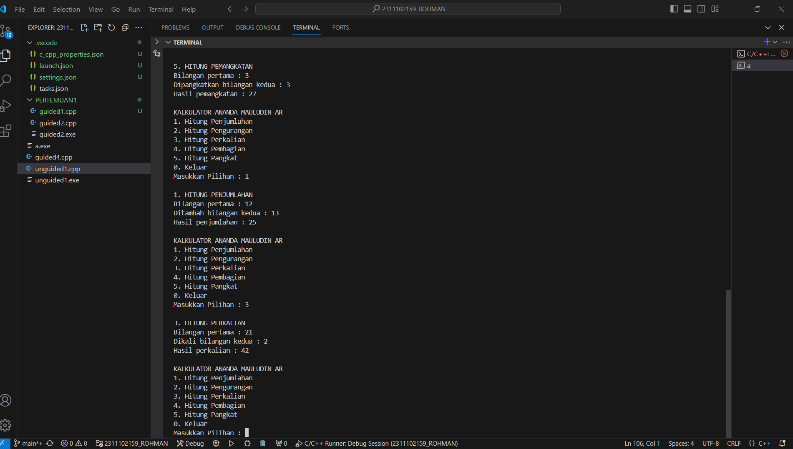
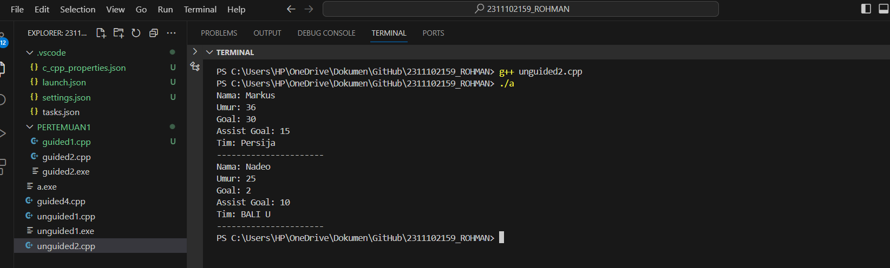
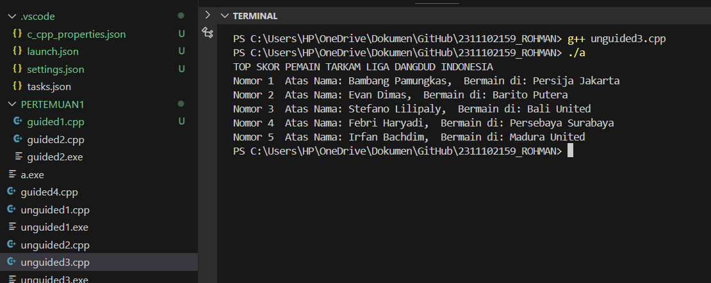

# <h1 align="center">Laporan Praktikum Modul Tipe Data</h1>
<p align="center"> Ananda Mauludin Ar Rokhman_2311102159</p>

//add new

## Dasar Teori

Tipe adalah format penyimpanan data. Fungsi tipe data adalah mempresentasikan suatu jenis dari suatu nilai yang terdapat pada program. Macam-macam tipe data yang terdapat pada C++ ada 3, yaitu:
1. Tipe Data Primitif
2. Tipe Data Abstrak
3. Tipe Data Koleksi

### 1. Tipe data Primitif
Tipe data primitif adalah tipe data yang  ditentukan sistem. Tipe data primitif ini disediakan oleh banyak bahasa pemrograman, perbedaannya terletak pada jumlah bit yang dialokasikan untuk setiap bit dalam tipe data primitif, tergantung pada bahasa pemrograman, compiler, dan sistem operasi. Contoh tipe data primitif adalah: 
1. Int, untuk Bilangan Bulat
2. Float, untuk Bilangan Desimal
3. Char, untuk Huruf.
4. Boolean, untuk True dan False.

### 2. Tipe Data Abstrak
Tipe data abstrak (Abstract Data Type - ADT) adalah konsep ilmu komputer yang memberikan spesifikasi matematis dari suatu tipe data dan operasi yang dapat dilakukan pada tipe data tersebut tanpa memberikan implementasi konkrit. ADT memisahkan  apa yang perlu dilakukan (spesifikasi) dan bagaimana hal itu perlu dilakukan (implementasi).

### 3. Tipe Data Koleksi
Tipe data koleksi (Collection Data Type) adalah tipe data yang digunakan untuk mengelompokkan dan menyimpan beberapa nilai atau objek secara bersamaan. Tipe data koleksi memungkinkan Anda menyimpan, mengelola, dan mengakses data dalam jumlah besar dengan cara yang terstruktur. Tipe data koleksi yang umum digunakan dalam pemrograman :
1. Array, adalah struktur data statis yang menyimpan elemen dengan tipe data yang sama. Elemen-elemen ini dapat diakses  menggunakan indeks. Array memiliki ukuran tetap yang ditentukan selama deklarasi.
2. Vector, adalah Standard Template Library (STL) jika pada C/C++ berbentuk std::vector. Secara umum vektor mirip dengan array karena mampu menyimpan data sebagai elemen yang alokasi memorinya dilakukan secara otomatis dan terus menerus. Kemampuan Vector tidak hanya terbatas pada jumlah elemen dinamis saja, Vector pada C/C++ juga dilengkapi dengan fitur tambahan sepert element access, iterators, capacity, modifiers.
3. Map, adalah mirip dengan array, namun dengan index tipe data selain integer. Pada map, indeks diberi nama “key”. Pada std::map digunakan Self-Balancing Tree khususnya Red-Black Tree.

## Guided 

### 1. [Tipe Data Primitif]

```C++
#include <iostream>
#include <iomanip>

using namespace std;

// Tipe Data Primitif by ANANDA MAULUDIN AR ROKHMAN_2311102159
int main() {
    char op;
    float num1, num2;

    // It allows user to enter operator i.e. +, -, *, /

    cout << "Enter operator (+, -, *, /): ";
    cin >> op;

    // It allows user to enter the operands
    cout << "Enter two operands: ";
    cin >> num1 >> num2;
    
    // Switch statement begins
    switch (op) {
        // If user enters +
        case '+':
        cout << "Result: " << num1 + num2;
        break;
        // If user enters -
        case '-':
        cout << "Result: " << num1 - num2;
        break;
        // If user enters *
        case '*':
        cout << "Result: " << num1 * num2;
        break;
        // If user enters /
        case '/':
        if (num2 != 0) {
            cout << "Result: " << fixed << setprecision(2) << num1 / num2;
            } else {
                cout << "Error! Division by zero is not allowed.";
                }
                break;
                // If the operator is other than +, -, * or /,
                // error message will display
                default:
                cout << "Error! Operator is not correct";
                } // switch statement ends
    return 0;
}

```
Kode di atas digunakan untuk melakukan operasi aritmatika dasar dari pilihan operasi penambahan (+), pengurangan (-), perkalian (*), dan pembagian (/). Program ini terdapat dua tipe data primitif, yakni char dan float. Tipe data char digunakan pada saat pemilihan switch case dan float, Serta akan aktif ketika pengguna sudah menginput dua angka. 

### 2. [Tipe Data Abstrak]

```C++
#include <stdio.h>
#include <string.h>
//Struct
struct Mahasiswa
{
    char name[50];
    char address[100];
    int age;
};
// // Tipe Data Abstrak by  Ananda Mauludin Arohman_2311102159
int main()
{
    // menggunakan struct
    struct Mahasiswa mhs1, mhs2;

    // mengisi nilai ke struct
    strcpy(mhs1.name, "Dian");
    strcpy(mhs1.address, "Mataram");
    mhs1.age = 22;
    strcpy(mhs2.name, "Bambang");
    strcpy(mhs2.address, "Surabaya");
    mhs2.age = 23;
    
    // mencetak isi struct
    printf("## Mahasiswa 1 ##\n");
    printf("Nama: %s\n", mhs1.name);
    printf("Alamat: %s\n", mhs1.address);
    printf("Umur: %d\n", mhs1.age);
    printf ("\n");
    printf("## Mahasiswa 2 ##\n");
    printf("Nama: %s\n", mhs2.name);\
    printf("Alamat: %s\n", mhs2.address);
    printf("Umur: %d\n", mhs2.age);

    return 0;
}

```
Kode di atas digunakan untuk mencetak data mahasiswa dengan menggunakan program struct. Struct merupakan contoh dari tipe data abstrak, Pada kode di atas terdapat sebuah struct 'Mahasiswa' dengan memiliki cabang 'name' (nama), 'address'(alamat), dan 'age' (umur). Ada 2 variabel mendeklarasikan dan menginisialisasi dengan data mahasiswa dengan struct 'mhs1' nama Dian dan 'mhs2' nama Bambang, dan fungsi 'printf' mencetak informasi mahasiswa.

### 3. [Tipe Data Koleksi]

```C++
clude <iostream>
#include <array>

using namespace std;

// Tipe Data Koleksi by  Ananda Mauludin Arohman_2311102159
int main() {

    // Deklarasi dan inisialisasi array
    int nilai[5];
    nilai[0] = 23;
    nilai[1] = 50;
    nilai[2] = 34;
    nilai[3] = 78;
    nilai[4] = 90;
    
    // Mencetak array dengan tab
    cout << "Isi array pertama : " << nilai[0] << endl;
    cout << "Isi array kedua : " << nilai[1] << endl;
    cout << "Isi array ketiga : " << nilai[2] << endl;
    cout << "Isi array keempat : " << nilai[3] << endl;
    cout << "Isi array kelima : " << nilai[4] << endl;

return 0;
}
```
Kode di atas digunakan untuk mengetahui isi nilai dari penggunaan array. Array adalah tipe data koleksi, pada program ini akan mendeklarasikan dan menginisialisasi sebuah array integer bernama 'nilai' dengan terdapat 5 nilai array, yakni 23, 50, 34, 78, dan 90.Kemudian program ini akan mencetak nilai setiap elemen yang ada di dalam array menggunakan 'cout'.


## Unguided 


### 1. [Buatlah program menggunakan tipe data primitif minimal dua fungsi dan bebas. Menampilkan program, jelaskan program tersebut dan ambil kesimpulan dari materi tipe data primitif!]

```C++
// LAPRAK 1 : UNGUIDED 2
// ANANDA MAULUDIN AR ROHMAN
// 2311102159
// S1 IF-11-D

#include <iostream>
#include <cmath>

using namespace std;

char pilihan_159; // Pilihan menu sebagai data char
float x_159, y_159; // Bilangan pertama dan kedua dalam format float

void TampilkanMenu_159() { // Fungsi untuk menampilkan menu pilihan
    cout << "KALKULATOR ANANDA MAULUDIN AR";
    cout << "\n1. Hitung Penjumlahan";
    cout << "\n2. Hitung Pengurangan";
    cout << "\n3. Hitung Perkalian";
    cout << "\n4. Hitung Pembagian";
    cout << "\n5. Hitung Pangkat";
    cout << "\n0. Keluar" << endl;
    cout << "Masukkan Pilihan : ";
    cin >> pilihan_159;
}

float LogikaPenjumlahan_159() { // Fungsi untuk penjumlahan
    cout << "\n1. HITUNG PENJUMLAHAN" << endl;
    cout << "Bilangan pertama : ";
    cin >> x_159;
    cout << "Ditambah bilangan kedua : ";
    cin >> y_159;
    cout << "Hasil penjumlahan : " << x_159 + y_159 << "\n" << endl;
    return x_159 + y_159;
}

float LogikaPengurangan_159() { // Fungsi untuk pengurangan
    cout << "\n2. HITUNG PENGURANGAN" << endl;
    cout << "Bilangan pertama : ";
    cin >> x_159;
    cout << "Dikurangi bilangan kedua : ";
    cin >> y_159;
    cout << "Hasil pengurangan : " << x_159 - y_159 << "\n" << endl;
    return x_159 - y_159;
}

float LogikaPerkalian_159() { // Fungsi untuk perkalian
    cout << "\n3. HITUNG PERKALIAN" << endl;
    cout << "Bilangan pertama : ";
    cin >> x_159;
    cout << "Dikali bilangan kedua : ";
    cin >> y_159;
    cout << "Hasil perkalian : " << x_159 * y_159 << "\n" << endl;
    return x_159 * y_159;
}

float LogikaPembagian_159() { // Fungsi untuk pembagian
    cout << "\n4. HITUNG PEMBAGIAN" << endl;
    cout << "Bilangan pertama : ";
    cin >> x_159;
    cout << "Dibagi bilangan kedua : ";
    cin >> y_159;
    if (y_159 != 0) {
        cout << "Hasil pembagian : " << x_159 / y_159 << "\n" << endl;
        return x_159 / y_159;
    } else {
        cout << "Error: Pembagian dengan nol tidak diperbolehkan.\n" << endl;
        return 0; // Mengembalikan 0 dalam kasus pembagian dengan nol
    }
}

float LogikaPemangkatan_159() { // Fungsi untuk pemangkatan
    cout << "\n5. HITUNG PEMANGKATAN" << endl;
    cout << "Bilangan pertama : ";
    cin >> x_159;
    cout << "Dipangkatkan bilangan kedua : ";
    cin >> y_159;
    cout << "Hasil pemangkatan : " << pow(x_159, y_159) << "\n" << endl;
    return pow(x_159, y_159);
}

int main() {
    do {
        TampilkanMenu_159();
        switch (pilihan_159) {
            case '1':
                LogikaPenjumlahan_159();
                break;
            case '2':
                LogikaPengurangan_159();
                break;
            case '3':
                LogikaPerkalian_159();
                break;
            case '4':
                LogikaPembagian_159();
                break;
            case '5':
                LogikaPemangkatan_159();
                break;
            case '0':
                cout << "\nProgram berakhir. Sampai jumpa, jangan lupa mencoba lagi" << endl;
                break;
            default:
                cout << "\nInput tidak valid, silakan mencoba lagi dengan nomor yang sesuai" << endl;
                return 0;
        }
    } while (pilihan_159 != '0');

    return 0;
}


```
#### Output:


Kode diatas digunakan untuk menjalankan Program KALKULATOR RICO ADE PRATAMA yang memungkinkan pengguna untuk melakukan operasi matematika dasar seperti penjumlahan, pengurangan, perkalian, pembagian, dan pemangkatan. Program memiliki menu pilihan yang ditampilkan kepada pengguna, dan setiap pilihan akan mengarahkan pengguna ke fungsi khusus yang melakukan perhitungan sesuai operasi yang dipilih. Program terus berjalan dalam loop hingga pengguna memilih opsi "0" untuk keluar dari program. Selain itu, program juga memiliki penanganan kasus khusus untuk pembagian dengan nol, memberikan pesan kesalahan jika hal tersebut terjadi.

Kesimpulan Tipe Data Primitif:
Kesimpulannya, program ini memanfaatkan tipe data primitif secara tepat sesuai dengan kebutuhan untuk menyederhanakan operasi kalkulasi matematika dasar. Penggunaan tipe data primitif membantu dalam mengelola data dengan efisien dan memudahkan implementasi program kalkulator sederhana ini.

### 2. [Jelaskan fungsi dari class dan struct secara detail dan berikan contoh programnya]

```C++
// LAPRAK 1 : UNGUIDED 2
// ANANDA MAULUDIN AR ROHMAN
// 2311102159
// S1 IF-11-D

#include <iostream>
#include <string>

using namespace std;

// Class PemainSepakBola
class PemainSepakBola {
public:
    // Attributes
    string nama;
    int umur;
    int Goal;
    int assistGoal;
    string tim;

    // Method to display player information
    void displayInfo() {
        cout << "Nama: " << nama << endl;
        cout << "Umur: " << umur << endl;
        cout << "Goal: " << Goal << endl;
        cout << "Assist Goal: " << assistGoal << endl;
        cout << "Tim: " << tim << endl;
        cout << "----------------------" << endl;
    }
};

// Struct PemainSepakBolaStruct
struct PemainSepakBolaStruct {
    // Attributes
    string nama;
    int umur;
    int Goal;
    int assistGoal;
    string tim;
};

int main() {
    // Create object of class PemainSepakBola and fill in data
    PemainSepakBola pemain1;
    pemain1.nama = "Markus";
    pemain1.umur = 36;
    pemain1.Goal = 30;
    pemain1.assistGoal = 15;
    pemain1.tim = "Persija";

    // Display information of pemain1
    pemain1.displayInfo();

    // Create object of struct PemainSepakBolaStruct and fill in data
    PemainSepakBolaStruct pemain2;
    pemain2.nama = "Nadeo";
    pemain2.umur = 25;
    pemain2.Goal = 2;
    pemain2.assistGoal = 10;
    pemain2.tim = "BALI U";

    // Display information of pemain2
    cout << "Nama: " << pemain2.nama << endl;
    cout << "Umur: " << pemain2.umur << endl;
    cout << "Goal: " << pemain2.Goal << endl;
    cout << "Assist Goal: " << pemain2.assistGoal << endl;
    cout << "Tim: " << pemain2.tim << endl;
    cout << "----------------------" << endl;

    return 0;
}


```
#### Output:


Kode di atas digunakan untuk mendefinisikan sebuah class 'PemainSepakBola' dan sebuah struct 'PemainSepakBolaStruct' untuk merepresentasikan informasi seorang pemain sepak bola. Class dan struct tersebut memiliki atribut-atribut seperti nama, umur, jumlah goal, jumlah assist goal, dan tim. Dalam program main(), objek pertama (pemain1) dibuat menggunakan class 'PemainSepakBola' dan diisi dengan data seperti nama Lionel Messi, umur 36 tahun, jumlah goal 30, jumlah assist goal 15, dan tim Inter Miami FC. Objek tersebut kemudian ditampilkan menggunakan metode print() yang ada di dalam class. Selanjutnya, objek kedua (pemain2) dibuat menggunakan struct 'PemainSepakBolaStruct' dan diisi dengan data seperti nama Cristiano Ronaldo, umur 39 tahun, jumlah goal 51, jumlah assist goal 10, dan tim Al-Nassr FC. Informasi objek kedua ditampilkan secara langsung dengan menggunakan cout.

Fungsi Class dalam 'PemainSepakBola':
1. Atribut: Menyimpan informasi pemain sepak bola seperti nama, umur, jumlah gol, jumlah assist goal, dan tim.
2. Method print(): Digunakan untuk menampilkan informasi pemain sepak bola ke layar.
3. Objek pemain1: Membuat objek dari class 'PemainSepakBola' bernama pemain1 dan mengisi data pemain tersebut.
4. Pemanggilan pemain1.print(): Menampilkan informasi pemain1 dengan menggunakan method print().

Fungsi Struct dalam 'PemainSepakBolaStruct':
1. Atribut: Sama seperti class, menyimpan informasi pemain sepak bola seperti nama, umur, jumlah gol, jumlah assist goal, dan tim.
2. Objek pemain2: Membuat objek dari struct 'PemainSepakBolaStruct' bernama pemain2 dan mengisi data pemain tersebut.
3. Pemanggilan langsung: Informasi pemain2 ditampilkan langsung tanpa menggunakan method khusus seperti pada class.

### 3. [Buat dan jelaskan program menggunakan fungsi map dan jelaskan perbedaan dari array dengan map.]

```C++
// LAPRAK 1 : UNGUIDED 3
// ANANDA MAULUDIN AR ROHMAN
// 2311102159
// S1 IF-11-D

#include <iostream>
#include <map>

using namespace std;

// Struktur data untuk menyimpan informasi pemain sepak bola
struct PemainSepakBola {
    string nama_159;
    string klub_159;
};

int main() {
    // Deklarasi map dengan key int dan value berupa objek PemainSepakBola
    map<int, PemainSepakBola> club_159 = {
        {1, {"Bambang Pamungkas", "Persija Jakarta"}},
        {2, {"Evan Dimas", "Barito Putera"}},
        {3, {"Stefano Lilipaly", "Bali United"}},
        {4, {"Febri Haryadi", "Persebaya Surabaya"}},
        {5, {"Irfan Bachdim", "Madura United"}}
    };

    cout << "TOP SKOR PEMAIN TARKAM LIGA DANGDUD INDONESIA" << endl;

    // Perulangan for menggunakan range-based for loop
    for (const auto& entry : club_159) {
        cout << "Nomor " << entry.first << "  Atas Nama: " << entry.second.nama_159 << ",  Bermain di: " << entry.second.klub_159 << endl;
    }

    return 0;
}


```
#### Output:


Kode di atas digunakan untuk implementasi sederhana untuk menampilkan informasi 'TOP SKOR PEMAIN SEPAK BOLA DUNIA'. Program menggunakan struktur data map untuk menyimpan informasi pemain sepak bola, di mana nomor pemain menjadi kunci (key), dan objek PemainSepakBola menjadi nilai (value). Setelah data pemain sepak bola ditambahkan ke dalam map, program melakukan perulangan menggunakan range-based for loop untuk mencetak informasi setiap pemain, termasuk nomor, nama, dan klubnya.

Perbedaan antara Array dan Map adalah bagaimana elemen disimpan dan diakses. Contoh perbedaan utama: 
1. Penyimpanan Data: 
 Array: Menyimpan elemen berurutan di lokasi berurutan. Elemen diakses menggunakan indeks numerik.
 Map : Menyimpan pasangan nilai key. Setiap elemen dapat diakses melalui key unik.
2. Indeks atau Key: 
 Array: Akses elemen menggunakan indeks numerik (biasanya dimulai dari 0).
 Map : Gunakan key (dari tipe data apa pun) untuk mengakses nilai terkait.
3. Ukuran: 
 Array: Ukuran tetap saat deklarasi dan tidak dapat diubah saat runtime.
 Map : bersifat dinamis dan dapat bertambah atau menyusut saat program sedang berjalan.
4. Kecepatan Pencarian: 
 Array: Pencarian menggunakan indeks bisa lebih cepat karena posisi elemen dapat dihitung secara langsung.
 Map : Pencarian  menggunakan key dan kecepatan pencarian bergantung pada implementasi struktur data.
5. Fitur dengan key unik: 
 Array: Semua indeks harus unik, tetapi nilai elemen dapat diulang.
 Map : Setiap key harus unik dan setiap key memiliki nilai yang ditetapkan padanya.

Dalam kasus program di atas, map digunakan untuk menyimpan data pemain sepak bola menggunakan nomor sebagai key atau kuncinya, memungkinkan akses langsung ke informasi pemain berdasarkan nomor tertentu. Hal ini membuat map lebih fleksibel dalam situasi di mana key tidak perlu berurutan atau dibatasi pada nomor atau nilai numerik tertentu.

## Kesimpulan
Kesimpulannya, Pemahaman tipe data C++ sangat penting dalam pengembangan perangkat lunak dan membantu programmer dalam mengelola data dengan cara yang sesuai. Penggunaan tipe data primitif, seperti int, float, dan char, memberikan efisiensi dalam penggunaan memori dan operasi matematika dasar. Serta Penggunaan class dan struct dalam C++ tergantung pada kebutuhan dan desain program. Class lebih canggih dengan dukungan enkapsulasi, pewarisan, dan hak akses, sementara struct lebih sederhana dan cocok untuk menyimpan data terstruktur tanpa banyak fungsionalitas tambahan. Selain itu, struktur data seperti array dan map memungkinkan penyimpanan dan akses data yang terorganisir.

## Referensi
[1] Asisten Praktikum. Modul 1 : Tipe Data 1. UNIVERSITAS TELKOM PURWOKERTO, 2024
[2] Putri Muslina. Dasar-Dasar Pemprograman Komputer. UNIVERSITAS ADZKIA PADANG, 2023.
[3] A Zein, & ES Erian