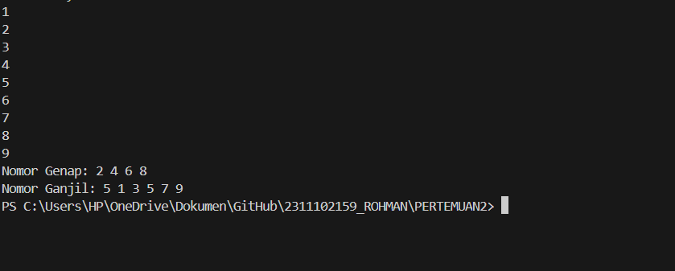
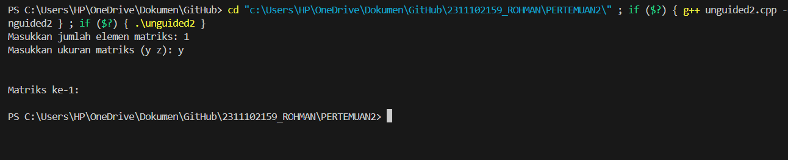
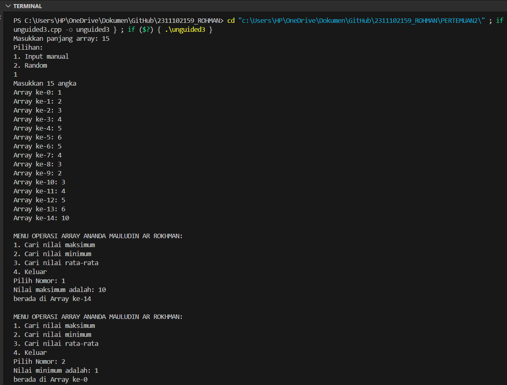

# <h1 align="center">Laporan Praktikum Modul Array</h1>
<p align="center">ANANDA MAULUDIN AR ROKHMAN - 2311102159</p>

## Dasar Teori

Array adalah suatu struktur yang terdiri dari sejumlah elemen yang memiliki tipe data yang sama. Elemen-elemen array tersusun secara sekuensial dalam memori komputer. Semua elemem array bertipe sama. Array cocok untuk organisasi kumpulan data homogen yang ukuran atau jumlah elemen maksimumnya telah diketahui dari awal. Homogen adalah bahwa setiap elemen dari sebuah array tertentu haruslah mempunyai tipe data yang sama.Array dibagi menjadi:

1. Array Satu Dimensi Array satu dimensi tidak lain adalah kumpulan elemen-elemen identik yang tersusun dalam satu baris, tetapi isi dari elemen tersebut boleh berbeda.  Dapat disebut juga dengan istilah vektor yang menggambarkan data dalam suatu urutanDeklarasi : Type_Data Nama_Variabel [index] Misalnya : int A[5];

 2. Array Dua Dimensi Array dua dimensi yang sering digambarkan sebagai sebuah matriks merupakan perluasan dari sebuah array satu dimensi. Jika array satu dimensi hanya terdiri dari sebuah baris dengan beberapa kolom elemen maka array dua dimensi terdiri dari beberapa baris dan beberapa kolom elemen yang bertipe sama. Pendeklarasian array dua dimensi hampir sama dengan pendeklarasian array satu dimensi, kecuali bahwa array dua dimensi terdapat dua jumlah elemen array yangterdapat di dalam kurung siku dan keduanya boleh tidak sama.Deklarasi : Type_Data Nama_Variabel [Index1] [index2]; Misal : int A[3][2];
 
 3.  Array Tiga Dimensi           Array tiga dimensi digunakan untuk mengelola data dalam bentuk 3 dimensi atautiga sisi. Deklarasi : Type_Data Nama_Variabel [index1] [ndex2] [index3]; Misal : int A [3][4][2];       

 4.  Array Banyak DimensiSebenarnya array banyak dimensi ini tidak terlalu sering dipakai seperti halnyaarray satu dimensi, dua dimensi, dan tiga dimensi. Array banyak dimensi ini pada dasarnya sama dengan array sebelimnya kecuali pada jumlah dimensinya.Deklarasi : Type_Data Nama_Variabel [index1] [ndex2] [index3] [ndex4].....;Misal : int A [3][4][2][5];

## Guided 

### 1. [Program Input Array Tiga Dimensi]

```C++
#include <iostream>
using namespace std;
// PROGRAM INPUT ARRAY 3 DIMENSI

int main()
{
    // Deklarasi array
    int arr[2][3][3];
    // Input elemen
    for (int x = 0; x < 2; x++)
    {
        for (int y = 0; y < 3; y++)
        {
            for (int z = 0; z < 3; z++)
            {
            cout << "Input Array[" << x << "][" << y << "][" << z << "] = ";
            cin >> arr[x][y][z];
        }
    }
    cout << endl;
}

// Output Array
for (int x = 0; x < 2; x++)
{
    for (int y = 0; y < 3; y++)
    {
        for (int z = 0; z < 3; z++)
        {
        cout << "Data Array[" << x << "][" << y << "][" << z << "] = " << arr[x][y][z] << endl;
        }
    }
}
cout << endl;
// Tampilan array
for (int x = 0; x < 2; x++)
{
    for (int y = 0; y < 3; y++)
    {
        for (int z = 0; z < 3; z++)
        {
        cout << arr[x][y][z] << ends;
    }
    cout << endl;
    }
    cout << endl;
    }
}
```
Pertama, pada program telah dideklarasikan array tiga dimensi dengan tipe data integer ukuran masing-masing dimensi 2, 3, 3. Kemudian, program melakukan input elemen array dengan tiga pengulangan for. Perulangan pertama akan mengakses elemen pada dimensi pertama begitu seterusnya sampai dengan dimensi ketiga. Selama perulangan, program akan menampilkan input array [x][y][z] dan meminta pengguna untuk memasukkan nilai elemen array yang kemudian disimpan ke array di indeks yang sesuai. Setelah itu, cetak array menggunakan tiga loop for yang mirip dengan loop fase input. Selama perulangan, program menampilkan pesan "Data Array[x][y][z] =" dan nilai elemen array pada indeks yang sesuai. Terakhir, program akan menampilkan tabel dengan tiga loop yang mirip dengan loop input dan output. Selama perulangan, program hanya menampilkan nilai elemen array pada indeks yang sesuai tanpa pesan tambahan. Program diakhiri dengan return 0.

### 2. [Program Mencari Nilai Maksimal pada Array]

```C++
#include <iostream>
using namespace std;

int main()
{
    int maks, a, i = 1, lokasi;
    cout << "Masukkan panjang array: ";
    cin >> a;
    int array[a];
    cout << "Masukkan " << a << " angka\n";
    for (i = 0; i < a; i++)
    {
        cout << "Array ke-" << (i) << ": ";
        cin >> array[i];
    }
        maks = array[0];
        for (i = 0; i < a; i++)
        {
            if (array[i] > maks)
            {
                maks = array[i];
                lokasi = i;
        }
    }
    cout << "Nilai maksimum adalah " << maks << " berada di Array ke " << lokasi << endl;
}
```
Pertama, program akan meminta pengguna untuk memasukan panjang array dan menyimpan input pada variabel a. Setelah itu, program akan membuat arrau dengan panjang a dengan menggunakan deklarasi array dinamis. Selanjutnya, program akan meminta pengguna untuk memasukan nilai di setiap elemen array dan menggunakan pengulangan for untuk meminta input nilai sebanyak a. Setelah semua nilai elemen array dimasukkan, program akan mencari nilai maksimum dari bilangan yang telah dimasukkan menggunakan pengulangan for. Program akan membandingkan nilai array pada indeks ke-I dengan nilai maksimum pada variabel maksimum. Setelah nilai maksimum diperoleh, program akan berakhir dan mengembalikan nilai 0.

## Unguided 

### 1. [Buatlah program untuk menampilkan Output seperti berikut dengan data yangdiinputkan oleh user!]

```C++
#include <iostream>
#include <vector>
using namespace std;

vector<int> filterArray(const int arr[], int size, bool even) {
    vector<int> result;
    for (int i = 0; i < size; ++i) {
        if ((arr[i] % 2 == 0) == even) {
            result.push_back(arr[i]);
        }
    }
    return result;
}

int main() {
    int bilangan141[10];

    cout << "Data Array: ";
    for (int i = 0; i < 10; i++) {
        cin >> bilangan141[i];
    }

    vector<int> evenNumbers = filterArray(bilangan141, 10, true);
    vector<int> oddNumbers = filterArray(bilangan141, 10, false);

    cout << "Nomor Genap: ";
    for (int num : evenNumbers) {
        cout << num << " ";
    }
    cout << endl;

    cout << "Nomor Ganjil: ";
    for (int num : oddNumbers) {
        cout << num << " ";
    }
    cout << endl;

    return 0;
}

```
#### Output:


Program ini menggunakan namespace std untuk mengelola input dan output. Di dalam fungsi main, ia memiliki array bilangan dengan ukuran 10. Program mengambil input dari pengguna untuk mengisi array bilangan. Setelah itu, ia menampilkan data array yang telah diisi. Lalu, program mencari dan menampilkan nomor genap dari array bilangan. Setelah itu, ia menampilkan nomor ganjil dari array bilangan. Setelah proses pemilihan selesai, program kembalikan nilai 0.

### 2. [Buatlah program Input array tiga dimensi (seperti pada guided) tetapi jumlah atau ukuran elemennya diinputkan oleh user!]

```C++
#include <iostream> 
using namespace std; 

int main() { 
    int a, b, c; 
    cout << "Masukkan jumlah elemen matriks: "; 
    cin >> a; 
    cout << "Masukkan ukuran matriks (y z): "; 
    cin >> b >> c; 
    
    int arr[a][b][c]; 
    //Input elemen 
    for (int i = 0; i < a; i++) { 
        for (int j = 0; j < b; j++) { 
            for (int k = 0; k < c; k++) { 
                cout << "Input Array[" << i << "][" << j << "][" << k << "] = "; 
                cin >> arr[i][j][k]; 
            } 
        } 
        cout << endl; 
    } 
    //Output Array 
    for (int i = 0; i < a; i++) { 
        for (int j = 0; j < b; j++) { 
            for (int k = 0; k < c; k++) { 
                cout << "Data Array[" << i << "][" << j << "][" << k << "] = " << arr[i][j][k] << endl; 
            }
            
        } 
    }
    cout << endl; 
    //Tampilan array 
    for (int i = 0; i < a; i++) { 
        cout << "Matriks ke-" << i+1 << ":" << endl; 
        for (int j = 0; j < b; j++) { 
            for (int k = 0; k < c; k++) { 
                cout << arr[i][j][k] << " "; 
            } 
             cout << endl; 
        } 
        cout << endl; 
    } 
    return 0; 
}
```
#### Output:


Di dalam fungsi main, ia memiliki variabel a, b, dan c untuk menyimpan jumlah elemen matriks dan ukuran matriks. Program mengambil input dari pengguna untuk mengisi jumlah elemen matriks dan ukuran matriks. Setelah itu, ia membuat array arr dengan ukuran a x b x c. Setelah itu, program mengambil input dari pengguna untuk mengisi elemen array arr. Setelah itu, ia menampilkan data array yang telah diisi. Setelah itu, ia menampilkan matriks dengan format yang spesifik. Setelah proses pemilihan selesai, program kembalikan nilai 0.

### 3. [Buatlah program menu untuk mencari nilai Maksimum, Minimum dan Nilai rata – rata dari suatu array dengan input yang dimasukan oleh user!]

```C++
// LAPRAK 2 : UNGUIDED 3
// ANANDA MAULUDIN AR ROKHMAN
// 2311102159
// S1 IF-11-D
#include <iostream>
#include <iomanip>
#include <cstdlib> // Untuk random
#include <ctime> // Untuk waktu

using namespace std;

// Fungsi untuk mencari nilai maksimum
int Mauludin_Maksimum(const int array_159[], int size_159, int& lokasi_159) {
    int maks_159 = array_159[0];
    lokasi_159 = 0;
    for (int i_159 = 1; i_159 < size_159; ++i_159) {
        if (array_159[i_159] > maks_159) {
            maks_159 = array_159[i_159];
            lokasi_159 = i_159;
        }
    }
    return maks_159;
}

// Fungsi untuk mencari nilai minimum
int Mauludin_Minimum(const int array_159[], int size_159, int& lokasi_159) {
    int min_159 = array_159[0];
    lokasi_159 = 0;
    for (int i_159 = 1; i_159 < size_159; ++i_159) {
        if (array_159[i_159] < min_159) {
            min_159 = array_159[i_159];
            lokasi_159 = i_159;
        }
    }
    return min_159;
}

// Fungsi untuk mencari nilai rata-rata atau Average
double Mauludin_Average(const int array_159[], int size_159) {
    int total_159 = 0;
    for (int i_159 = 0; i_159 < size_159; ++i_159) {
        total_159 += array_159[i_159];
    }
    return static_cast<double>(total_159) / size_159;
}

int main() {
    int n_159;
    cout << "Masukkan panjang array: ";
    cin >> n_159;

    int array_159[n_159];
    cout << "Pilihan: \n1. Input manual\n2. Random\n";
    int pilihanInput;
    cin >> pilihanInput;

    if (pilihanInput == 1) {
        cout << "Masukkan " << n_159 << " angka\n";
        for (int i_159 = 0; i_159 < n_159; ++i_159) {
            cout << "Array ke-" << i_159 << ": ";
            cin >> array_159[i_159];
        }
    } else if (pilihanInput == 2) {
        srand(time(0)); // Untuk inisialisasi seed dengan waktu saat ini
        cout << "Array random dengan " << n_159 << " angka: \n";
        for (int i_159 = 0; i_159 < n_159; ++i_159) {
            array_159[i_159] = rand() % 100; // Angka random antara 0 sampai 99
            cout << array_159[i_159] << " ";
        }
        cout << endl;
    } else {
        cout << "Pilihan tidak valid. Keluar dari program.\n";
        return 0;
    }

    int Pilihan_159;
    int lokasi_159;
    do {
        cout << "\nMENU OPERASI ARRAY ANANDA MAULUDIN AR ROKHMAN:\n";
        cout << "1. Cari nilai maksimum\n";
        cout << "2. Cari nilai minimum\n";
        cout << "3. Cari nilai rata-rata\n";
        cout << "4. Keluar\n";
        cout << "Pilih Nomor: ";
        cin >> Pilihan_159;

        switch (Pilihan_159) {
            case 1:
                cout << "Nilai maksimum adalah: " << Mauludin_Maksimum(array_159, n_159, lokasi_159) << " \nberada di Array ke-" << lokasi_159 << endl;
                break;
            case 2:
                cout << "Nilai minimum adalah: " << Mauludin_Minimum(array_159, n_159, lokasi_159) << " \nberada di Array ke-" << lokasi_159 << endl;
                break;
            case 3:
                cout << "Nilai rata-rata adalah: " << fixed << setprecision(2) << Mauludin_Average(array_159, n_159) << endl;
                break;
            case 4:
                cout << "Terima kasih telah menggunakan program ini!\n";
                break;
            default:
                cout << "Pilihan tidak valid, Silahkan coba lagi menggunakan nomor yang tersedia!\n";
        }
    } while (Pilihan_159 != 4);
    return 0;
}

```
#### Output:


Program ini menggunakan namespace std untuk mengelola input dan output. Di dalam fungsi main, ia memiliki variabel a untuk menyimpan jumlah elemen array yang diinginkan. Program mengambil input dari pengguna untuk mengisi jumlah elemen array. Setelah itu, ia membuat array arr dengan ukuran a. Setelah itu, program mengambil input dari pengguna untuk mengisi elemen array. Setelah itu, ia menampilkan menu untuk pengguna untuk memilih menu yang diinginkan. Setelah pengguna memilih menu, program melakukan operasi yang sesuai dengan pilihan yang diberikan. Setelah proses pemilihan selesai, program kembalikan nilai 0.

## Kesimpulan
Array merupakan kumpulan tipe data dalam suatu program yang digunakan sebagai wadah berkumpulnya tipe data yang sama.Array dapat berupa satu dimensi, dua dimensi, ataupun multidimensi.Elemen-elemen array tersusun secara sekuensial dalam memori komputer.Array dapat digunakan untuk menyederhanakan dan mempermudah dalam penulisan syntax program.Array dapat digunakan untuk berbagai aplikasi, seperti pembuatan program, database, dan lain-lain.Array memiliki fleksibilitas rendah, sehingga tidak cocok untuk berbagai aplikasi karena array mempunyai batasan, seperti harus bertipe homogen dan sulit diubah ukurannya di waktu eksekusi.Array merupakan bagian dasar dari struktur data lain yang lebih kompleks.

## Referensi
[28]D. P. Sari, O. M. Febriani, and A. S. Putra, “Perancangan Sistem Informasi SDM Berprestasi pada SD Global Surya,” in Prosiding Seminar Nasional Darmajaya, 2018, vol. 1, no. 1, pp. 289–294