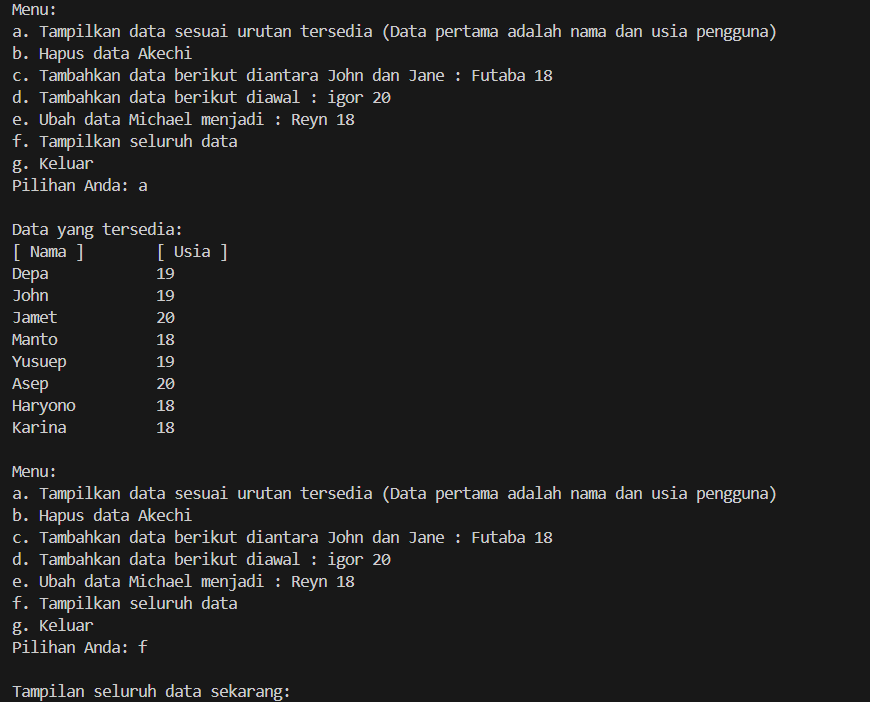
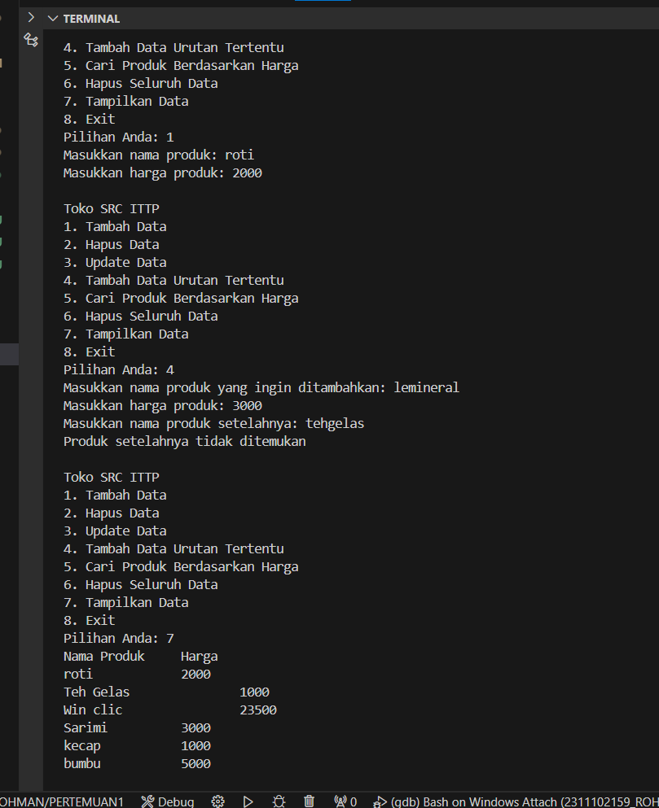

# <h1 align="center">LAPORAN PRAKTIKUM MODUL 3 : SINGLE AND DOUBLE LINKED LIST</h1>
<p align="center">ANANDA MAULUDIN AR ROKHMAN - 2311102159</p>

# Dasar Teori

## SINGLE AND DOUBLE LINKED LIST

### LINKED LIST

Linked List adalah salah satu bentuk struktur data, berisi kumpulan data (node) yang tersusun secara sekuensial, saling sambung-menyambung, dinamis dan terbatas.
- Linked List sering disebut juga Senarai Berantai
- Linked List saling terhubung dengan bantuan variabel pointer
- Masing-masing data dalam Linked List disebut dengan node (simpul) yang menempati alokasi memori secara dinamis dan biasanya berupa struct yang terdiri dari beberapa field.

### SINGLE LINKED LIST

Single Linked List (SLL) adalah linked list unidirectional yang hanya memiliki satu arah. Single Linked List adalah sebuah LINKED LIST yang menggunakan sebuah variabel pointer saja untuk menyimpan banyak data dengan metode LINKED LIST, suatu daftar isi yang saling berhubungan. Single Linked List (SLL) adalah linked list unidirectional yang hanya memiliki satu arah. Pengguna hanya dapat melintasinya dalam satu arah, yaitu dari simpul kepala ke simpul ekor. SLL memiliki beberapa karakteristik, seperti memiliki memori tambahan untuk menyimpan link (tautan), memiliki simpul pertama yang disebut head atau simpul kepala, dan memiliki simpul akhir yang menunjuk ke simpul kepala. SLL dapat digunakan untuk membuat file system, adjacency list, dan hash table.

### DOUBLE LINKED LIST

Double Linked List (DLL) adalah linked list bidirectional yang memiliki dua arah. Pengguna bisa melintasinya secara dua arah. Double Linked List hampir sama dengan penggunaan Single Linked List. Hanya saja Double Linked List menerapkan dan memiliki tambahan sebuah pointer baru, yaitu prev (pointer previous), yang digunakan untuk menggeser mundur selain tetap mempertahankan pointer next. DLL ini memiliki simpul yang menunjuk ke simpul sebelumnya. Pointer ini memungkinkan Pengguna untuk melintas ke simpul sebelumnya dan ke simpul setelahnya. DLL lebih efisien dalam kasus dimana Pengguna membutuhkan akses ke simpul sebelumnya dan ke simpul setelahnya.

## Guided 

### 1. [Program Single Linked List]

```C++
// ANANDA MAULUDIN AR ROHMAN
// 2311102159
// S1 IF-11-D
#include <iostream>
using namespace std;
/// PROGRAM SINGLE LINKED LIST NON-CIRCULAR
// Deklarasi Struct Node
struct Node
{
    int data;
    Node *next;
};
Node *head;
Node *tail;
// Inisialisasi Node
void init()
{
    head = NULL;
    tail = NULL;
}
// Pengecekan
bool isEmpty()
{
    if (head == NULL)
        return true;
    else
        ;
    return false;
}
// Tambah Depan
void insertDepan(int nilai)
{
    // Buat Node baru
    Node *baru = new Node;
    baru->data = nilai;
    baru->next = NULL;
    if (isEmpty() == true)
    {
        head = tail = baru;
        tail->next = NULL;
    }
    else
    {
        baru->next = head;
        head = baru;
    }
}
// Tambah Belakang
void insertBelakang(int nilai)
{
    // Buat Node baru
    Node *baru = new Node;
    baru->data = nilai;
    baru->next = NULL;
    if (isEmpty() == true)
    {
        head = tail = baru;
        tail->next = NULL;
    }
    else
    {
        tail->next = baru;
        tail = baru;
    }
}
// Hitung Jumlah List
int hitungList()
{
    Node *hitung;
    hitung = head;
    int jumlah = 0;
    while (hitung != NULL)
    {
        jumlah++;
        hitung = hitung->next;
    }
    return jumlah;
}
// Tambah Tengah
void insertTengah(int data, int posisi)
{
    if (posisi < 1 || posisi > hitungList())
    {
        cout << "Posisi diluar jangkauan" << endl;
    }
    else if (posisi == 1)
    {
        cout << "Posisi bukan posisi tengah" << endl;
    }
    else
    {
        Node *baru, *bantu;
        baru = new Node();
        baru->data = data;
        // tranversing
        bantu = head;
        int nomor = 1;
        while (nomor < posisi - 1)
        {
            bantu = bantu->next;
            nomor++;
        }
        baru->next = bantu->next;
        bantu->next = baru;
    }
}
// Hapus Depan
void hapusDepan()
{
    Node *hapus;
    if (isEmpty() == false)
    {
        if (head->next != NULL)
        {
            hapus = head;
            head = head->next;
            delete hapus;
        }
        else
        {
            head = tail = NULL;
        }
    }
    else
    {
        cout << "List kosong!" << endl;
    }
}
// Hapus Belakang
void hapusBelakang()
{
    Node *hapus;
    Node *bantu;
    if (isEmpty() == false)
    {
        if (head != tail)
        {
            hapus = tail;
            bantu = head;
            while (bantu->next != tail)
            {
                bantu = bantu->next;
            }
            tail = bantu;
            tail->next = NULL;
            delete hapus;
        }
        else
        {
            head = tail = NULL;
        }
    }
    else
    {
        cout << "List kosong!" << endl;
    }
}
// Hapus Tengah
void hapusTengah(int posisi)
{
    Node *hapus, *bantu, *bantu2;
    if (posisi < 1 || posisi > hitungList())
    {
        cout << "Posisi di luar jangkauan" << endl;
    }
    else if (posisi == 1)
    {
        cout << "Posisi bukan posisi tengah" << endl;
    }
    else
    {
        int nomor = 1;
        bantu = head;
        while (nomor <= posisi)
        {
            if (nomor == posisi - 1)
            {
                bantu2 = bantu;
            }
            if (nomor == posisi)
            {
                hapus = bantu;
            }
            bantu = bantu->next;
            nomor++;
        }
        bantu2->next = bantu;
        delete hapus;
    }
}
// Ubah Depan
void ubahDepan(int data)
{
    if (isEmpty() == false)
    {
        head->data = data;
    }
    else
    {
        cout << "List masih kosong!" << endl;
    }
}
// Ubah Tengah
void ubahTengah(int data, int posisi)
{
    Node *bantu;
    if (isEmpty() == false)
    {
        if (posisi < 1 || posisi > hitungList())
        {
            cout << "Posisi di luar jangkauan" << endl;
        }
        else if (posisi == 1)
        {
            cout << "Posisi bukan posisi tengah" << endl;
        }
        else
        {
            bantu = head;
            int nomor = 1;
            while (nomor < posisi)
            {
                bantu = bantu->next;
                nomor++;
            }
            bantu->data = data;
        }
    }
    else
    {
        cout << "List masih kosong!" << endl;
    }
}
// Ubah Belakang
void ubahBelakang(int data)
{
    if (isEmpty() == false)
    {
        tail->data = data;
    }
    else
    {
        cout << "List masih kosong!" << endl;
    }
}
// Hapus List
void clearList()
{
    Node *bantu, *hapus;
    bantu = head;
    while (bantu != NULL)
    {
        hapus = bantu;
        bantu = bantu->next;
        delete hapus;
    }
    head = tail = NULL;
    cout << "List berhasil terhapus!" << endl;
}
// Tampilkan List
void tampil()
{
    Node *bantu;
    bantu = head;
    if (isEmpty() == false)
    {
        while (bantu != NULL)
        {
            cout << bantu->data << ends;
            bantu = bantu->next;
        }
        cout << endl;
    }
    else
    {
        cout << "List masih kosong!" << endl;
    }
}
int main()
{
    init();
    insertDepan(3);
    tampil();
    insertBelakang(5);
    tampil();
    insertDepan(2);
    tampil();
    insertDepan(1);
    tampil();
    hapusDepan();
    tampil();
    hapusBelakang();
    tampil();
    insertTengah(7, 2);
    tampil();
    hapusTengah(2);
    tampil();
    ubahDepan(1);
    tampil();
    ubahBelakang(8);
    tampil();
    ubahTengah(11, 2);
    tampil();
    return 0;
}

```

Kode di atas digunakan untuk mengimplementasikan program Single Linked List Non-Circular yang dapat digunakan untuk menangani operasi data yang berhubungan dengan linked list. Program ini menampilkan isi, menghitung jumlah, serta mengelola data dalam linked list secara efisien. Program ini juga memiliki bagian utama yang menggunakan fungsi untuk menambah, menghapus, mengubah, dan mengosongkan node dalam linked list. Program ini menggunakan struct Node untuk mengelola data dan tautan ke node berikutnya. Fungsi yang tersedia dalam program: `init()` Fungsi ini digunakan untuk menginisialisasi linked list. Dengan memanggil fungsi ini, kita mengatur head dan tail menjadi NULL. `isEmpty()` Fungsi ini digunakan untuk mengecek apakah linked list masih kosong atau tidak. `insertDepan(int nilai)` Fungsi ini digunakan untuk menambah data baru di depan linked list. `insertBelakang(int nilai)` Fungsi ini digunakan untuk menambah data baru di belakang linked list. `hitungList()` Fungsi ini digunakan untuk menghitung jumlah data yang ada dalam linked list. `insertTengah(int data, int posisi)` Fungsi ini digunakan untuk menambah data baru di posisi tertentu dalam linked list. `hapusDepan()` Fungsi ini digunakan untuk menghapus data terakhir dari linked list. `hapusBelakang()` Fungsi ini digunakan untuk menghapus data pertama dari linked list. `hapusTengah(int posisi)` Fungsi ini digunakan untuk menghapus data yang berada di posisi tertentu dalam linked list. `ubahDepan(int data)` Fungsi ini digunakan untuk mengubah data pertama dalam linked list menjadi data yang diberikan. `ubahTengah(int data, int posisi)` Fungsi ini digunakan untuk mengubah data yang berada di posisi tertentu dalam linked list menjadi data yang diberikan. `ubahBelakang(int data)` Fungsi ini digunakan untuk mengubah data terakhir dalam linked list menjadi data yang diberikan. `clearList()` Fungsi ini digunakan untuk menghapus semua data dalam linked list.`tampil()` Fungsi ini digunakan untuk menampilkan semua data dalam linked list. Hasil output akan berjalan sesuai codingan.

### 2. [Program Double Linked List]

```C++
// ANANDA MAULUDIN AR ROHMAN
// 2311102159
// S1 IF-11-D
#include <iostream>
using namespace std;

class Node
{
public:
    int data;
    Node *prev;
    Node *next;
};
class DoublyLinkedList
{
public:
    Node *head;
    Node *tail;
    DoublyLinkedList()
    {
        head = nullptr;
        tail = nullptr;
    }
    void push(int data)
    {
        Node *newNode = new Node;
        newNode->data = data;
        newNode->prev = nullptr;
        newNode->next = head;
        if (head != nullptr)
        {
            head->prev = newNode;
        }
        else
        {
            tail = newNode;
        }
        head = newNode;
    }
    void pop()
    {
        if (head == nullptr)
        {
            return;
        }
        Node *temp = head;
        head = head->next;
        if (head != nullptr)
        {
            head->prev = nullptr;
        }
        else
        {
            tail = nullptr;
        }
        delete temp;
    }
    bool update(int oldData, int newData)
    {
        Node *current = head;
        while (current != nullptr)
        {
            if (current->data == oldData)
            {
                current->data = newData;
                return true;
            }
            current = current->next;
        }
        return false;
    }
    void deleteAll()
    {
        Node *current = head;
        while (current != nullptr)
        {
            Node *temp = current;
            current = current->next;
            delete temp;
        }
        head = nullptr;
        tail = nullptr;
    }
    void display()
    {
        Node *current = head;
        while (current != nullptr)
        {
            cout << current->data << " ";
            current = current->next;
        }
        cout << endl;
    }
};
int main()
{
    DoublyLinkedList list;
    while (true)
    {
        cout << "1. Add data" << endl;
        cout << "2. Delete data" << endl;
        cout << "3. Update data" << endl;
        cout << "4. Clear data" << endl;
        cout << "5. Display data" << endl;
        cout << "6. Exit" << endl;
        int choice;
        cout << "Enter your choice: ";
        cin >> choice;
        switch (choice)
        {
        case 1:
        {
            int data;
            cout << "Enter data to add: ";
            cin >> data;
            list.push(data);
            break;
        }
        case 2:
        {
            list.pop();
            break;
        }
        case 3:
        {
            int oldData, newData;
            cout << "Enter old data: ";
            cin >> oldData;
            cout << "Enter new data: ";
            cin >> newData;
            bool updated = list.update(oldData, newData);
            if (!updated)
            {
                cout << "Data not found" << endl;
            }
            break;
        }
        case 4:
        {
            list.deleteAll();
            break;
        }
        case 5:
        {
            list.display();
            break;
        }
        case 6:
        {
            return 0;
        }
        default:
        {
            cout << "Invalid choice" << endl;
            break;
        }
        }
    }
    return 0;
}
```

Kode di atas digunakan untuk mengimplementasikan program Double Linked List yang mengelola data berupa angka. Program ini Hampir sama pada guided 1 atau hampir sama dengan Single Linked List. Program ini menggunakan class Node untuk mengelola data dan tautan ke node berikutnya, dan tautan ke node sebelumnya. Fungsi yang tersedia dalam program: `push(int data)` Fungsi ini digunakan untuk menambah data baru di akhir Double Linked List. `pop()` Fungsi ini digunakan untuk menghapus data terakhir dari Double Linked List. `update(int oldData, int newData)` Fungsi ini digunakan untuk mengubah data yang sesuai dengan oldData menjadi newData. `deleteAll()` Fungsi ini digunakan untuk menghapus semua data dari Double Linked List. `display()` Fungsi ini digunakan untuk menampilkan semua data yang ada dalam Double Linked List.
Program ini juga menampilkan menu pilihan untuk mengelola data, yaitu:
1. Add data
2. Delete data
3. Update data
4. Clear data
5. Display data
6. Exit
Hasil outputnya adalah pilihan pengguna. Pengguna dapat memilih opsi yang diinginkan dan program akan melakukan operasi yang sesuai dengan opsi yang dipilih.

## Unguided 

### 1. [Buatlah program menu Single Linked List Non-Circular untuk menyimpan Nama dan usia mahasiswa, dengan menggunakan inputan dari user. Lakukan operasi berikut: a. Masukkan data sesuai urutan berikut. (Gunakan insert depan, belakang atau tengah). Data pertama yang dimasukkan adalah nama dan usia anda.  b. Hapus data Akechi. c. Tambahkan data berikut diantara John dan Jane : Futaba 18. d. Tambahkan data berikut diawal : Igor 20. e. Ubah data Michael menjadi : Reyn 18. f. Tampilkan seluruh data]

```C++
// LAPRAK 3 : UNGUIDED 1
// ANANDA MAULUDIN AR
// 2311102159
// S1 IF-11-D
#include <iostream>
using namespace std;

struct Node {
    string nama_159;
    int usia_159;
    Node* next_159;
};

Node* head_159 = nullptr;

void tampilkanList_159() {
    cout << "[ Nama ]" << "\t" << "[ Usia ]" << endl;
    Node* saatIni_159 = head_159;
    while (saatIni_159 != nullptr) {
        cout << saatIni_159->nama_159 << "\t\t" << saatIni_159->usia_159 << endl;
        saatIni_159 = saatIni_159->next_159;
    }
}

void insertDepan_159(string nama_159, int usia_159) {
    Node* baru_159 = new Node;
    baru_159->nama_159 = nama_159;
    baru_159->usia_159 = usia_159;
    baru_159->next_159 = head_159;
    head_159 = baru_159;
}

void insertBelakang_159(string nama_159, int usia_159) {
    Node* baru_159 = new Node;
    baru_159->nama_159 = nama_159;
    baru_159->usia_159 = usia_159;
    baru_159->next_159 = nullptr;
    if (head_159 == nullptr) {
        head_159 = baru_159;
    }
    else {
        Node* temp_159 = head_159;
        while (temp_159->next_159 != nullptr) {
            temp_159 = temp_159->next_159;
        }
        temp_159->next_159 = baru_159;
    }
}

void insertTengah_159(string nama_159, int usia_159, int posisi_159) {
    Node* baru_159 = new Node;
    baru_159->nama_159 = nama_159;
    baru_159->usia_159 = usia_159;
    Node* bantu_159 = head_159;
    for (int i_159 = 1; i_159 < posisi_159 - 1; i_159++) {
        if (bantu_159 != nullptr) {
            bantu_159 = bantu_159->next_159;
        }
    }
    if (bantu_159 != nullptr) {
        baru_159->next_159 = bantu_159->next_159;
        bantu_159->next_159 = baru_159;
    }
}

void hapusData_159(string nama_159) {
    Node* hapus_159 = head_159;
    Node* prev_159 = nullptr;
    while (hapus_159 != nullptr && hapus_159->nama_159 != nama_159) {
        prev_159 = hapus_159;
        hapus_159 = hapus_159->next_159;
    }
    if (hapus_159 == nullptr) {
        cout << "Data tidak ditemukan" << endl;
        return;
    }
    if (prev_159 == nullptr) {
        head_159 = hapus_159->next_159;
    }
    else {
        prev_159->next_159 = hapus_159->next_159;
    }
    delete hapus_159;
}

void ubahData_159(string nama_159, string newnama_159, int newusia_159) {
    Node* temp_159 = head_159;
    while (temp_159 != nullptr && temp_159->nama_159 != nama_159) {
        temp_159 = temp_159->next_159;
    }
    if (temp_159 != nullptr) {
        temp_159->nama_159 = newnama_159;
        temp_159->usia_159 = newusia_159;
    }
}

void tampilkanData() {
    Node* temp_159 = head_159;
    while (temp_159 != nullptr) {
        cout << temp_159->nama_159 << " " << temp_159->usia_159 << endl;
        temp_159 = temp_159->next_159;
    }
}

int main() {
    insertBelakang_159("Depa", 19);
    insertBelakang_159("John", 19);
    insertBelakang_159("Jamet", 20);
    insertBelakang_159("Manto", 18);
    insertBelakang_159("Yusuep", 19);
    insertBelakang_159("Asep", 20);
    insertBelakang_159("Haryono", 18);
    insertBelakang_159("Karina", 18);

    char pilihan_159;
    do {
        cout << "\nMenu:\n";
        cout << "a. Tampilkan data sesuai urutan tersedia (Data pertama adalah nama dan usia pengguna)\n";
        cout << "b. Hapus data Akechi\n";
        cout << "c. Tambahkan data berikut diantara John dan Jane : Futaba 18\n";
        cout << "d. Tambahkan data berikut diawal : igor 20\n";
        cout << "e. Ubah data Michael menjadi : Reyn 18\n";
        cout << "f. Tampilkan seluruh data\n";
        cout << "g. Keluar\n";
        cout << "Pilihan Anda: ";
        cin >> pilihan_159;

        switch (pilihan_159) {
            case 'a':
                cout << "\nData yang tersedia:\n";
                tampilkanList_159();
                break;
            case 'b':
                hapusData_159("Adep");
                cout << "Data Asep berhasil dihapus.\n";
                cout << "\nData yang tersedia setelah penghapusan:\n";
                tampilkanList_159();
                break;
            case 'c':
                insertTengah_159("Futaba", 18, 3); 
                cout << "Data Futaba berhasil ditambahkan.\n";
                cout << "\nData yang tersedia setelah penambahan:\n";
                tampilkanList_159();
                break;
            case 'd':
                insertDepan_159("Igor", 20);
                cout << "Data Igor berhasil ditambahkan di awal.\n";
                cout << "\nData yang tersedia setelah penambahan:\n";
                tampilkanList_159();
                break;
            case 'e':
                ubahData_159("Mant0", "Reyn", 18);
                cout << "Data Manto berhasil diubah menjadi Reyn 18.\n";
                cout << "\nData yang tersedia setelah perubahan:\n";
                tampilkanList_159();
                break;
            case 'f':
                cout << "\nTampilan seluruh data sekarang:\n";
                tampilkanList_159();
                break;
            case 'g':
                cout << "Terima kasih, program selesai.\n";
                break;
            default:
                cout << "Pilihan tidak valid, silakan coba lagi.\n";
                break;
        }
    } while (pilihan_159 != 'g');

    return 0;
}


```
#### Output:



Kode di atas digunakan untuk implementasi sederhana dari program Single Linked List yang mengelola data nama dan umur. Program ini menggunakan struct Node untuk mengelola data nama dan umur dan tautan ke node berikutnya. Berikut adalah deskripsi fungsi yang tersedia dalam program: `tampilkanList_138()` Fungsi ini digunakan untuk menampilkan semua data nama dan umur yang ada dalam linked list. `insertDepan_138(string nama_138, int usia_138)` Fungsi ini digunakan untuk menambah data nama dan umur baru di awal linked list. `insertBelakang_138(string nama_138, int usia_138)` Fungsi ini digunakan untuk menambah data nama dan umur baru di akhir linked list. `insertTengah_138(string nama_138, int usia_138, int posisi_138)` Fungsi ini digunakan untuk menambah data nama dan umur baru di posisi tertentu dalam linked list. `hapusData_138(string nama_138)` Fungsi ini digunakan untuk menghapus data nama dan umur yang sesuai diberikan. `ubahData_138(string nama_138, string newnama_138, int newusia_138)` Fungsi ini digunakan untuk mengubah data nama dan umur yang sesuai dengan nama yang diberikan. `tampilkanData()` Fungsi ini digunakan untuk menampilkan semua data nama dan umur yang ada dalam linked list. Program ini juga menampilkan menu pilihan untuk mengelola data nama dan umur, yaitu:
- a. Tampilkan data sesuai urutan tersedia (Data pertama adalah nama dan usia pengguna)
- b. Hapus data Akechi
- c. Tambahkan data berikut diantara John dan Jane : Futaba 18
- d. Tambahkan data berikut diawal : igor 20
- e. Ubah data Michael menjadi : Reyn 18
- f. Tampilkan seluruh data
- g. Keluar
Pengguna dapat memilih opsi yang diinginkan dan program akan melakukan operasi yang sesuai dengan opsi yang dipilih. Sebagai contoh memilih opsi urut dari a sampai g. Lebih jelasnya yang hasil programnya seperti gambar output diatas.

### 2. [Modifikasi Guided Double Linked List dilakukan dengan penambahanoperasi untuk menambah data, menghapus, dan update di tengah / di urutan tertentu yang diminta. Selain itu, buatlah agar tampilannya menampilkan Nama produk dan harga.  Nama Produk Harga Originote 60.000, Somethinc 150.000, Skintific 100.000, Wardah 50.000, Hanasui 30.000. Case: 1. Tambahkan produk Azarine dengan harga 65000 diantara Somethinc dan Skintific. 2. Hapus produk wardah. 3. Update produk Hanasui menjadi Cleora dengan harga 55.000. 4. Tampilkan menu seperti dibawah ini. Toko Skincare Purwokerto. 1. Tambah Data, 2. Hapus Data, 3. Update Data, 4. Tambah Data Urutan Tertentu, 5. Hapus Data Urutan Tertentu, 6. Hapus Seluruh Data, 7. Tampilkan Data, 8. Exit. Pada menu 7, tampilan akhirnya akan menjadi seperti dibawah ini :]

```C++
// LAPRAK 3 : UNGUIDED 2
// ANANDA MAULUDIN AR ROHMAN
// 2311102159
// S1 IF-11-D
#include <iostream>
using namespace std;

struct Node {
    string namaProduk;
    double harga;
    Node* prev;
    Node* next;
};

class DoubleLinkedList {
private:
    Node* head;
    Node* tail;

public:
    DoubleLinkedList() {
        head = NULL;
        tail = NULL;
    }

    // Menambah data di awal
    void tambahData(string nama, double harga) {
        Node* newNode = new Node();
        newNode->namaProduk = nama;
        newNode->harga = harga;
        newNode->prev = NULL;
        newNode->next = head;

        if (head != NULL)
            head->prev = newNode;
        
        head = newNode;

        if (tail == NULL)
            tail = newNode;
    }

    // Menghapus data dengan nama tertentu
    void hapusData(string nama) {
        Node* current = head;
        while (current != NULL) {
            if (current->namaProduk == nama) {
                if (current->prev != NULL)
                    current->prev->next = current->next;
                else
                    head = current->next;

                if (current->next != NULL)
                    current->next->prev = current->prev;
                else
                    tail = current->prev;

                delete current;
                return;
            }
            current = current->next;
        }
        cout << "Produk tidak ditemukan" << endl;
    }

    // Update data dengan nama tertentu
    void updateData(string nama, string newNama, double newHarga) {
        Node* current = head;
        while (current != NULL) {
            if (current->namaProduk == nama) {
                current->namaProduk = newNama;
                current->harga = newHarga;
                return;
            }
            current = current->next;
        }
        cout << "Produk tidak ditemukan" << endl;
    }

    // Menambah data di urutan tertentu
    void tambahDataUrutanTertentu(string nama, double harga, string namaSetelah) {
        Node* newNode = new Node();
        newNode->namaProduk = nama;
        newNode->harga = harga;

        Node* current = head;
        while (current != NULL) {
            if (current->namaProduk == namaSetelah) {
                newNode->next = current->next;
                newNode->prev = current;
                if (current->next != NULL)
                    current->next->prev = newNode;
                else
                    tail = newNode;
                current->next = newNode;
                return;
            }
            current = current->next;
        }
        cout << "Produk setelahnya tidak ditemukan" << endl;
    }

    // Menampilkan semua data
    void tampilkanData() {
        Node* current = head;
        cout << "Nama Produk\tHarga" << endl;
        while (current != NULL) {
            cout << current->namaProduk << "\t\t" << current->harga << endl;
            current = current->next;
        }
    }

    // Mencari produk berdasarkan harga
    void cariProdukBerdasarkanHarga(double harga) {
        Node* current = head;
        bool found = false;
        cout << "Produk dengan harga " << harga << ":" << endl;
        while (current != NULL) {
            if (current->harga == harga) {
                cout << current->namaProduk << endl;
                found = true;
            }
            current = current->next;
        }
        if (!found) {
            cout << "Tidak ada produk dengan harga tersebut." << endl;
        }
    }

    // Hapus semua data
    void hapusSeluruhData() {
        Node* current = head;
        while (current != NULL) {
            Node* next = current->next;
            delete current;
            current = next;
        }
        head = NULL;
        tail = NULL;
    }
};

int main() {
    DoubleLinkedList list;
    list.tambahData("bumbu", 5000);
    list.tambahData("kecap", 1000);
    list.tambahData("Sarimi", 3000);
    list.tambahData("Win clic", 23500);
    list.tambahData("Teh Gelas", 1000);
    
    int choice;
    string nama, newNama, namaSetelah;
    double harga, newHarga;

    do {
        cout << "\nToko SRC ITTP\n";
        cout << "1. Tambah Data\n";
        cout << "2. Hapus Data\n";
        cout << "3. Update Data\n";
        cout << "4. Tambah Data Urutan Tertentu\n";
        cout << "5. Cari Produk Berdasarkan Harga\n";
        cout << "6. Hapus Seluruh Data\n";
        cout << "7. Tampilkan Data\n";
        cout << "8. Exit\n";
        cout << "Pilihan Anda: ";
        cin >> choice;

        switch (choice) {
            case 1:
                cout << "Masukkan nama produk: ";
                cin >> nama;
                cout << "Masukkan harga produk: ";
                cin >> harga;
                list.tambahData(nama, harga);
                break;
            case 2:
                cout << "Masukkan nama produk yang akan dihapus: ";
                cin >> nama;
                list.hapusData(nama);
                break;
            case 3:
                cout << "Masukkan nama produk yang ingin diupdate: ";
                cin >> nama;
                cout << "Masukkan nama baru: ";
                cin >> newNama;
                cout << "Masukkan harga baru: ";
                cin >> newHarga;
                list.updateData(nama, newNama, newHarga);
                break;
            case 4:
                cout << "Masukkan nama produk yang ingin ditambahkan: ";
                cin >> nama;
                cout << "Masukkan harga produk: ";
                cin >> harga;
                cout << "Masukkan nama produk setelahnya: ";
                cin >> namaSetelah;
                list.tambahDataUrutanTertentu(nama, harga, namaSetelah);
                break;
            case 5:
                cout << "Masukkan harga produk yang ingin dicari: ";
                cin >> harga;
                list.cariProdukBerdasarkanHarga(harga);
                break;
            case 6:
                list.hapusSeluruhData();
                cout << "Semua data telah dihapus." << endl;
                break;
            case 7:
                list.tampilkanData();
                break;
            case 8:
                cout << "Terima kasih!" << endl;
                break;
            default:
                cout << "Pilihan tidak valid." << endl;
        }
    } while (choice != 8);

    return 0;
}


```
#### Output:



Kode di atas digunakan untuk membuat program menu, dari implementasi Double Linked List yang memiliki beberapa fungsi untuk menambah, mengurang, mengupdate, dan menampilkan data pada list yang berbasis linked list. Program ini menggunakan struktur data Node yang memiliki atribut produk dan harga. Kelas Double Linked List memiliki beberapa metode: `Push` Menambahkan data di depan list. `PushPosition` Menambahkan data pada posisi tertentu. `Pop` Menghapus data di depan list. `PopPosition` Menghapus data pada posisi tertentu. `Update` Mengupdate data. `DeleteAll` Menghapus semua data. `Display` Menampilkan data. Program ini juga menggunakan beberapa kondisi untuk mengatasi kasus kesalahan, seperti posisi yang tidak valid. Dalam program terdapat pilihan menu interaktif 1. Tambah Data, 2. Hapus Data, 3. Update Data, 4. Tambah Data Urutan tertentu, 5. Hapus Data Urutan tertentu, 6. Hapus Seluruh Data, 7. Tampilkan Data. 8. Exit . Pengguna dapat memilih nomor untuk melakukan salah satu dari tindakan tersebut. 
Seperti contoh pada output, pertama pilih no 4 masukkan produk ke posisi 3 (diantara somethinc dan skintific) tambah nama produk Azarine dan tambah harga 65000. Kedua pilih no 5 menghapuskan produk Wardah dengan masukkan posisi ke-5(sesuai nama produk Wardah). Ketiga pilih no 3 Update Data dengan ubah produk Hanasui menjadi Cleora dan masukkan harga 55000. Lalu trakhir pilih no 7 Tampilkan Hasil dan selesai. lebih jelasnya yang hasil programnya seperti gambar output diatas.

## Kesimpulan
Kesimpulannya, pada modul 3 ini Linked List terdapat dua jenis, yaitu Single Linked List dan Double Linked List. Dengan mempertimbangkan kelebihan dan kekurangan masing-masing, pemilihan antara Single Linked List dan Double Linked List sangat tergantung pada kebutuhan dan karakteristik dari aplikasi yang sedang dibangun.

Single Linked List cocok digunakan ketika:
- Akses data dilakukan secara linear, seperti iterasi dari awal hingga akhir.
- Membutuhkan penggunaan memori yang lebih efisien.
- Operasi yang umumnya dilakukan adalah penambahan atau penghapusan node dari akhir atau awal list.

Double Linked List lebih cocok digunakan ketika:
- Akses data seringkali memerlukan navigasi maju dan mundur, seperti saat penghapusan atau penambahan pada posisi tertentu.
- Kebutuhan akan fleksibilitas dalam traversal data. 
- Efisiensi operasi seperti penghapusan, penambahan, atau pembaruan data lebih penting daripada penggunaan memori.

Dalam prakteknya, terkadang kombinasi dari kedua jenis linked list ini juga digunakan untuk memenuhi kebutuhan spesifik. Misalnya, dapat menggunakan Single Linked List untuk keperluan umum, sementara menggunakan Double Linked List untuk operasi-operasi yang memerlukan navigasi maju dan mundur. Pemilihan jenis linked list haruslah didasarkan pada analisis mendalam terhadap karakteristik aplikasi dan kebutuhan fungsionalnya, serta mempertimbangkan faktor-faktor seperti performa, efisiensi memori, dan kompleksitas implementasi.

## Referensi
[1] DS Malik. C++ programming academia.edu. 2023. https://d1wqtxts1xzle7.cloudfront.net/44550466/malik98092_0538798092_01.01_toc-libre.pdf?1460150743=&response-content-disposition=inline%3B+filename%3DLicensed_to_iChapters_User.pdf&Expires=1711417840&Signature=QUWLkxNCREaUZERtTrNMyVuArAiqfL8gW59W~ig-gMmJ1R2emo2yfmdrdD5Pi7aVTVYCFWPxLAk2r83lsQNM-oALR8mOiDroa1fXQQZoUN5Hy4F~TVXpM1sjheUpOcFfH6A46ps3ldcZPWNPoDZtSXk7dxhUf5~0jmJe1X5yFtSyvfhLDQEQybrF~KOpLZew5gbro5aMP2J2NzRjCAbU-FKWDTs4jiQehla8qeQ0h7bsMPVOIX-EMTouUAu1PAzaa2OD41WS3M38pNFDC9YuN2evzzLSHzJzvJsJTgy9vfDgIraZE8T7j6xnfa8nQMOpDBlfjdUL4hTBOi9enkuwgg__&Key-Pair-Id=APKAJLOHF5GGSLRBV4ZA

[2] Agung Kurniman Putra. Single Linked List. Umitra Bandar Lampung. 2019. https://web.archive.org/web/20220428114131/https://files.osf.io/v1/resources/u6qf7/providers/osfstorage/5cc20527e68786001813664e?format=pdf&action=download&direct&version=1

[3] Anugrah Ananda Nauli Siregar. PENGERTIAN LINKED OBJECT. Umitra Bandar Lampung. 2019. https://www.academia.edu/99621929/Pengertian_Linked_Object