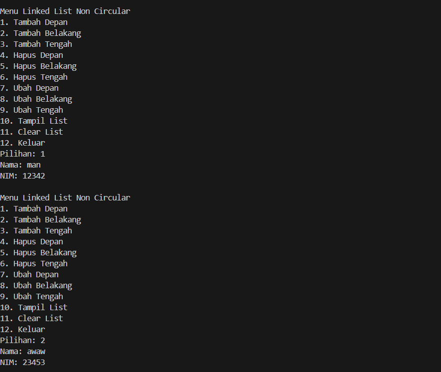
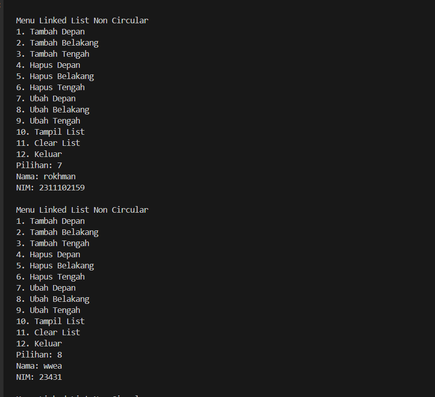
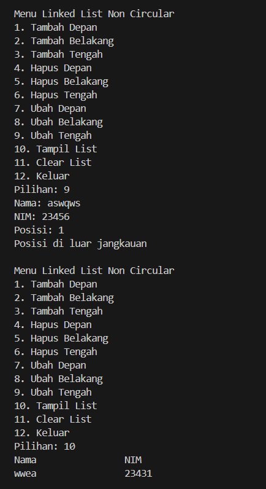
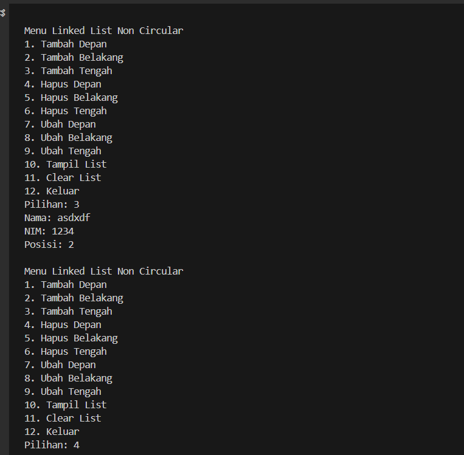
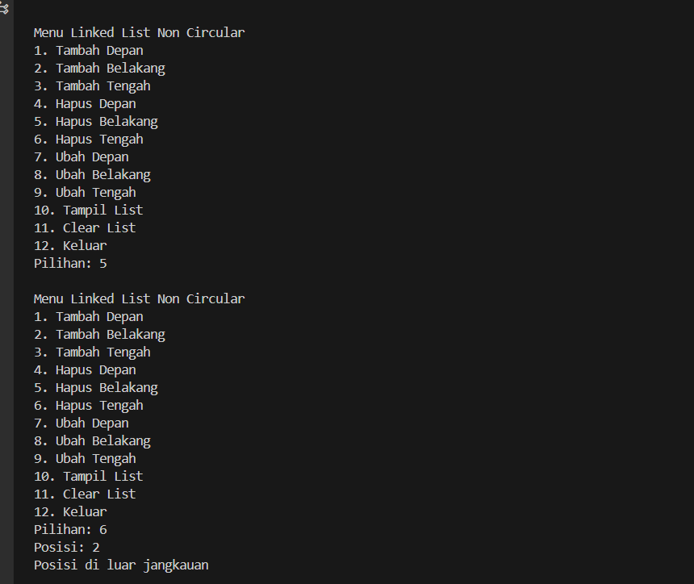
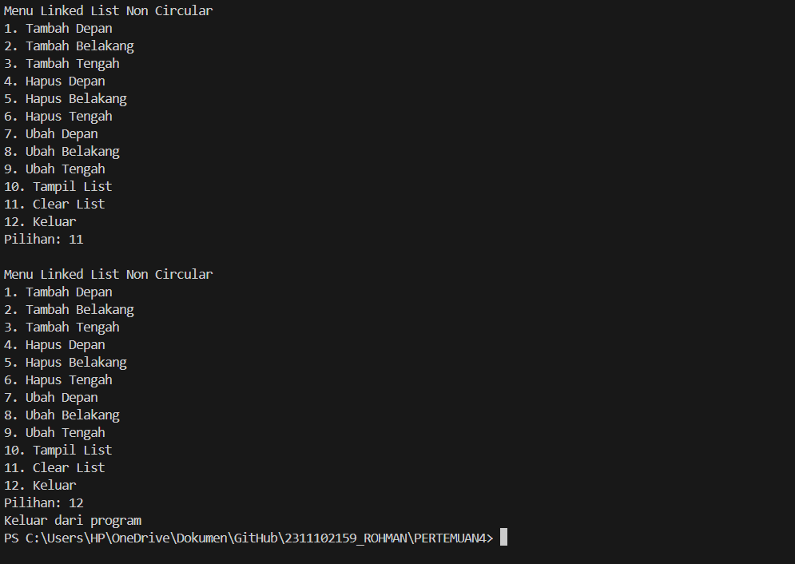

# <h1 align="center">LAPORAN PRAKTIKUM MODUL 4 : LINKED LIST CIRCULAR DAN NON CIRCULAR</h1>
<p align="center">ANANDA MAULUDIN AR ROKHMAN - 2311102159</p>

# Dasar Teori

## Linked list 

Linked List adalah kumpulan elemen yang terhubung melalui pointer. Setiap elemen memiliki pointer yang menyimpan alamat memori, bisa berupa data atau pointer lain. Elemen pertama disebut head, dan jika kosong, head menunjuk ke NULL. Elemen terakhir disebut tail dengan pointer yang menunjuk ke NULL. Linked list memungkinkan penyimpanan data dengan alokasi memori dinamis, dan mudah dalam penambahan serta penghapusan elemen, namun ia memiliki kelemahan dalam akses acak yang lambat dan kebutuhan ruang ekstra untuk pointer. Linked list sering digunakan untuk data yang sering mengalami perubahan dan membutuhkan fleksibilitas dalam operasi penambahan atau penghapusan. Selain itu, linked list juga sering digunakan dalam implementasi struktur data lain seperti stack, queue, dan graph.

Terdapat beberapa jenis linked list, yaitu:
### Single Linked List
1. Single linked list Non Circular
Single linked list Non Circular adalah jenis struktur data linked list yang terdiri dari sejumlah node yang setiap node hanya memiliki satu pointer, yaitu pointer yang digunakan untuk menunjuk ke node selanjutnya dalam urutan linked list, kecuali untuk node terakhir yang disebut sebagai tail. Pada node tail atau node terakhir ini, pointer yang dimilikinya menunjuk ke NULL, menandakan akhir dari linked list tersebut.

2. Single Linked List Circular
Single Linked List Circular adalah suatu jenis linked list di mana setiap node memiliki sebuah field pointer yang menunjuk ke node berikutnya dalam urutan, tetapi dengan satu keistimewaan. Keistimewaan tersebut adalah pointer next dari node terakhir akan kembali menunjuk ke node pertama atau head, sehingga membentuk suatu lingkaran atau sirkuit. Dengan kata lain, dalam Single Linked List Circular, node tail atau node terakhir akan selalu menunjuk kembali ke node head atau node pertama, menghasilkan suatu struktur data yang berputar atau bersirkulasi.

### Double Linked List
1. Double Linked List Non Circular
Double Linked List Non Circular, saat berada pada node yang berfungsi sebagai head atau node pertama dalam linked list, nilai dari pointer prev pada node tersebut akan diatur menjadi NULL. Hal ini dikarenakan node head tidak memiliki node sebelumnya. Sedangkan untuk node yang berfungsi sebagai tail atau node terakhir dalam linked list, nilai dari pointer next pada node tersebut akan diatur untuk menunjuk ke NULL, menandakan akhir dari linked list tersebut.

2. Double Linked List Circular
Double Linked List Circular adalah jenis linked list di mana field pointer-nya terdiri dari dua buah pointer yang bergerak ke dua arah, yaitu prev dan next. Selain itu, pointer next pada Double Linked List Circular akan menunjuk kembali pada elemen tersebut sendiri, menciptakan sebuah pola sirkular. Dengan kata lain, baik pointer next maupun pointer prev pada Double Linked List Circular akan membentuk sebuah loop yang menghubungkan setiap elemen dalam struktur data ini secara berputar.

## Guided 

### 1. [Program Linked List Non Circular]

```C++
#include <iostream>
using namespace std;

// Deklarasi struct node
struct Node {
    int data;
    Node *next;
};

Node *head;
Node *tail;

// Inisialisasi node
void init() {
    head = NULL;
    tail = NULL;
}

// Pengecekan apakah kosong
bool isEmpty() {
    if (head == NULL)
        return true;
    else
        return false;
}

// Tambah depan
void insertDepan(int nilai) {
    // Buat node baru
    Node *baru = new Node;
    baru->data = nilai;
    baru->next = NULL;
    if (isEmpty()) {
        head = tail = baru;
        tail->next = NULL;
    } else {
        baru->next = head;
        head = baru;
    }
}

// Tambah belakang
void insertBelakang(int nilai) {
    // Buat node baru
    Node *baru = new Node;
    baru->data = nilai;
    baru->next = NULL;
    if (isEmpty()) {
        head = tail = baru;
        tail->next = NULL;
    } else {
        tail->next = baru;
        tail = baru;
    }
}

// Hitung jumlah list
int hitungList() {
    Node *hitung = head;
    int jumlah = 0;
    while (hitung != NULL) {
        jumlah++;
        hitung = hitung->next;
    }
    return jumlah;
}

// Tambah tengah
void insertTengah(int data, int posisi) {
    if (posisi < 1 || posisi > hitungList()) {
        cout << "Posisi di luar jangkauan" << endl;
    } else if (posisi == 1) {
        cout << "Posisi bukan posisi tengah" << endl;
    } else {
        Node *baru, *bantu;
        baru = new Node();
        baru->data = data;

        // Transversing
        bantu = head;
        int nomor = 1;
        while (nomor < posisi - 1) {
            bantu = bantu->next;
            nomor++;
        }
        baru->next = bantu->next;
        bantu->next = baru;
    }
}

// Hapus depan
void hapusDepan() {
    Node *hapus;
    if (!isEmpty()) {
        if (head->next != NULL) {
            hapus = head;
            head = head->next;
            delete hapus;
        } else {
            head = tail = NULL;
        }
    } else {
        cout << "List kosong" << endl;
    }
}

// Hapus tengah
void hapusTengah(int posisi) {
    Node *bantu, *hapus, *sebelum;
    if (posisi < 1 || posisi > hitungList()) {
        cout << "Posisi di luar jangkauan" << endl;
    } else if (posisi == 1) {
        cout << "Posisi bukan posisi tengah" << endl;
    } else {
        int nomor = 1;
        bantu = head;
        while (nomor <= posisi) {
            if (nomor == posisi - 1) {
                sebelum = bantu;
            }
            if (nomor == posisi) {
                hapus = bantu;
            }
            bantu = bantu->next;
            nomor++;
        }
        sebelum->next = bantu;
        delete hapus;
    }
}

// Ubah depan
void ubahDepan(int data) {
    if (!isEmpty()) {
        head->data = data;
    } else {
        cout << "List masih kosong!" << endl;
    }
}

// Ubah tengah
void ubahTengah(int data, int posisi) {
    Node *bantu;
    if (!isEmpty()) {
        if (posisi < 1 || posisi > hitungList()) {
            cout << "Posisi di luar jangkauan" << endl;
        } else if (posisi == 1) {
            cout << "Posisi bukan posisi tengah" << endl;
        } else {
            bantu = head;
            int nomor = 1;
            while (nomor < posisi) {
                bantu = bantu->next;
                nomor++;
            }
            bantu->data = data;
        }
    } else {
        cout << "List masih kosong!" << endl;
    }
}

// Ubah belakang
void ubahBelakang(int data) {
    if (!isEmpty()) {
        tail->data = data;
    } else {
        cout << "List masih kosong!" << endl;
    }
}

// Hapus semua list
void clearList() {
    Node *bantu, *hapus;
    bantu = head;
    while (bantu != NULL) {
        hapus = bantu;
        bantu = bantu->next;
        delete hapus;
    }
    head = tail = NULL;
    cout << "List berhasil terhapus!" << endl;
}

// Tampilkan list
void tampil() {
    Node *bantu;
    bantu = head;
    if (!isEmpty()) {
        while (bantu != NULL) {
            cout << bantu->data << " ";
            bantu = bantu->next;
        }
        cout << endl;
    } else {
        cout << "List masih kosong!" << endl;
    }
}

int main() {
    init();
    insertDepan(3);
    tampil();
    insertBelakang(5);
    tampil();
    insertDepan(2);
    tampil();
    insertDepan(1);
    tampil();
    hapusDepan();
    tampil();
    hapusTengah(2);
    tampil();
    insertTengah(7, 2);
    tampil();
    hapusTengah(2);
    tampil();
    ubahDepan(1);
    tampil();
    ubahBelakang(8);
    tampil();
    ubahTengah(11, 2);
    tampil();
    return 0;
}
```

Kode di atas digunakan untuk mengimplementasikan program data dalam bentuk single linked list non-circular. Program ini menggunakan struct Node untuk menyimpan data Nama dan NIM mahasiswa. Program ini menggunakan struct Node yang memiliki data dan pointer ke node selanjutnya. Setiap node juga memiliki pointer ke node awal dan node terakhir dari Linked List. Program ini juga menggunakan input-output dan looping untuk menampilkan menu pengguna dan mengelola pilihan pengguna. Pengguna dapat menambah, mengubah, dan menghapus data dari Linked List sesuai dengan pilihan yang dipilih. Program akan berjalan hingga pengguna memilih untuk keluar. Dalam Program ini berisi tentang untuk menyimpan, mengubah, dan menghapus data Nama dan NIM mahasiswa dalam Linked List.


### 2. [Program Linked List Circular]

```C++
#include <iostream>
using namespace std;

// Deklarasi Struct Node
struct Node
{
    string data;
    Node* next;
};

Node* head, * tail, * baru, * bantu, * hapus;

void init()
{
    head = NULL;
    tail = head;
}

// Pengecekan
int isEmpty()
{
    if (head == NULL)
        return 1; // true
    else
        return 0; // false
}

// Buat Node Baru
void buatNode(string data)
{
    baru = new Node;
    baru->data = data;
    baru->next = NULL;
}

// Hitung List
int hitungList()
{
    bantu = head;
    int jumlah = 0;
    while (bantu != NULL)
    {
        jumlah++;
        bantu = bantu->next;
    }
    return jumlah;
}

// Tambah Depan
void insertDepan(string data)
{
    // Buat Node baru
    buatNode(data);

    if (isEmpty() == 1)
    {
        head = baru;
        tail = head;
        baru->next = head;
    }
    else
    {
        while (tail->next != head)
        {
            tail = tail->next;
        }
        baru->next = head;
        head = baru;
        tail->next = head;
    }
}

// Tambah Belakang
void insertBelakang(string data)
{
    // Buat Node baru
    buatNode(data);

    if (isEmpty() == 1)
    {
        head = baru;
        tail = head;
        baru->next = head;
    }
    else
    {
        while (tail->next != head)
        {
            tail = tail->next;
        }
        tail->next = baru;
        baru->next = head;
    }
}

// Tambah Tengah
void insertTengah(string data, int posisi)
{
    if (isEmpty() == 1)
    {
        head = baru;
        tail = head;
        baru->next = head;
    }
    else
    {
        baru->data = data;
        // transversing
        int nomor = 1;
        bantu = head;
        while (nomor < posisi - 1)
        {
            bantu = bantu->next;
            nomor++;
        }
        baru->next = bantu->next;
        bantu->next = baru;
    }
}

// Hapus Depan
void hapusDepan()
{
    if (isEmpty() == 0)
    {
        hapus = head;
        tail = head;
        if (hapus->next == head)
        {
            head = NULL;
            tail = NULL;
            delete hapus;
        }
        else
        {
            while (tail->next != hapus)
            {
                tail = tail->next;
            }
            head = head->next;
            tail->next = head;
            hapus->next = NULL;
            delete hapus;
        }
    }
    else
    {
        cout << "List masih kosong!" << endl;
    }
}

// Hapus Belakang
void hapusBelakang()
{
    if (isEmpty() == 0)
    {
        hapus = head;
        tail = head;
        if (hapus->next == head)
        {
            head = NULL;
            tail = NULL;
            delete hapus;
        }
        else
        {
            while (hapus->next != head)
            {
                hapus = hapus->next;
            }
            while (tail->next != hapus)
            {
                tail = tail->next;
            }
            tail->next = head;
            hapus->next = NULL;
            delete hapus;
        }
    }
    else
    {
        cout << "List masih kosong!" << endl;
    }
}

// Hapus Tengah
void hapusTengah(int posisi)
{
    if (isEmpty() == 0)
    {
        // transversing
        int nomor = 1;
        bantu = head;
        while (nomor < posisi - 1)
        {
            bantu = bantu->next;
            nomor++;
        }
        hapus = bantu->next;
        bantu->next = hapus->next;
        delete hapus;
    }
    else
    {
        cout << "List masih kosong!" << endl;
    }
}

// Hapus List
void clearList()
{
    if (head != NULL)
    {
        hapus = head->next;
        while (hapus != head)
        {
            bantu = hapus->next;
            delete hapus;
            hapus = bantu;
        }
        delete head;
        head = NULL;
    }
    cout << "List berhasil terhapus!" << endl;
}

// Tampilkan List
void tampil()
{
    if (isEmpty() == 0)
    {
        tail = head;
        do
        {
            cout << tail->data << ends;
            tail = tail->next;
        } while (tail != head);
        cout << endl;
    }
    else
    {
        cout << "List masih kosong!" << endl;
    }
}

int main()
{
    init();
    insertDepan("Ayam");
    tampil();
    insertDepan("Bebek");
    tampil();
    insertBelakang("Cicak");
    tampil();
    insertBelakang("Domba");
    tampil();
    hapusBelakang();
    tampil();
    hapusDepan();
    tampil();
    insertTengah("Sapi", 2);
    tampil();
    hapusTengah(2);
    tampil();
    return 0;
}
```

Kode di atas digunakan untuk mengimplementasikan program yang menggunakan single linked list circular. Dalam program ini, memiliki sebuah struktur(struct) yang dinamakan Node dengan berisi informasi data dalam bentuk string dan pointer yang menunjuk ke node berikutnya. Kemudian, mendeklarasikan struktur Node dengan informasi string data dan pointer next. Dan mendeklarasikan beberapa variabel seperti head, tail, baru, bantu, dan hapus yang semuanya bertipe pointer Node. selanjutnya, membuat beberapa fungsi untuk menambahkan data ke dalam list, baik di bagian depan, belakang, maupun di tengah list. Selain itu, ada juga fungsi untuk menghapus data dari list, menghitung jumlah data, menampilkan seluruh data, dan menghapus semua data dalam list. Kemudian program memanggil fungsi-fungsi tersebut di dalam fungsi main. Hasil tampilan output program di atas adalah:
-Ayam
-Bebek Ayam
-Bebek Ayam Cicak
-Bebek Ayam Cicak Domba
-Bebek Ayam Cicak
-Ayam Cicak
-Ayam Sapi Cicak
-Ayam Cicak

## Unguided 

### 1. [Buatlah program menu Linked List Non Circular untuk menyimpan Nama dan NIM mahasiswa, dengan menggunakan input dari user.
]

```C++
// LAPRAK 4 : UNGUIDED 
// ANANDA MAULUDIN AR
// 2311102159
// S1 IF-11-D

// Program menu Linked List Non Circular untuk menyimpan Nama dan NIM mahasiswa
#include <iostream>
#include <iomanip> // untuk mengatur format output, seperti mengatur presisi desimal, lebar bidang, dan tata letak output

using namespace std;

// Deklarasi Struct Node
struct Node {
    string Nama_159; // Menyimpan Nama
    string NIM_159; // Menyimpan NIM
    Node *next_159; // Pointer ke node berikutnya dalam linked list
};

Node *head_159; // Pointer ke node awal dari linked list
Node *tail_159; // Pointer ke node terakhir dari linked list

// Inisialisasi linked list
void init_159() {
    head_159 = nullptr;
    tail_159 = nullptr;
}

// Pengecekan apakah linked list kosong atau tidak
bool isEmpty_159() {
    return head_159 == nullptr;
}

// Tambah Node di depan linked list
void insertDepan_159(const string& Nama_159, const string& NIM_159) {
    Node *baru_159 = new Node;
    baru_159->Nama_159 = Nama_159;
    baru_159->NIM_159 = NIM_159;
    baru_159->next_159 = head_159;

    if (isEmpty_159()) {
        tail_159 = baru_159;
    }

    head_159 = baru_159;
}

// Tambah Node di belakang linked list
void insertBelakang_159(const string& Nama_159, const string& NIM_159) {
    Node *baru_159 = new Node;
    baru_159->Nama_159 = Nama_159;
    baru_159->NIM_159 = NIM_159;
    baru_159->next_159 = nullptr;

    if (isEmpty_159()) {
        head_159 = tail_159 = baru_159;
    } else {
        tail_159->next_159 = baru_159;
        tail_159 = baru_159;
    }
}

// Menghitung jumlah Node dalam linked list
int hitungList_159() {
    int jumlah_159 = 0;
    for (Node *current = head_159; current != nullptr; current = current->next_159) {
        jumlah_159++;
    }
    return jumlah_159;
}

// Tambah Node di posisi tertentu dalam linked list
void insertTengah_159(const string& Nama_159, const string& NIM_159, int posisiNama_159) {
    if (posisiNama_159 < 2 || posisiNama_159 > hitungList_159()) {
        cout << "Posisi di luar jangkauan" << endl;
        return;
    }

    Node *baru_159 = new Node;
    baru_159->Nama_159 = Nama_159;
    baru_159->NIM_159 = NIM_159;

    Node *current = head_159;
    for (int i = 1; i < posisiNama_159 - 1; i++) {
        current = current->next_159;
    }

    baru_159->next_159 = current->next_159;
    current->next_159 = baru_159;
}

// Hapus Node di depan linked list
void hapusDepan_159() {
    if (isEmpty_159()) {
        cout << "List masih kosong!" << endl;
        return;
    }

    Node *hapus_159 = head_159;
    head_159 = head_159->next_159;
    delete hapus_159;

    if (head_159 == nullptr) {
        tail_159 = nullptr;
    }
}

// Hapus Node di belakang linked list
void hapusBelakang_159() {
    if (isEmpty_159()) {
        cout << "List masih kosong!" << endl;
        return;
    }

    if (head_159 == tail_159) {
        delete head_159;
        head_159 = tail_159 = nullptr;
    } else {
        Node *current = head_159;
        while (current->next_159 != tail_159) {
            current = current->next_159;
        }
        delete tail_159;
        tail_159 = current;
        tail_159->next_159 = nullptr;
    }
}

// Hapus Node di posisi tertentu dalam linked list
void hapusTengah_159(int posisi_159) {
    if (posisi_159 < 2 || posisi_159 > hitungList_159()) {
        cout << "Posisi di luar jangkauan" << endl;
        return;
    }

    Node *current = head_159;
    for (int i = 1; i < posisi_159 - 1; i++) {
        current = current->next_159;
    }

    Node *hapus_159 = current->next_159;
    current->next_159 = hapus_159->next_159;
    delete hapus_159;
}

// Ubah Node di depan linked list
void ubahDepan_159(const string& Nama_159, const string& NIM_159) {
    if (isEmpty_159()) {
        cout << "List masih kosong!" << endl;
        return;
    }

    head_159->Nama_159 = Nama_159;
    head_159->NIM_159 = NIM_159;
}

// Ubah Node di belakang linked list
void ubahBelakang_159(const string& Nama_159, const string& NIM_159) {
    if (isEmpty_159()) {
        cout << "List masih kosong!" << endl;
        return;
    }

    tail_159->Nama_159 = Nama_159;
    tail_159->NIM_159 = NIM_159;
}

// Ubah Node di posisi tertentu dalam linked list
void ubahTengah_159(const string& Nama_159, const string& NIM_159, int posisiNama_159) {
    if (posisiNama_159 < 2 || posisiNama_159 > hitungList_159()) {
        cout << "Posisi di luar jangkauan" << endl;
        return;
    }

    Node *current = head_159;
    for (int i = 1; i < posisiNama_159; i++) {
        current = current->next_159;
    }

    current->Nama_159 = Nama_159;
    current->NIM_159 = NIM_159;
}

// Menghapus seluruh Node dalam linked list
void clearList_159() {
    while (!isEmpty_159()) {
        hapusDepan_159();
    }
}

// Menampilkan seluruh Node dalam linked list
void tampilList_159() {
    if (isEmpty_159()) {
        cout << "List masih kosong!" << endl;
        return;
    }

    cout << left << setw(20) << "Nama" << "NIM" << endl;
    for (Node *current = head_159; current != nullptr; current = current->next_159) {
        cout << left << setw(20) << current->Nama_159 << current->NIM_159 << endl;
    }
}

// Fungsi utama main
int main() {
    int pilihan_159;
    string Nama_159, NIM_159;
    int posisi_159;

    do {
        cout << "\nMenu Linked List Non Circular\n";
        cout << "1. Tambah Depan\n";
        cout << "2. Tambah Belakang\n";
        cout << "3. Tambah Tengah\n";
        cout << "4. Hapus Depan\n";
        cout << "5. Hapus Belakang\n";
        cout << "6. Hapus Tengah\n";
        cout << "7. Ubah Depan\n";
        cout << "8. Ubah Belakang\n";
        cout << "9. Ubah Tengah\n";
        cout << "10. Tampil List\n";
        cout << "11. Clear List\n";
        cout << "12. Keluar\n";
        cout << "Pilihan: ";
        cin >> pilihan_159;

        cin.ignore(); // Mengabaikan newline character setelah input pilihan
        switch (pilihan_159) {
            case 1:
                cout << "Nama: ";
                getline(cin, Nama_159);
                cout << "NIM: ";
                getline(cin, NIM_159);
                insertDepan_159(Nama_159, NIM_159);
                break;
            case 2:
                cout << "Nama: ";
                getline(cin, Nama_159);
                cout << "NIM: ";
                getline(cin, NIM_159);
                insertBelakang_159(Nama_159, NIM_159);
                break;
            case 3:
                cout << "Nama: ";
                getline(cin, Nama_159);
                cout << "NIM: ";
                getline(cin, NIM_159);
                cout << "Posisi: ";
                cin >> posisi_159;
                insertTengah_159(Nama_159, NIM_159, posisi_159);
                cin.ignore(); // Mengabaikan newline character setelah input posisi
                break;
            case 4:
                hapusDepan_159();
                break;
            case 5:
                hapusBelakang_159();
                break;
            case 6:
                cout << "Posisi: ";
                cin >> posisi_159;
                hapusTengah_159(posisi_159);
                cin.ignore(); // Mengabaikan newline character setelah input posisi
                break;
            case 7:
                cout << "Nama: ";
                getline(cin, Nama_159);
                cout << "NIM: ";
                getline(cin, NIM_159);
                ubahDepan_159(Nama_159, NIM_159);
                break;
            case 8:
                cout << "Nama: ";
                getline(cin, Nama_159);
                cout << "NIM: ";
                getline(cin, NIM_159);
                ubahBelakang_159(Nama_159, NIM_159);
                break;
            case 9:
                cout << "Nama: ";
                getline(cin, Nama_159);
                cout << "NIM: ";
                getline(cin, NIM_159);
                cout << "Posisi: ";
                cin >> posisi_159;
                ubahTengah_159(Nama_159, NIM_159, posisi_159);
                cin.ignore(); // Mengabaikan newline character setelah input posisi
                break;
            case 10:
                tampilList_159();
                break;
            case 11:
                clearList_159();
                break;
            case 12:
                cout << "Keluar dari program\n";
                break;
            default:
                cout << "Pilihan tidak valid\n";
        }
    } while (pilihan_159 != 12);

    return 0;
}


```
#### Output:






### 2. [Setelah membuat menu tersebut, masukkan data sesuai urutan berikut, lalu tampilkan data yang telah dimasukkan. (Gunakan insert depan, belakang atau tengah)
.PNG)]

#### Output:




### 3. [Lakukan perintah berikut: 
]


#### Output:


Kode di atas digunakan untuk implementasi Linked List Non-Circular untuk membuat program menu, dengan menyimpan Nama dan NIM mahasiswa. Program ini menggunakan struct Node yang memiliki data Nama dan NIM, serta pointer ke node selanjutnya dalam linked list dengan sangat kompleks. Program ini memiliki beberapa fungsi untuk menyimpan, mengubah, dan menghapus data dalam linked list. Berikut fungsi yang tersedia adalah:

init_138(): Fungsi untuk memulihkan linked list ke keadaan awal, dengan mengatur pointer ke node awal dan node terakhir ke NULL.
isEmpty_138(): Fungsi untuk mengecek apakah linked list kosong atau tidak.
insertDepan_138(): Fungsi untuk menambah data di depan linked list.
insertBelakang_138(): Fungsi untuk menambah data di belakang linked list.
hitungList_138(): Fungsi untuk menghitung jumlah node dalam linked list.
insertTengah_138(): Fungsi untuk menambah data di posisi tertentu dalam linked list.
hapusDepan_138(): Fungsi untuk menghapus data di depan linked list.
hapusBelakang_138(): Fungsi untuk menghapus data di belakang linked list.
hapusTengah_138(): Fungsi untuk menghapus data di posisi tertentu dalam linked list.
ubahDepan_138(): Fungsi untuk mengubah data di depan linked list.
ubahBelakang_138(): Fungsi untuk mengubah data di belakang linked list.
ubahTengah_138(): Fungsi untuk mengubah data di posisi tertentu dalam linked list.
clearList_138(): Fungsi untuk menghapus semua data dalam linked list.
tampilList_138(): Fungsi untuk menampilkan data dalam linked list.

Program ini menggunakan input-output dan looping untuk menampilkan menu pengguna dengan mengelola pilihan atau inputan dari pengguna. Pengguna dapat menambah, mengubah, dan menghapus data dalam linked list sesuai dengan pilihan yang dipilih. Program akan berjalan hingga pengguna memilih untuk keluar (Pilih_138 = 0). Program ini dapat digunakan untuk menyimpan, mengubah, dan menghapus data Nama dan NIM mahasiswa dalam linked list. 

## Kesimpulan
Kesimpulannya, pada modul 4 ini Linked List terdapat banyak jenis, yaitu Single Linked List Circular dan Non-Circular, serta Double Linked List Circular dan Non-Circular. Linked list adalah kumpulan elemen yang saling terhubung melalui pointer

- Single Linked List Circular: Tidak ada simpul null, traversal tidak memiliki batas akhir, namun memerlukan penanganan khusus agar tidak terjebak dalam pengulangan tak terbatas.
- Single Linked List Non-Circular: Sederhana dalam implementasi, efisien dalam penggunaan memori, namun traversal terbatas ke depan saja.
- Double Linked List Circular: Memungkinkan traversal dari mana saja dalam lingkaran, dan operasi penghapusan/penambahan di ujung list lebih efisien, namun juga memerlukan penanganan khusus dan penggunaan memori yang lebih besar.
- Double Linked List Non-Circular: Lebih fleksibel dengan traversal maju dan mundur, namun memerlukan lebih banyak ruang memori dan implementasi yang lebih rumit.

Dalam pemilihan jenis linked list, pertimbangkan kebutuhan spesifik antara efisiensi ruang dan waktu operasi. Circular linked list Cocok untuk navigasi data maju dan mundur terus menerus, serta lebih fleksibel dalam hal navigasi. Non-circular linked list Lebih sederhana dan efisien dalam hal memori.

## Referensi
[1] Dr. Joseph Teguh Santoso., Struktur Data dan ALgoritma. Semarang: Yayasan Prima Agus Teknik, 2021.
[2] Rafsanjani, Malik Akbar Hashemi. "Implementasi Algoritma Pengurutan General Purpose dan Berbasis Komparasi untuk Data Berkategori dalam Waktu Linier Tanpa Paralelisasi" (2021).