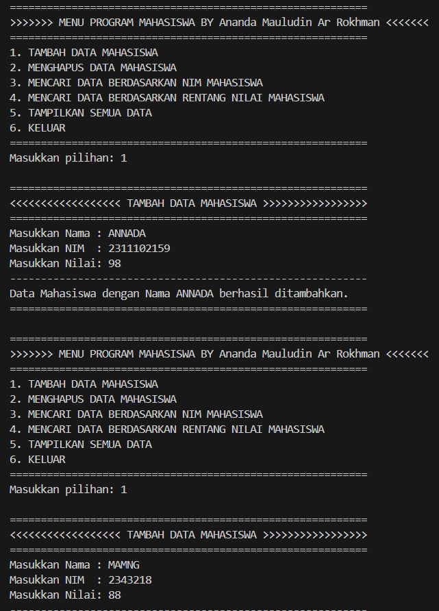
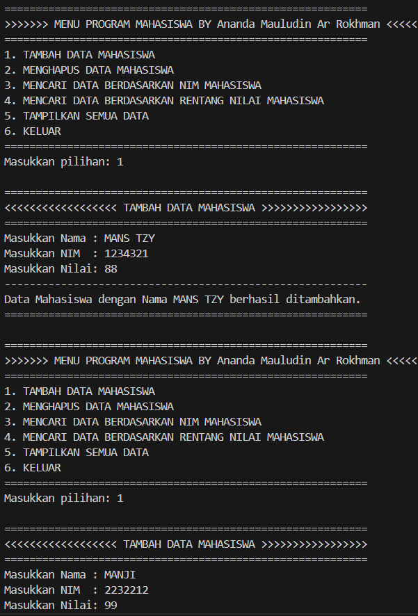
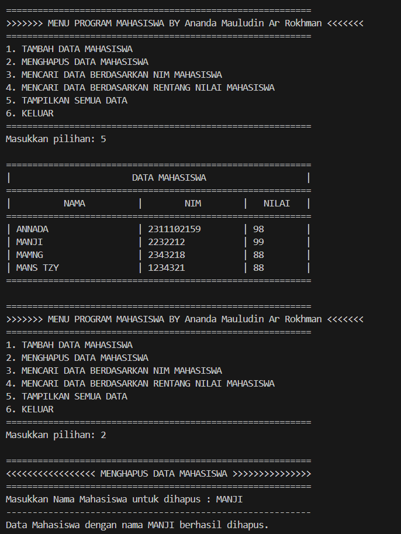
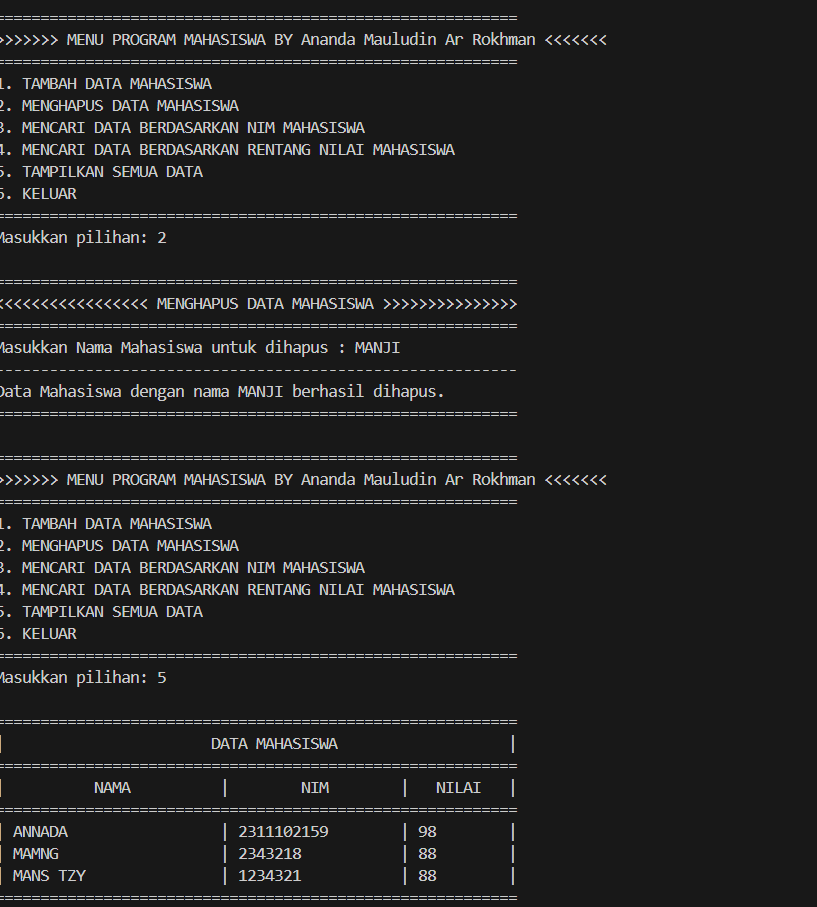
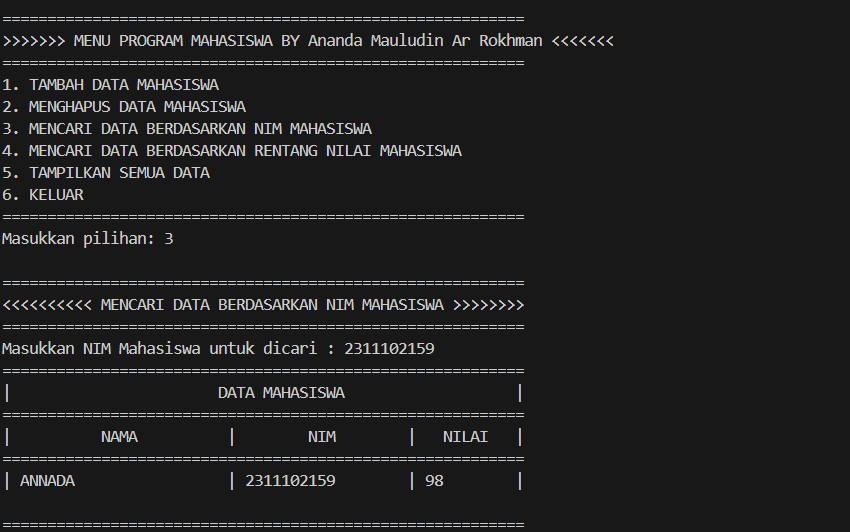
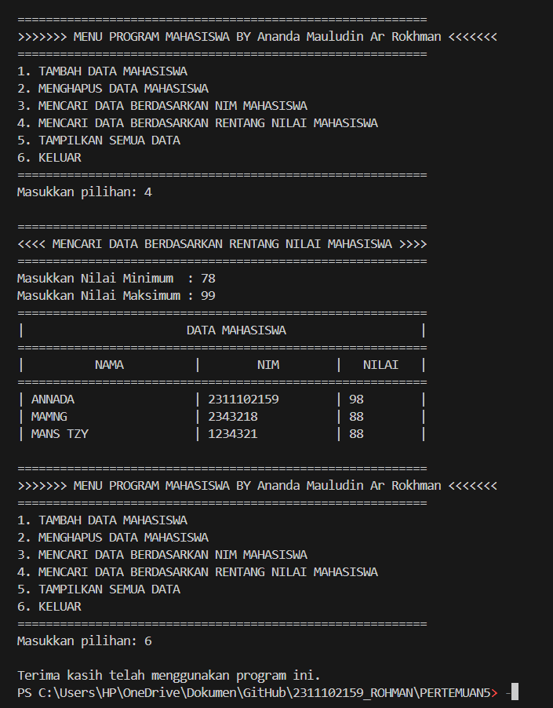

# <h1 align="center">Laporan Praktikum HASH TABLE</h1>
# <p align="center">Ananda Mauludin A Rokhman-2311102159 </p>

## Dasar Teori

hash table adalah  struktur data yang terdiri dari tabel dan fungsi yang bertujuan untuk memetakan nilai kunci unik  setiap record (baris) ke nomor (hash) untuk posisi record  dalam  tabel. Kelebihan dari struktur table hash  ini adalah waktu pengambilannya yang cukup cepat, jika record yang dicari letaknya tepat pada nomor hash lokasi penyimpanan. Karena pemetaan hash  yang digunakan bukan pemetaan satu-ke-satu (antara dua record berbeda yang  dapat menghasilkan nomor hash yang sama), maka dapat terjadi konflik saat menempatkan record data. diperlukan untuk menerapkan kebijakan resolusi konflik. Kebijakan) untuk menentukan lokasi record dalam tabel. Biasanya kebijakan penyelesaian konflik adalah dengan mencari  tabel  kosong di lokasi setelah lokasi konflik.

hash table menggunakan struktur data array asosiatif yang mengaitkan catatan dengan bidang kunci unik sebagai angka (hash) yang merupakan representasi catatan. Misalnya, Anda ingin menyimpan data sebagai string  dalam tabel hash. String  direpresentasikan dalam bidang kunci k. Ada berbagai cara untuk mendapatkan bidang kunci ini, namun hasil akhirnya adalah nomor hash yang digunakan untuk menemukan rekaman . Nomor hash ini dimasukkan ke dalam fungsi hash  dan membuat indeks lokasi rekaman yang dicatat dalam tabel. Fungsi generator bidang kunci k(x)  (1) Fungsi hash h(x)  (2) 

## Guided 

### 1. Guided 1 

```C++
#include <iostream>
using namespace std;
const int MAX_SIZE = 10;
// Fungsi hash sederhana
int hash_func(int key)
{
    return key % MAX_SIZE;
}
// Struktur data untuk setiap node
struct Node
{
    int key;
    int value;
    Node *next;
    Node(int key, int value) : key(key), value(value),
                               next(nullptr) {}
};
// Class hash table
class HashTable
{
private:
    Node **table;

public:
    HashTable()
    {
        table = new Node *[MAX_SIZE]();
    }
    ~HashTable()
    {
        for (int i = 0; i < MAX_SIZE; i++)
        {
            Node *current = table[i];
            while (current != nullptr)
            {
                Node *temp = current;
                current = current->next;
                delete temp;
            }
        }
        delete[] table;
    }
    // Insertion
    void insert(int key, int value)
    {
        int index = hash_func(key);
        Node *current = table[index];
        while (current != nullptr)
        {
            if (current->key == key)
            {
                current->value = value;
                return;
            }
            current = current->next;
        }
        Node *node = new Node(key, value);
        node->next = table[index];
        table[index] = node;
    }
    // Searching
    int get(int key)
    {
        int index = hash_func(key);
        Node *current = table[index];
        while (current != nullptr)
        {
            if (current->key == key)
            {
                return current->value;
            }
            current = current->next;
        }
        return -1;
    }
    // Deletion
    void remove(int key)
    {
        int index = hash_func(key);
        Node *current = table[index];
        Node *prev = nullptr;
        while (current != nullptr)
        {
            if (current->key == key)
            {
                if (prev == nullptr)
                {
                    table[index] = current->next;
                }
                else
                {
                    prev->next = current->next;
                }
                delete current;
                return;
            }
            prev = current;
            current = current->next;
        }
    }
    // Traversal
    void traverse()
    {
        for (int i = 0; i < MAX_SIZE; i++)
        {
            Node *current = table[i];
            while (current != nullptr)
            {
                cout << current->key << ": " << current->value
                     << endl;
                current = current->next;
            }
        }
    }
};
int main()
{
    HashTable ht;
    // Insertion
    ht.insert(1, 10);
    ht.insert(2, 20);
    ht.insert(3, 30);
    // Searching
    cout << "Get key 1: " << ht.get(1) << endl;
    cout << "Get key 4: " << ht.get(4) << endl;
    // Deletion
    ht.remove(4);
    // Traversal
    ht.traverse();
    return 0;
}
```
Kode C++ ini mengimplementasikan tabel hash dasar dengan fungsi  penyisipan, pencarian, penghapusan, dan traversal. Berikut detail kodenya: 

- hash_func: Fungsi ini menghitung nilai hash untuk kunci tertentu menggunakan operator modulo.</br>
- Node: Struktur ini mewakili sebuah node dalam tabel hash. Ini berisi pasangan nilai kunci dan penunjuk ke node berikutnya.</br>
- HashTable: Kelas ini mewakili tabel hash. Ini berisi array pointer Node.</br>
- insert: Masukkan pasangan nilai kunci ke dalam tabel hash. Jika kunci sudah ada,  nilai terkait akan diperbarui.</br>
- get: Mendapatkan nilai yang terkait dengan kunci yang ditentukan dari tabel hash.</br>
- remove: Menghapus pasangan nilai kunci yang terkait dengan kunci tertentu dari tabel hash.</br>
- traverse : Cetak semua pasangan nilai kunci di tabel hash.</br>
- main: Fungsi main mendemonstrasikan cara menggunakan tabel hash dengan menyisipkan beberapa pasangan nilai kunci, mencari nilai, mencoba menghapus pasangan nilai kunci, dan menelusuri tabel hash.</br>

### 2. Guided 2

```C++
#include <iostream>
#include <string>
#include <vector>
using namespace std;
const int TABLE_SIZE = 11;
string name;
string phone_number;
class HashNode
{
public:
    string name;
    string phone_number;
    HashNode(string name, string phone_number)
    {
        this->name = name;
        this->phone_number = phone_number;
    }
};
class HashMap
{
private:
    vector<HashNode *> table[TABLE_SIZE];

public:
    int hashFunc(string key)
    {
        int hash_val = 0;
        for (char c : key)
        {
            hash_val += c;
        }
        return hash_val % TABLE_SIZE;
    }
    void insert(string name, string phone_number)
    {
        int hash_val = hashFunc(name);
        for (auto node : table[hash_val])
        {
            if (node->name == name)
            {
                node->phone_number = phone_number;
                return;
            }
        }
        table[hash_val].push_back(new HashNode(name,
                                               phone_number));
    }
    void remove(string name)
    {
        int hash_val = hashFunc(name);
        for (auto it = table[hash_val].begin(); it !=
                                                table[hash_val].end();
             it++)
        {
            if ((*it)->name == name)
            {
                table[hash_val].erase(it);
                return;
            }
        }
    }
    string searchByName(string name)
    {
        int hash_val = hashFunc(name);
        for (auto node : table[hash_val])
        {
            if (node->name == name)
            {
                return node->phone_number;
            }
        }
        return "";
    }
    void print()
    {
        for (int i = 0; i < TABLE_SIZE; i++)
        {
            cout << i << ": ";
            for (auto pair : table[i])
            {
                if (pair != nullptr)
                {
                    cout << "[" << pair->name << ", " << pair->phone_number << "]";
                }
            }
            cout << endl;
        }
    }
};
int main()
{
    HashMap employee_map;
    employee_map.insert("Mistah", "1234");
    employee_map.insert("Pastah", "5678");
    employee_map.insert("Ghana", "91011");
    cout << "Nomer Hp Mistah : "
         << employee_map.searchByName("Mistah") << endl;
    cout << "Phone Hp Pastah : "
         << employee_map.searchByName("Pastah") << endl;
    employee_map.remove("Mistah");
    cout << "Nomer Hp Mistah setelah dihapus : "
         << employee_map.searchByName("Mistah") << endl
         << endl;
    cout << "Hash Table : " << endl;
    employee_map.print();
    return 0;
}
```
Kode C++ ini mengimplementasikan peta hash sederhana untuk menyimpan nama karyawan dan nomor telepon terkait. Mari kita uraikan kodenya: 

- HashNodeclass: Mewakili sebuah node di peta hash. Setiap node berisi nama dan nomor telepon.</br>
- HashMapclass: Mengimplementasikan fungsionalitas peta hash.</br>
- hashFunc: Hitung nilai hash untuk kunci tertentu (nama karyawan) menggunakan metode penambahan nilai ASCII sederhana.</br>
- insert: Masukkan pasangan nilai kunci baru ke dalam peta hash. Jika kunci sudah ada,  nilai terkait akan diperbarui.</br>
- remove: Menghapus pasangan nilai kunci dari peta hash berdasarkan kunci yang diberikan.</br>
- searchByName: Mencari kunci (nama karyawan) dan mengembalikan nilai yang sesuai (nomor telepon).</br>
- print: Cetak isi peta hash.</br>
- Fungsi utama : mendemonstrasikan penggunaan peta hash dengan menyisipkan beberapa pasangan nilai kunci, mencari nilai, menghapus pasangan nilai kunci, dan mencetak peta hash.</br>

## Unguided 

### 1. Implementasikan hash table untuk menyimpan data mahasiswa. Setiap mahasiswa memiliki NIM dan nilai. Implementasikan fungsi untuk menambahkan data baru, menghapus data, mencari data berdasarkan NIM, dan mencari data berdasarkan nilai. Dengan ketentuan : a. Setiap mahasiswa memiliki NIM dan nilai. b. Program memiliki tampilan pilihan menu berisi poin C. c. Implementasikan fungsi untuk menambahkan data baru, menghapus data, mencari data berdasarkan NIM, dan mencari data berdasarkan rentang nilai (80 – 90).

```C++
#include <iostream>
#include <string> // Untuk memanipulasi string ke variable tujuan
#include <vector> // untuk menggunakan struktur data vektor
#include <iomanip> // Untuk mengatur format tabel bidang dalam output

using namespace std;

// Konstanta untuk ukuran tabel hash
const int TABLE_SIZE = 100;

// Kelas HashNode untuk menampung data mahasiswa
class HashNode
{
public:
    string Nama_159; // Menyimpan Nama
    string NIM_159; // Menyimpan NIM
    int Nilai_159; // Menyimpan Nilai

    // Konstruktor untuk inisialisasi data mahasiswa
    HashNode(string Nama_159, string NIM_159, int Nilai_159)
    {
        this->Nama_159 = Nama_159;
        this->NIM_159 = NIM_159;
        this->Nilai_159 = Nilai_159;
    }
};

// Kelas HashMap untuk mengelola data mahasiswa dalam tabel hash
class HashMap
{
private:
    vector<HashNode *> table_159[TABLE_SIZE]; // Tabel hash untuk menyimpan data

public:
    // Fungsi hash untuk menghitung nilai hash dari kunci (nama)
    int hashFunc(string key)
    {
        int hash_val = 0;
        for (char c : key)
        {
            hash_val += c; // Menambahkan nilai ASCII dari setiap karakter
        }
        return hash_val % TABLE_SIZE; // Mengembalikan nilai hash yang terbatas pada ukuran tabel
    }

    // Fungsi untuk memasukkan data mahasiswa ke dalam tabel hash
    void insert(string Nama_159, string NIM_159, int Nilai_159)
    {
        int hash_val = hashFunc(Nama_159);                               // Mendapatkan nilai hash dari nama mahasiswa
        HashNode *node_159 = new HashNode(Nama_159, NIM_159, Nilai_159); // Membuat objek HashNode baru
        table_159[hash_val].push_back(node_159);                         // Menambahkan data mahasiswa ke dalam tabel
        cout << "----------------------------------------------------------\n";
        cout << "Data Mahasiswa dengan Nama " << Nama_159 << " berhasil ditambahkan." << endl;
        cout << "==========================================================\n";
    }

    // Fungsi untuk menghapus data mahasiswa dari tabel hash
    void remove(string Nama_159)
    {
        int hash_val = hashFunc(Nama_159); // Mendapatkan nilai hash dari nama mahasiswa
        for (auto it = table_159[hash_val].begin(); it != table_159[hash_val].end(); ++it)
        {
            if ((*it)->Nama_159 == Nama_159)
            {                                  // Memeriksa apakah nama mahasiswa sesuai
                delete *it;                    // Menghapus objek HashNode
                table_159[hash_val].erase(it); // Menghapus elemen dari vektor
                cout << "----------------------------------------------------------\n";
                cout << "Data Mahasiswa dengan nama " << Nama_159 << " berhasil dihapus." << endl;
                cout << "==========================================================\n";
                return;
            }
        }
        cout << "----------------------------------------------------------\n";
        cout << "Data Mahasiswa dengan nama " << Nama_159 << " tidak ditemukan." << endl;
        cout << "==========================================================\n";
    }

    // Fungsi untuk mencari data mahasiswa berdasarkan NIM
    void searchByNIM(string NIM_159)
    {
        bool found_159 = false;
        for (int i_159 = 0; i_159 < TABLE_SIZE; ++i_159)
        {
            for (auto node_159 : table_159[i_159])
            {
                if (node_159->NIM_159 == NIM_159)
                {                         // Memeriksa apakah NIM sesuai
                    displayHeader();      // Menampilkan header tabel
                    displayRow(node_159); // Menampilkan baris data mahasiswa
                    found_159 = true;
                    return;
                }
            }
        }
        cout << "----------------------------------------------------------\n";
        cout << "Mahasiswa dengan NIM " << NIM_159 << " tidak ditemukan." << endl;
        cout << "==========================================================\n";
    }

    // Fungsi untuk mencari data mahasiswa berdasarkan rentang nilai
    void CariRentangNilai(int NilaiMin_159, int NilaiMax_159)
    {
        bool found_159 = false;
        displayHeader(); // Menampilkan header tabel
        for (int i_159 = 0; i_159 < TABLE_SIZE; ++i_159)
        {
            for (auto node_159 : table_159[i_159])
            {
                if (node_159->Nilai_159 >= NilaiMin_159 && node_159->Nilai_159 <= NilaiMax_159)
                {                         // Memeriksa rentang nilai
                    displayRow(node_159); // Menampilkan baris data mahasiswa
                    found_159 = true;
                }
            }
        }
        if (!found_159)
        {
            cout << "----------------------------------------------------------\n";
            cout << "Tidak ada data Mahasiswa dengan rentang nilai " << NilaiMin_159 << " sampai " << NilaiMax_159 << "." << endl;
            cout << "==========================================================\n";
        }
    }
    // Fungsi untuk menampilkan footer penutup tabel
    void displayFooter()
    {
        cout << "==========================================================\n";
    }

    // Fungsi untuk menampilkan header tabel
    void displayHeader()
    {
        cout << "==========================================================\n";
        cout << "|                       DATA MAHASISWA                   |\n";
        cout << "==========================================================\n";
        cout << "|          NAMA          |        NIM        |   NILAI   |\n";
        cout << "==========================================================\n";
    }

    // Fungsi untuk menampilkan baris data mahasiswa
    void displayRow(HashNode *node_159)
    {
        cout << "| " << left << setw(23) << node_159->Nama_159            // Menampilkan nama
             << "| " << left << setw(18) << node_159->NIM_159             // Menampilkan NIM
             << "| " << left << setw(9) << node_159->Nilai_159 << " |\n"; // Menampilkan nilai
    }

    // Fungsi untuk menampilkan semua data mahasiswa
    void tampilkanSemuaData()
    {
        bool found = false;
        displayHeader(); // Menampilkan header tabel
        for (int i = 0; i < TABLE_SIZE; ++i)
        {
            for (auto node : table_159[i])
            {
                displayRow(node); // Menampilkan baris data mahasiswa
                found = true;
            }
        }
        displayFooter(); // Menampilkan footer penutup tabel
        if (!found)
        {
            cout << "Tidak ada data yang tersimpan." << endl;
        }
    }
};

int main()
{
    HashMap hmap_159; // Membuat objek HashMap
    int Pilihan_159;
    string Nama_159, NIM_159;
    int nilai, NilaiMin_159, NilaiMax_159;

    // Menu utama program
    do
    {
        cout << "\n==========================================================\n";
        cout << ">>>>>>> MENU PROGRAM MAHASISWA BY Ananda Mauludin Ar Rokhman <<<<<<<\n";
        cout << "==========================================================\n";
        cout << "1. TAMBAH DATA MAHASISWA\n";
        cout << "2. MENGHAPUS DATA MAHASISWA\n";
        cout << "3. MENCARI DATA BERDASARKAN NIM MAHASISWA\n";
        cout << "4. MENCARI DATA BERDASARKAN RENTANG NILAI MAHASISWA\n";
        cout << "5. TAMPILKAN SEMUA DATA\n";
        cout << "6. KELUAR\n";
        cout << "==========================================================\n";
        cout << "Masukkan pilihan: ";
        cin >> Pilihan_159; // Meminta input dari pengguna
        cout << endl;
        switch (Pilihan_159)
        {
        case 1: // Untuk pilihan menu menambah data mahasiswa
            cout << "==========================================================\n";
            cout << "<<<<<<<<<<<<<<<<<< TAMBAH DATA MAHASISWA >>>>>>>>>>>>>>>>>\n";
            cout << "==========================================================\n";
            cout << "Masukkan Nama : ";
            cin >> ws;
            getline(cin, Nama_159); // Meminta input nama mahasiswa
            cout << "Masukkan NIM  : ";
            cin >> NIM_159; // Meminta input NIM mahasiswa
            cout << "Masukkan Nilai: ";
            cin >> nilai;                              // Meminta input nilai mahasiswa
            hmap_159.insert(Nama_159, NIM_159, nilai); // Memanggil fungsi untuk memasukkan data mahasiswa
            break;
        case 2: // Untuk pilihan menu menghapus data mahasiswa
            cout << "==========================================================\n";
            cout << "<<<<<<<<<<<<<<<<< MENGHAPUS DATA MAHASISWA >>>>>>>>>>>>>>>\n";
            cout << "==========================================================\n";
            cout << "Masukkan Nama Mahasiswa untuk dihapus : ";
            cin >> ws;
            getline(cin, Nama_159);    // Meminta input nama mahasiswa yang akan dihapus
            hmap_159.remove(Nama_159); // Memanggil fungsi untuk menghapus data mahasiswa
            break;
        case 3: // Untuk pilihan menu Mencari data berdasarkan NIM mahasiswa
            cout << "==========================================================\n";
            cout << "<<<<<<<<<< MENCARI DATA BERDASARKAN NIM MAHASISWA >>>>>>>>\n";
            cout << "==========================================================\n";
            cout << "Masukkan NIM Mahasiswa untuk dicari : ";
            cin >> NIM_159;                // Meminta input NIM mahasiswa yang akan dicari
            hmap_159.searchByNIM(NIM_159); // Memanggil fungsi untuk mencari data berdasarkan NIM
            break;
        case 4: // Untuk pilihan menu Mencari data berdasarkan Rentang nilai mahasiswa
            cout << "==========================================================\n";
            cout << "<<<< MENCARI DATA BERDASARKAN RENTANG NILAI MAHASISWA >>>>\n";
            cout << "==========================================================\n";
            cout << "Masukkan Nilai Minimum  : ";
            cin >> NilaiMin_159; // Meminta input nilai minimum
            cout << "Masukkan Nilai Maksimum : ";
            cin >> NilaiMax_159;                                   // Meminta input nilai maksimum
            hmap_159.CariRentangNilai(NilaiMin_159, NilaiMax_159); // Memanggil fungsi untuk mencari data berdasarkan rentang nilai
            break;
        case 5: // Untuk pilihan menu Menampilkan semua data
            hmap_159.tampilkanSemuaData(); // Memanggil fungsi untuk menampilkan semua data
            break;
        case 6: // Untuk pilihan Keluar menu
            cout << "Terima kasih telah menggunakan program ini." << endl; // Pesan penutup
            break;
        default:
            cout << "Pilihan tidak valid. Silakan pilih sesuai nomor pada menu." << endl; // Pesan kesalahan
        }
    } while (Pilihan_159 != 6); // Melanjutkan program sampai pengguna memilih untuk keluar

    return 0; // Mengakhiri program
}


```

#### Output:









Program C++ ini mengimplementasikan tabel hash untuk menyimpan data siswa (NIM, nama, dan nilai). Ini menyediakan antarmuka berbasis menu untuk melakukan berbagai operasi seperti menambah data, menghapus data, mencari berdasarkan NIM, mencari berdasarkan rentang skor, dan menampilkan semua data siswa.

Berikut rincian kodenya:

1. Nodestruct: Mewakili sebuah node dalam tabel hash. Setiap node berisi NIM, nama, skor, dan penunjuk ke node berikutnya.
   
2. HashTableclass: Mengimplementasikan fungsionalitas tabel hash.
   - insert: Menyisipkan node baru ke dalam tabel hash.</br>
   - Hapus: Menghapus node dari tabel hash berdasarkan NIM yang ditentukan.</br>
   - searchByNIM: Mencari node berdasarkan NIM yang ditentukan dan mengeluarkan data jika ditemukan.</br>
   - searchByRange: Mencari node dengan skor antara 80 dan 90 dan mengeluarkan datanya.</br>
   - displayAllData: Menampilkan semua data siswa yang disimpan dalam tabel hash.</br>
   - displayMenu: Menampilkan opsi menu.</br>
  
3. mainfunction : Logika program utama untuk interaksi pengguna  dengan tabel hash.</br>
   - Tampilkan opsi menu.</br>
   - Gunakan tabel hash untuk melakukan operasi terkait berdasarkan pilihan pengguna.</br>

 

## Kesimpulan
1. Tabel hash adalah struktur data yang mengatur data menjadi pasangan nilai kunci.</br>
2. Tabel hash terdiri dari dua komponen utama: array  (atau vektor) dan fungsi hash.</br>
3. Hashing adalah teknik yang mengubah nilai kunci menjadi rentang indeks array.</br>
4. Fungsi hash digunakan untuk menghasilkan nilai unik dari setiap bagian data dan digunakan sebagai array indeks.</br>
5. Setiap keranjang dapat berisi satu atau lebih item data.</br>
6. Ketika data perlu diambil, input kunci digunakan sebagai parameter  fungsi hash dan indeks posisi array yang dihasilkan digunakan untuk mengambil data.</br>
7. Ketika tabrakan hash terjadi ketika dua atau lebih data memiliki nilai hash yang sama, tabel hash menyimpan data  dalam slot yang sama melalui teknik yang disebut chaining.</br>
8. Struktur Data dan Algoritma dalam Prakteknya mencakup pengertian, landasan teori, dan fungsionalitas tabel hash, serta contoh penggunaan tabel hash dalam pemrograman.</br>


## Referensi
[1] (https://elektro.um.ac.id/wp-content/uploads/2016/04/Struktur-Data-Modul-Praktikum-11-Hashing-Table.pdf)