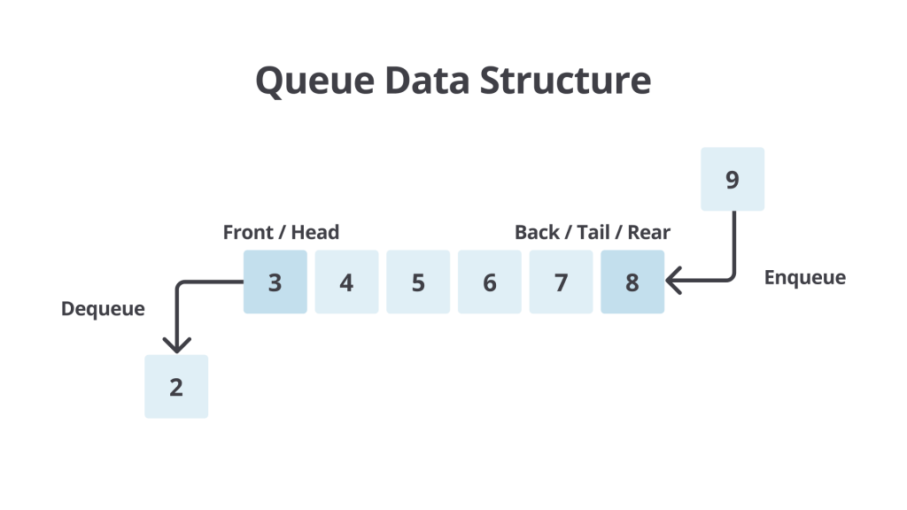
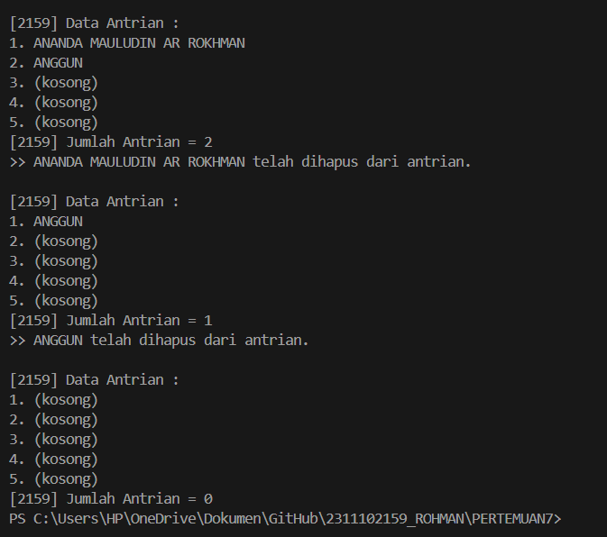
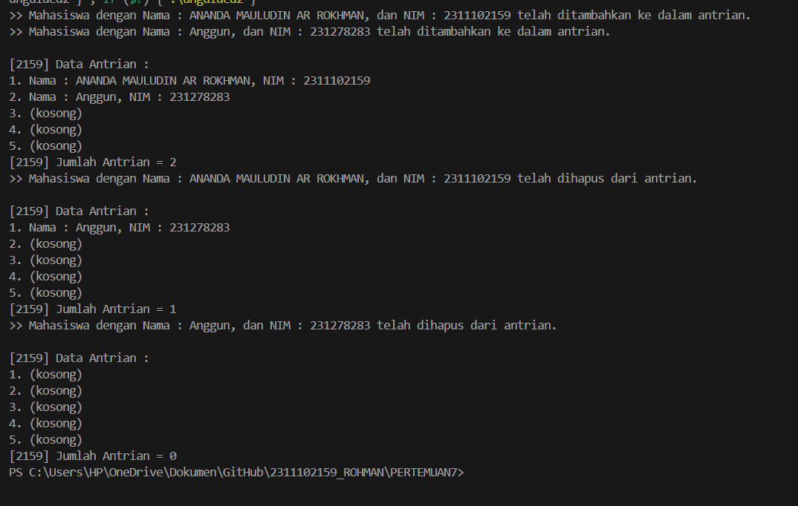

# <h1 align="center">LAPORAN PRAKTIKUM MODUL 7 : QUEUE</h1>
<p align="center">ANANDA MAULUDIN AR ROKHMAN - 2311102159</p>

# Dasar Teori

## A. PENGERTIAN QUEUE
Queue adalah struktur data yang memungkinkan penyimpanan dan pengambilan data dengan prinsip FIFO (First-In First-Out). Artinya, data yang pertama dimasukkan ke dalam queue akan menjadi data yang pertama pula untuk dikeluarkan. Konsep ini serupa dengan antrian pada kehidupan sehari-hari di mana orang yang datang lebih dulu akan dilayani terlebih dahulu. Dalam implementasinya, queue dapat dibangun menggunakan array atau linked list. Struktur data queue memiliki dua pointer utama, yaitu front dan rear. Front mengarah ke elemen pertama dalam queue, sementara rear mengarah ke elemen terakhir.

## B. PERBEDAAN QUEUE DENGAN STRUKTUR DATA YANG LAIN
Perbedaan mendasar antara queue dan struktur data lainnya seperti stack terletak pada aturan penambahan dan penghapusan elemen. Pada stack, penambahan dan penghapusan elemen dilakukan di satu ujung saja. Namun, pada queue, operasi tersebut dilakukan pada ujung yang berbeda karena perubahan data selalu mengacu pada head. Oleh karena itu, hanya terdapat satu jenis operasi untuk menambah atau menghapus elemen, yaitu Enqueue dan Dequeue. Saat Enqueue, elemen ditambahkan setelah elemen terakhir dalam queue. Sedangkan saat Dequeue, head digeser untuk menunjuk pada elemen selanjutnya dalam antrian.

## C. JENIS-JENIS PADA OPERASI QUEUE
Operasi pada Queue melibatkan serangkaian fungsi yang memberikan kita kemampuan untuk berinteraksi dengan struktur data ini. Mari kita jabarkan beberapa operasi dasar yang dapat kita lakukan pada Queue:

### 1. Berdasarkan Implementasinya

#### Linear/Simple Queue: Elemen-elemen data disusun dalam barisan linear dan penambahan serta penghapusan elemen hanya terjadi pada dua ujung barisan. Contoh Linear Queue:

##### Enqueue (Tambahkan Elemen):
- Elemen pertama: 1
- Elemen kedua: 2
- Elemen ketiga: 3
- Elemen keempat: 4
- Elemen kelima: 5
##### Dequeue (Hapus Elemen):
- Elemen pertama: 1 (dihapus)
- Elemen yang tersisa: 2, 3, 4, 5
##### Enqueue (Tambahkan Elemen):
- Elemen pertama: 2 (sebelumnya)
- Elemen kedua: 6
- Elemen ketiga: 7
- Elemen keempat: 8
- Elemen kelima: 9
##### Dequeue (Hapus Elemen):
- Elemen pertama: 2 (dihapus)
- Elemen yang tersisa: 3, 4, 5, 6, 7, 8, 9

#### Circular Queue: Mirip dengan jenis linear, tetapi ujung-ujung barisan terhubung satu sama lain, menciptakan struktur antrean yang berputar. Contoh Circular Queue:

##### Enqueue (Tambahkan Elemen):
- Elemen pertama: 1
- Elemen kedua: 2
- Elemen ketiga: 3
- Elemen keempat: 4
- Elemen kelima: 5
##### Dequeue (Hapus Elemen):
- Elemen pertama: 1 (dihapus)
- Elemen yang tersisa: 2, 3, 4, 5
##### Enqueue (Tambahkan Elemen):
- Elemen pertama: 2 (sebelumnya)
- Elemen kedua: 6
- Elemen ketiga: 7
- Elemen keempat: 8
- Elemen kelima: 9
##### Dequeue (Hapus Elemen):
- Elemen pertama: 2 (dihapus)
- Elemen yang tersisa: 3, 4, 5, 6, 7, 8, 9
##### Enqueue (Tambahkan Elemen):
- Elemen pertama: 3 (sebelumnya)
- Elemen kedua: 10
- Elemen ketiga: 11
- Elemen keempat: 12
- Elemen kelima: 13
##### Dequeue (Hapus Elemen):
- Elemen pertama: 3 (dihapus)
- Elemen yang tersisa: 4, 5, 6, 7, 8, 9, 10, 11, 12, 13

### 2. Berdasarkan Penggunaan

#### Priority Queue: Setiap elemen memiliki prioritas tertentu. Elemen dengan prioritas tertinggi akan diambil terlebih dahulu.Elemen dengan prioritas rendah akan dihapus setelah elemen dengan prioritas tinggi. Contoh Priority Queue:

##### Enqueue (Tambahkan Elemen):
- Elemen pertama: 1 (prioritas tinggi)
- Elemen kedua: 3 (prioritas sedang)
- Elemen ketiga: 2 (prioritas rendah)
- Elemen keempat: 4 (prioritas tinggi)
- Elemen kelima: 5 (prioritas rendah)
##### Dequeue (Hapus Elemen):
- Elemen pertama: 1 (dihapus prioritas tinggi)
- Elemen yang tersisa: 3, 2, 4, 5

#### Double-ended Queue (Dequeue): Elemen dapat ditambahkan atau dihapus dari kedua ujung antrean Contoh Double Ended Queue (Dequeue):

##### Enqueue (Tambahkan Elemen):
- Elemen pertama: 1
- Elemen kedua: 2
- Elemen ketiga: 3
- Elemen keempat: 4
- Elemen kelima: 5
##### Dequeue (Hapus Elemen):
- Elemen pertama: 1 (dihapus urutan paling depan)
- Elemen yang tersisa: 2, 3, 4, 5
##### Dequeue (Hapus Elemen):
- Elemen pertama: 5 (dihapus urutan paling ujung belakang)
- Elemen yang tersisa: 2, 3, 4.

## D. PROSEDUR OPERASI PADA QUEUE:
- enqueue() :menambahkan data kedalam queue.
- dequeue() :mengeluarkan data dari queue.
- peek() :mengambil data dari queue tanpa menghapusnya.
- isEmpty() :mengecek apakah queue kosong atau tidak.
- isFull() :mengecek apakah queue penuh atau tidak.
- size() :menghitung jumlah elemen dalam queue. 

## E. CONTOH ILLUSTRASI QUEUE



## Guided 

### 1. [Program Operasi Queue]

```C++
#include<iostream>
using namespace std;

const int MaksimalAntrian = 5;
int front = 0;
int back = 0;
string QueueTeller[5];

//Mengecek apakah antrian sudah penuh atau belum
bool isFull(){
    if(back == MaksimalAntrian){
        return true;
    } else {
        return false;
    }
}

//Mengecek apakah antrian masih kosong atau tidak
bool isEmpty(){
    if(back == 0){
        return true;
    } else {
        return false;
    }
}

//Menambah antrian
void TambahData(string nama){
    if(isFull()){
        cout << "Antrian sudah penuh" << endl;
    } else if(!isFull()){
        if(isEmpty()){
            QueueTeller[0] = nama;
            front++;
            back++;
        } else if(!isEmpty()){
            QueueTeller[back] = nama;
            back++;
        }
    }
}

//Mengurangi antrian
void KurangAntrian(){
    if(isEmpty()){
        cout << "Antrian masih kosong" << endl;
    } else if(!isEmpty()){
        for(int i = 0; i < back; i++){
            QueueTeller[i] =  QueueTeller[i+1];
        }
        back--;
    }
}

//Menghitung banyak antrian
int Count(){
    return back;
}

//Menghapus seluruh antrian
void ClearQueue(){
    if(isEmpty()){
        cout << "Antrian masih kosong" << endl;
    } else if(!isEmpty()){
        for(int i = 0; i < back; i++){
            QueueTeller[i] = "";
        }
        back = 0;
        front = 0;
    }
}

//Melihat Antrian
void ViewQueue(){
    cout << "Data antrian = " << endl;
    for(int i = 0; i < MaksimalAntrian; i++){
        if(QueueTeller[i] != ""){
            cout << i+1 << ". " << QueueTeller[i] << endl;
        } else {
            cout << i+1 << ". " << "(kosong)" << endl;
        }
    }
    cout << endl;
}

//main fungsi
int main(){
    //Menambah 3 data nama kedalam antrian
    TambahData("Alya");
    TambahData("Kiki");
    TambahData("Artika");

    //menampilkan data yang sudah ditambahkan
    ViewQueue();

    //mengurangi data
    KurangAntrian();

    //menampilkan data setelah dikurangi
    ViewQueue();

    //menghapus seluruh antrian
    ClearQueue();

    //menampilkan data setelah dihapus
    ViewQueue();
}
```

Kode di atas digunakan untuk mengimplementasikan program sederhana dari struktur data queue menggunakan array dalam bahasa C++. Program ini memungkinkan penambahan dan penghapusan elemen dari antrian serta operasi lainnya seperti melihat jumlah elemen dan menghapus semua elemen dalam antrian. Deskripsi singkat fungsi utama:
- isFull(): Memeriksa apakah antrian penuh atau tidak.
- isEmpty(): Memeriksa apakah antrian kosong atau tidak.
- enqueueAntrian(string data): Menambahkan elemen ke dalam antrian.
- dequeueAntrian(): Menghapus elemen dari antrian.
- countQueue(): Menghitung jumlah elemen dalam antrian.
- clearQueue(): Menghapus semua elemen dari antrian.
- viewQueue(): Menampilkan elemen-elemen dalam antrian.

  Fungsi-fungsi ini digunakan dalam fungsi main() untuk melakukan operasi-operasi pada antrian, seperti menambahkan elemen, menampilkan antrian, menghitung jumlah elemen, menghapus elemen, dan menghapus semua elemen dari antrian.


## Unguided 

### 1. [Ubahlah penerapan konsep queue pada bagian guided dari array menjadi linked list]

```C++
// LAPRAK 7 : UNGUIDED 1
// ANANDA MAULUDIN AR ROKHMAN
// 2311102159
// S1 IF-11-D

// Program penerapan konsep queue pada bagian guided dari array menjadi linked list
#include <iostream>
using namespace std;

const int maksimalQueue_159 = 5;  // Maksimal antrian adalah 5

// Node untuk menyimpan data_159 dan pointer ke node berikutnya
struct Node {
    string data_159;
    Node* next_159;
};

class Queue {
private:
    Node* front_159; // Node depan dari antrian
    Node* rear_159;  // Node belakang dari antrian

public: 
    Queue() { // Konstruktor untuk menginisialisasi antrian kosong
        front_159 = nullptr;
        rear_159 = nullptr;
    }

    // Fungsi untuk menambahkan data_159 ke antrian
    void enqueue_159(const string& data_159) {
        Node* newNode_159 = new Node;
        newNode_159->data_159 = data_159;
        newNode_159->next_159 = nullptr;
        
        // Jika antrian kosong
        if (isEmpty_159()) { // Jika antrian kosong maka front_159 dan rear_159 menunjuk ke newNode_159 yang baru dibuat 
            front_159 = rear_159 = newNode_159;
        } else { // Jika antrian tidak kosong maka rear_159 menunjuk ke newNode_159 yang baru dibuat
            rear_159->next_159 = newNode_159;
            rear_159 = newNode_159;
        }
        
        cout << ">> " << data_159 << " telah ditambahkan ke dalam antrian." << endl;
    }

    // Fungsi untuk menghapus data_159 dari antrian
    void dequeue_159() {
        if (isEmpty_159()) { // Jika antrian kosong maka tampilkan pesan "Antrian kosong" dan kembalikan nilai void
            cout << "Antrian kosong." << endl;
            return;
        }

        Node* temp_159 = front_159; // Simpan node front_159 ke dalam variabel temp_159 untuk dihapus nantinya 
        front_159 = front_159->next_159; // Geser front_159 ke node selanjutnya 

        cout << ">> " << temp_159->data_159 << " telah dihapus dari antrian." << endl; // Tampilkan data_159 yang dihapus dari antrian 
        delete temp_159; // Hapus node yang disimpan di variabel temp_159

        // Jika setelah penghapusan antrian menjadi kosong
        if (front_159 == nullptr) {
            rear_159 = nullptr;
        }
    }

    // Fungsi untuk menampilkan seluruh antrian
    void displayQueue_159() {
        if (isEmpty_159()) { // Jika antrian kosong maka tampilkan pesan "Data antrian:" dan tampilkan pesan "(kosong)"
            cout << "\n[2159] Data Antrian :" << endl;
            for (int i_159 = 0; i_159 < maksimalQueue_159; i_159++) {
                cout << i_159 + 1 << ". (kosong)" << endl;
            }
        } else { // Jika antrian tidak kosong maka tampilkan data_159 antrian yang ada
            cout << "\n[2159] Data Antrian :" << endl;
            Node* current_159 = front_159;
            int i_159 = 1;
            while (current_159 != nullptr) { // Selama current_159 tidak menunjuk ke nullptr maka tampilkan data_159 antrian yang ada 
                cout << i_159 << ". " << current_159->data_159 << endl;
                current_159 = current_159->next_159;
                i_159++;
            }
            for (; i_159 <= maksimalQueue_159; i_159++) { // Tampilkan pesan "(kosong)" untuk antrian yang kosong 
                cout << i_159 << ". (kosong)" << endl;
            }
        }
    }

    // Fungsi untuk memeriksa apakah antrian kosong
    bool isEmpty_159() {
        return front_159 == nullptr;
    }

    // Fungsi untuk mengembalikan jumlah elemen dalam antrian
    int countQueue_159() {
        int count = 0;
        Node* current_159 = front_159;
        while (current_159 != nullptr) { // Selama current_159 tidak menunjuk ke nullptr maka hitung jumlah elemen dalam antrian
            count++;
            current_159 = current_159->next_159;
        }
        return count; // Kembalikan jumlah elemen dalam antrian
    }

    // Fungsi untuk menghapus semua elemen dalam antrian
    void clearQueue_159() {
        while (!isEmpty_159()) { // Selama antrian tidak kosong maka hapus elemen dalam antrian
            dequeue_159(); // Hapus elemen dalam antrian 
        } 
        cout << "Antrian telah dibersihkan." << endl;
    }
};

int main() {
    Queue queue; // Buat objek queue dari class Queue
    queue.enqueue_159("ANANDA MAULUDIN AR ROKHMAN");
    queue.enqueue_159("ANGGUN");
    queue.displayQueue_159();
    cout << "[2159] Jumlah Antrian = " << queue.countQueue_159() << endl;
    queue.dequeue_159();
    queue.displayQueue_159();
    cout << "[2159] Jumlah Antrian = " << queue.countQueue_159() << endl;
    queue.dequeue_159();
    queue.displayQueue_159();
    cout << "[2159] Jumlah Antrian = " << queue.countQueue_159() << endl;

    return 0;
}


```
#### Output:



Kode di atas digunakan untuk implementasi struktur data Queue atau antrian dengan menggunakan linked list di C++. Antrian diimplementasikan sebagai kelas yang disebut 'Queue', yang memiliki penunjuk depan dan penunjuk belakang untuk melacak elemen depan dan belakang antrian. Antrian dapat menyimpan string sebagai elemennya.
Kelas Queue memiliki beberapa metode untuk memanipulasi antrian:
- 'enqueue_138(const string& data_138)': menambahkan elemen ke bagian belakang antrian.
- 'dequeue_138()': menghapus elemen dari depan antrian.
- 'displayQueue_138()': menampilkan semua elemen dalam antrian.
- 'isEmpty_138()': memeriksa apakah antrian kosong.
- 'countQueue_138()': mengembalikan jumlah elemen dalam antrian.
- 'clearQueue_138()': menghapus semua elemen dari antrian.

  Fungsi ini 'main' mendemonstrasikan cara menggunakan 'Queue' kelas dengan membuat objek antrian, menambah dan menghapus elemen dari antrian, dan menampilkan antrian di berbagai tahapan. Program ini juga menggunakan metode 'isEmpty_138()', 'countQueue_138()', dan 'clearQueue_138()' untuk menunjukkan status antrian saat ini.

  Program ini dalam penggunaannya menggunakan output dari code otomatis. Lebih jelasnya yang hasil programnya seperti gambar output diatas.


### 2. [Dari nomor 1 buatlah konsep antri dengan atribut Nama mahasiswa dan NIM Mahasiswa]

```C++
// LAPRAK 7 : UNGUIDED 2
// ANANDA MAULUDIN AR ROKHMAN
// 2311102159
// S1 IF-11-D

// Program dari nomor 1, membuat konsep antri dengan atribut Nama mahasiswa dan NIM Mahasiswa
#include <iostream>
#include <string>

using namespace std;

const int maksimalQueue_159 = 5;  // Maksimal antrian adalah 5

// Node untuk menyimpan data dan pointer ke node berikutnya
struct Node {
    string Nama_159;
    string NIM_159;
    Node* next_159;
};

class Queue {
private:
    Node* front_159; // Node depan dari antrian
    Node* rear_159;  // Node belakang dari antrian

public: 
    Queue() { // Konstruktor untuk menginisialisasi antrian kosong
        front_159 = nullptr;
        rear_159 = nullptr;
    }

    // Fungsi untuk menambahkan data ke antrian
    void enqueue_159(const string& Nama_159, const string& NIM_159) {
        Node* newNode_159 = new Node;
        newNode_159->Nama_159 = Nama_159;
        newNode_159->NIM_159 = NIM_159;
        newNode_159->next_159 = nullptr;
        
        // Jika antrian kosong
        if (isEmpty_159()) { // Jika antrian kosong maka front_159 dan rear_159 menunjuk ke newNode_159 yang baru dibuat 
            front_159 = rear_159 = newNode_159;
        } else { // Jika antrian tidak kosong maka rear_159 menunjuk ke newNode_159 yang baru dibuat
            rear_159->next_159 = newNode_159;
            rear_159 = newNode_159;
        }
        
        cout << ">> Mahasiswa dengan Nama : " << newNode_159->Nama_159 << ", dan NIM : " << newNode_159->NIM_159 << " telah ditambahkan ke dalam antrian." << endl;
    }

    // Fungsi untuk menghapus data dari antrian
    void dequeue_159() {
        if (isEmpty_159()) { // Jika antrian kosong maka tampilkan pesan "Antrian kosong" dan kembalikan nilai void
            cout << "Antrian kosong." << endl;
            return;
        }

        Node* temp_159 = front_159; // Simpan node front_159 ke dalam variabel temp_159 untuk dihapus nantinya 
        front_159 = front_159->next_159; // Geser front_159 ke node selanjutnya 

        cout << ">> Mahasiswa dengan Nama : " << temp_159->Nama_159 << ", dan NIM : " << temp_159->NIM_159 << " telah dihapus dari antrian." << endl; // Tampilkan data mahasiswa yang dihapus dari antrian 
        delete temp_159; // Hapus node yang disimpan di variabel temp_159

        // Jika setelah penghapusan antrian menjadi kosong
        if (front_159 == nullptr) {
            rear_159 = nullptr;
        }
    }

    // Fungsi untuk menampilkan seluruh antrian
    void displayQueue_159() {
        if (isEmpty_159()) { // Jika antrian kosong maka tampilkan pesan "Data antrian:" dan tampilkan pesan "(kosong)"
            cout << "\n[2159] Data Antrian :" << endl;
            for (int i_159 = 0; i_159 < maksimalQueue_159; i_159++) {
                cout << i_159 + 1 << ". (kosong)" << endl;
            }
        } else { // Jika antrian tidak kosong maka tampilkan data antrian yang ada
            cout << "\n[2159] Data Antrian :" << endl;
            Node* current_159 = front_159;
            int i_159 = 1;
            while (current_159 != nullptr) { // Selama current_159 tidak menunjuk ke nullptr maka tampilkan data antrian yang ada 
                cout << i_159 << ". " << "Nama : " << current_159->Nama_159 << ", NIM : " << current_159->NIM_159 << endl;
                current_159 = current_159->next_159;
                i_159++;
            }
            for (; i_159 <= maksimalQueue_159; i_159++) { // Tampilkan pesan "(kosong)" untuk antrian yang kosong 
                cout << i_159 << ". (kosong)" << endl;
            }
        }
    }

    // Fungsi untuk memeriksa apakah antrian kosong
    bool isEmpty_159() {
        return front_159 == nullptr;
    }

    // Fungsi untuk mengembalikan jumlah elemen dalam antrian
    int countQueue_159() {
        int count_159 = 0;
        Node* current_159 = front_159;
        while (current_159 != nullptr) { 
            count_159++;
            current_159 = current_159->next_159;
        }
        return count_159; // Kembalikan jumlah elemen dalam antrian
    }

    // Fungsi untuk menghapus semua elemen dalam antrian
    void clearQueue_159() {
        while (!isEmpty_159()) { // Selama antrian tidak kosong maka hapus elemen dalam antrian
            dequeue_159(); // Hapus elemen dalam antrian 
        } 
        cout << "Antrian telah dibersihkan." << endl;
    }
};

int main() {
    Queue queue; // Buat objek queue dari class Queue
    queue.enqueue_159("ANANDA MAULUDIN AR ROKHMAN", "2311102159");
    queue.enqueue_159("Anggun", "231278283");
    queue.displayQueue_159();
    cout << "[2159] Jumlah Antrian = " << queue.countQueue_159() << endl;
    queue.dequeue_159();
    queue.displayQueue_159();
    cout << "[2159] Jumlah Antrian = " << queue.countQueue_159() << endl;
    queue.dequeue_159();
    queue.displayQueue_159();
    cout << "[2159] Jumlah Antrian = " << queue.countQueue_159() << endl;

    return 0;
}


```
#### Output:


Kode di atas digunakan untuk implementasi dari struktur data Queue atau antrian pada C++. Dengan dirancang khusus untuk menyimpan data siswa dengan atribut nama dan nomor induk siswa (NIM). Antrian memiliki kapasitas maksimal 5 siswa. Program ini menggunakan implementasi daftar tertaut dari antrian, dengan penunjuk depan dan belakang untuk melacak elemen depan dan belakang antrian.
Kelas 'Queue' memiliki beberapa metode untuk memanipulasi antrian:
- 'enqueue_138': menambahkan siswa baru ke belakang antrian dengan nama dan ID siswa yang diberikan.
- 'dequeue_138': mengeluarkan siswa depan dari antrian dan mencetak nama dan ID siswanya.
- 'displayQueue_138': mencetak status antrian saat ini, menampilkan nama dan ID siswa setiap siswa dalam antrian.
- 'isEmpty_138': memeriksa apakah antrian kosong dan mengembalikan nilai boolean yang menunjukkan hasilnya.
- 'countQueue_138': mengembalikan jumlah siswa yang sedang dalam antrian.
- 'clearQueue_138': mengeluarkan semua siswa dari antrian dan mencetak pesan yang menunjukkan bahwa antrian telah dihapus.

  Fungsi ini 'main' mendemonstrasikan cara menggunakan 'Queue' kelas dengan membuat objek antrian, menambahkan beberapa siswa ke antrian, menampilkan antrian, dan mengeluarkan siswa dari antrian. Program ini juga menggunakan metode 'isEmpty_138', 'countQueue_138', dan 'clearQueue_138' untuk menunjukkan status antrian saat ini.

  Program ini dalam penggunaannya menggunakan output dari code otomatis. Lebih jelasnya yang hasil programnya seperti gambar output diatas.


## Kesimpulan
Kesimpulannya, pada modul 7 ini Queue atau antrian merupakan struktur data LIFO (Last In First Out) dimana suatu struktur data yang terbentuk dari barisan hingga yang terurut dari satuan data. Queue mirip dengan konsep antrian pada kehidupan sehari-hari, dimana konsumen yang datang lebih dulu akan dilayani terlebih dahulu. Implementasinya dapat menggunakan array atau linked list, dengan dua pointer utama, yaitu front dan rear. Berbeda dengan struktur data lain seperti stack, penambahan dan penghapusan elemen dalam queue terjadi pada ujung yang berbeda, yaitu front untuk Dequeue dan rear untuk Enqueue.

Keunggulan atau Kelebihan Queue yaitu Implementasi yang sederhana, dan sangat efisiensi dalam hal Waktu. Queue jika menggunakan linked list lebih fleksibel dan efisien untuk penambahan dan penghapusan elemen di tengah antrian. Ada banyak jenis-jenis operasi. Queue menggunakan Prinsip FIFO yaitu yang memastikan bahwa data diproses sesuai urutan penerimaannya, membuat antrian berguna dalam aplikasi di mana data perlu diproses dalam urutan tertentu.

Kekurangan Queue antara lain seperti Ukuran terbatas atau overhead memori, ketika menambahkan dan menghapus elemen di tengah antrian tidak efisien karena membutuhkan pergeseran elemen lain. Batasan kapasitas pada implementasi dengan array dan Performa yang buruk pada implementasi dengan array jika terdapat operasi dequeue yang sering dilakukan. Queue memiliki sifat LIFO yang tidak dapat diubah, Artinya elemen yang pertama kali masuk akan menjadi elemen yang pertama kali dikeluarkan, Ini membuat queue kurang fleksibel untuk digunakan dalam beberapa situasi yang memerlukan akses acak atau pengubahan urutan data. Tidak dapat digunakan untuk semua kasus, dan Tidak mendukung operasi pencarian.

## Referensi
 [1] Dr. Joseph Teguh Santoso. Struktur Data dan ALgoritma. Semarang: Yayasan Prima Agus Teknik. 2021.

 [2] Muhammad Nugraha. Dasar Pemrograman Dengan C++ Materi Paling Dasar untuk Menjadi Programmer Berbagai Platform. Yogyakarta. 2021.

 [3] Mulyana A. E-Books Cara Mudah Mempelajari Algoritma dan Struktur Data. 2023.

 [4] Rafsanjani, Malik Akbar Hashemi. "Implementasi Algoritma Pengurutan General Purpose dan Berbasis Komparasi untuk Data Berkategori dalam Waktu Linier Tanpa Paralelisasi", 2021.