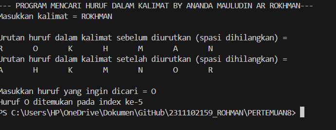
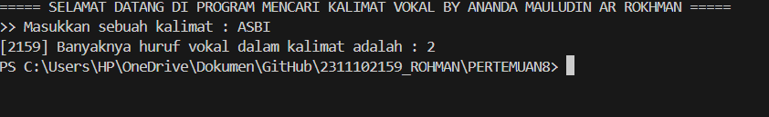
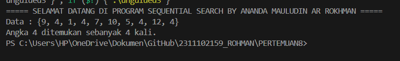

# <h1 align="center">LAPORAN PRAKTIKUM MODUL 8 : ALGORITMA SEARCHING</h1>
<p align="center">ANANDA MAULUDIN AR ROKHMAN - 2311102159</p>

# Dasar Teori

## A. PENGERTIAN ALGORITMA SEARCHING
Pencarian (Searching) adalah  proses untuk menemukan elemen tertentu dalam sekelompok data. Dalam pemrograman C++, dua metode pencarian umum yang digunakan adalah:

1. Pencarian Berurutan (Linear Search) :
Metode ini bekerja dengan membandingkan elemen data yang dicari satu per satu dengan setiap elemen dalam kumpulan data. Sampai elemen yang dicari ditemukan atau seluruh kumpulan data telah diproses, metode ini berfungsi. Meskipun mudah digunakan, pencarian berurutan tidak efektif untuk kumpulan data besar.

2. Pencarian Biner :
Metode ini hanya dapat diterapkan pada kumpulan data yang sudah terurut. Pencarian biner membagi kumpulan data secara berulang menjadi dua bagian dan memeriksa elemen yang dicari dengan elemen tengah. Jika elemen yang dicari lebih kecil atau lebih besar dari elemen tengah, maka pencarian dilanjutkan ke bagian kiri atau kanan kumpulan data.Untuk kumpulan data yang besar, pencarian biner lebih efektif daripada pencarian berurutan.

Faktor-faktor yang mempengaruhi efisiensi searching adalah sebagai berikut:
1. Ukuran Kumpulan Data: Waktu searching lebih lama dengan kumpulan data yang lebih besar.
2. Urutan Kumpulan Data: Hanya kumpulan data yang terurut yang dapat digunakan searching biner.
3. Pilihan Algoritma searching: Karakteristik kumpulan data dan kebutuhan aplikasi menentukan algoritma searching yang tepat.


## Guided 

### 1. Latihan Searching

```C++
#include <iostream>

using namespace std;

int main(){
    int n = 10;
    int data[n] = {9,4,1,7,5,12,4,13,4,10};
    int cari = 10;
    bool ketemu = false;
    int i;

    for (i = 0; i < n; i++){
        if(data[i] == cari){
            ketemu = true;
            break;
        }
    }

    cout << "Program Sequential Search" << endl;
    cout << "data : {9,4,1,7,5,12,4,13,4,10}" << endl;

    if (ketemu){
        cout << "\nAngka " << cari << " ditemukan pada indeks ke-" << i << endl;
    }else{
        cout << "data tidak ditemukan" << endl;
    }

    return 0;
}
```

### 2. Latihan Searching

```C++
#include<iostream>

using namespace std;

//Prosedur untuk menampilkan huruf-huruf didalam kalimat
void TampilkanHurufKalimat_159(char ArrayKalimat_159[], int PanjangKalimat_159){
    for(int i = 0; i < PanjangKalimat_159; i++){ //perulangan for untuk menampilkan huruf
        cout << ArrayKalimat_159[i] << '\t';
    }
    cout << endl;
}

//Prosedur untuk mengurutkan huruf sesuai abjad menggunakan bubble sort
void BubbleSort_159(char ArrayKalimat_159[], int PanjangKalimat_159){
    bool Urut_159 = true; 
    int j = 0; 
    char temp_159; 
    while(Urut_159){ 
        Urut_159 = false;
        j++; 
        for(int i = 0; i < PanjangKalimat_159 - j; i++){ 
            if(ArrayKalimat_159[i] > ArrayKalimat_159[i + 1]){  
                temp_159 = ArrayKalimat_159[i]; 
                ArrayKalimat_159[i] = ArrayKalimat_159[i + 1]; 
                ArrayKalimat_159[i + 1] = temp_159; 
                Urut_159 = true; 
            }
        }
    }
}

//Prosedur untuk mencari huruf didalam kalimat menggunakan binary search
void BinarySearch_159(char ArrayKalimat_159[], int PanjangKalimat_159, char HurufYangDicari_159){
    int awal_159, tengah_159, akhir_159, Posisi_159;  
    bool b_flag = false; 
    awal_159 = 0; 
    akhir_159 = PanjangKalimat_159; 
    while(!b_flag && awal_159 <= akhir_159){ 
        tengah_159 = (awal_159 + akhir_159)/2; 
        if(HurufYangDicari_159 == ArrayKalimat_159[tengah_159]){ 
            Posisi_159 = tengah_159; 
            b_flag = true; 
            break; 
        } else if(HurufYangDicari_159 < ArrayKalimat_159[tengah_159]){ 
            akhir_159 = tengah_159 - 1; 
        } else if(HurufYangDicari_159 > ArrayKalimat_159[tengah_159]){ 
            awal_159 = tengah_159 + 1; 
        }
    }
    if(b_flag){ 
        cout << "Huruf " << HurufYangDicari_159 << " ditemukan pada index ke-";
        for(int i = 0; i < PanjangKalimat_159; i++){
            if(HurufYangDicari_159 == ArrayKalimat_159[i]){
                cout << i;
                if(ArrayKalimat_159[i + 1] == HurufYangDicari_159){
                    cout << ", ";
                }
            }
        }
    } else { 
        cout << "Huruf " << HurufYangDicari_159 << " tidak ditemukan" << endl;
    }
}

int main(){
    string InputKalimat_159, KalimatTanpaSpasi_159; 
    int PanjangKalimat_159; 
    char HurufYangDicari_159; 
    cout << "--- PROGRAM MENCARI HURUF DALAM KALIMAT BY ANANDA MAULUDIN AR ROKHMAN---" << endl;
    cout << "Masukkan kalimat = "; 
    getline(cin, InputKalimat_159); 
    cout << endl;

    // Menghapus karakter spasi dari kalimat
    KalimatTanpaSpasi_159 = ""; 
    for(char c : InputKalimat_159){
        if(c != ' ') { 
            KalimatTanpaSpasi_159 += c; 
        }
    }

    //menghitung panjang kalimat
    PanjangKalimat_159 = KalimatTanpaSpasi_159.length();
    char ArrayKalimat_159[PanjangKalimat_159];
    for(int i = 0; i < PanjangKalimat_159; i++){
        ArrayKalimat_159[i] = KalimatTanpaSpasi_159[i]; 
    }

    //Menampilkan setiap huruf dalam kalimat sebelum di urutkan
    cout << "Urutan huruf dalam kalimat sebelum diurutkan (spasi dihilangkan) = " << endl;
    TampilkanHurufKalimat_159(ArrayKalimat_159, PanjangKalimat_159); 

    //Menampilkan setiap huruf dalam kalimat setelah di urutkan
    cout << "Urutan huruf dalam kalimat setelah diurutkan (spasi dihilangkan) = " << endl;
    BubbleSort_159(ArrayKalimat_159, PanjangKalimat_159); 
    TampilkanHurufKalimat_159(ArrayKalimat_159, PanjangKalimat_159); 
    cout << endl;

    //User menginputkan huruf yang ingin dicari
    cout << "Masukkan huruf yang ingin dicari = ";
    cin >> HurufYangDicari_159; 

    BinarySearch_159(ArrayKalimat_159, PanjangKalimat_159, HurufYangDicari_159);

    return 0;
}

```

#### Output:


Pengguna dapat mencari huruf tertentu dalam kalimat dengan aplikasi ini, Fitur Utama:
1. Menghapus spasi: Program ini menangani kalimat yang memiliki spasi di tengahnya. Untuk meningkatkan efisiensi, kalimat diurutkan sebelum pencarian.
2. Binary search: Algoritma pencarian biner digunakan untuk mempercepat pencarian huruf.
3. Pesan yang jelas: Untuk setiap langkah, program menampilkan pesan yang jelas kepada pengguna.

Langkah-langkahnya:

1. Membaca kalimat dari pengguna: Pengguna memasukkan kalimat yang ingin dianalisis.
2. Menghapus spasi dari kalimat: Spasi dihilangkan dari kalimat untuk mempermudah proses pencarian.
3. Menghitung panjang kalimat: Panjang kalimat tanpa spasi dihitung.
4. Membuat array untuk menyimpan huruf: Array dibuat dengan panjang yang sama dengan panjang kalimat tanpa spasi. Setiap karakter dari kalimat tanpa spasi disalin ke dalam array.
5. Menampilkan huruf dalam kalimat (sebelum diurutkan): Setiap huruf dalam array dicetak ke layar.
6. Mengurutkan huruf dalam kalimat (menggunakan bubble sort): Algoritma bubble sort digunakan untuk mengurutkan huruf dalam array.
7. Menampilkan huruf dalam kalimat (setelah diurutkan): Setiap huruf dalam array yang telah diurutkan dicetak ke layar.
8. Membaca huruf yang ingin dicari: Pengguna memasukkan huruf yang ingin dicari dalam kalimat.
9. Mencari huruf menggunakan binary search: Algoritma binary search digunakan untuk mencari huruf yang diberikan dalam array yang telah diurutkan.
10. Menampilkan hasil pencarian: Jika huruf ditemukan, program akan menampilkan indeksnya dalam kalimat. Jika huruf tidak ditemukan, program akan menampilkan pesan bahwa huruf tersebut tidak ditemukan.
    

### 2. [Buatlah sebuah program yang dapat menghitung banyaknya huruf vocal dalam sebuah kalimat!]

```C++
#include <iostream>
#include <string>
using namespace std;

// Fungsi untuk memeriksa apakah sebuah karakter adalah vokal
bool isVowel_159(char Karakter_159) {
    // Konversi karakter menjadi huruf kecil
    Karakter_159 = tolower(Karakter_159);
    // Periksa apakah karakter adalah salah satu dari 'a', 'e', 'i', 'o', 'u'
    return (Karakter_159 == 'a' || Karakter_159 == 'e' || Karakter_159 == 'i' || Karakter_159 == 'o' || Karakter_159 == 'u');
}

// Fungsi untuk menghitung banyaknya huruf vokal dalam sebuah kalimat
int countVowels_159(const string &Kalimat_159) {
    int Count_159 = 0;
    for (char Karakter_159 : Kalimat_159) {
        if (isVowel_159(Karakter_159)) {
            Count_159++;
        }
    }
    return Count_159;
}

int main() {
    string Kalimat_159;
    cout << "\n===== SELAMAT DATANG DI PROGRAM MENCARI KALIMAT VOKAL BY ANANDA MAULUDIN AR ROKHMAN =====";
    cout << "\n>> Masukkan sebuah kalimat : ";
    getline(cin, Kalimat_159); // Membaca input kalimat dari pengguna

    int vowelCount_159 = countVowels_159(Kalimat_159);
    cout << "[2159] Banyaknya huruf vokal dalam kalimat adalah : " << vowelCount_159 << endl;
    return 0;
}

```

#### Output:


Program ini menghitung jumlah huruf vokal dalam sebuah kalimat yang dimasukkan oleh pengguna.

Langkah-langkah:

1. Membaca kalimat dari pengguna: Pengguna memasukkan kalimat yang ingin dianalisis.
2. Membuat fungsi isVowel:
   - Fungsi ini menerima karakter sebagai input.</br>
   - Mengubah karakter menjadi huruf kecil menggunakan tolower.</br>
   - Memeriksa apakah karakter tersebut termasuk dalam vokal ('a', 'e', 'i', 'o', 'u').</br>
   - Mengembalikan true jika karakter adalah vokal, dan false jika bukan.</br>
3. Membuat fungsi countVowels:
   - Fungsi ini menerima string sebagai input.</br>
   - Inisialisasi variabel Count dengan 0.</br>
   - Mengulangi setiap karakter dalam string.</br>
   - Mengembalikan nilai Count (jumlah vokal).</br>
4. Fungsi main:
   - Menampilkan pesan selamat datang.</br>
   - Membaca kalimat dari pengguna menggunakan getline.</br>
   - Memanggil fungsi countVowels untuk menghitung jumlah vokal dalam kalimat.</br>
   - Menampilkan hasil perhitungan (jumlah vokal) ke pengguna.</br>

Fitur Utama:
1. Fungsi isVowel: Memisahkan logika pengecekan vokal menjadi fungsi terpisah, sehingga mudah digunakan kembali.
2. Penggunaan loop for-each: Mempermudah iterasi melalui karakter dalam string.
3. Pesan yang jelas: Program menampilkan pesan yang informatif kepada pengguna.
   

### 3. Diketahui data = 9, 4, 1, 4, 7, 10, 5, 4, 12, 4. Hitunglah berapa banyak angka 4 dengan menggunakan algoritma Sequential Search!

```C++
// ANANDA MAULUDIN AR ROKHMAN
// 2311102159
// S1 IF-11-D


#include <iostream>
using namespace std;

int main(){
    int n_159 = 10;
    int Data_159[n_159] = {9, 4, 1, 4, 7, 10, 5, 4, 12, 4};
    int Target_159 = 4;
    int Count_159 = 0;

    // Melakukan pencarian sequential untuk menghitung banyaknya angka 4
    for (int i = 0; i < n_159; i++) {
        if (Data_159[i] == Target_159) {
            Count_159++;
        }
    }
    cout << "===== SELAMAT DATANG DI PROGRAM SEQUENTIAL SEARCH BY ANANDA MAULUDIN AR ROKHMAN =====" << endl;
    cout << "Data : {9, 4, 1, 4, 7, 10, 5, 4, 12, 4}" << endl;
    cout << "Angka " << Target_159 << " ditemukan sebanyak " << Count_159 << " kali." << endl;
    return 0;
}

```

#### Output:


Program ini menghitung berapa kali angka 4 muncul dalam sebuah array.

Langkah-langkah:

1. Mendefinisikan variabel:
   - n 136: Ukuran array (10).</br>
   - Data_136: Array bilangan bulat dengan panjang n_136.</br>
   - Target_136: Angka yang ingin dicari (4).</br>
   - Count_136: Penghitung kemunculan angka 4.</br>
2. Melakukan pencarian sequential:
   - Perulangan for iterasi melalui setiap elemen dalam array Data_136.</br>
3. Menampilkan hasil:
   - Cetak pesan selamat datang.</br>
   - Cetak array Data_136.</br>
   - Cetak informasi tentang berapa kali angka Target_136 ditemukan.</br>

Fitur Utama:
1. Pencarian sequential: Algoritma pencarian sederhana yang memeriksa setiap elemen dalam array secara berurutan.
2. Loop for: Digunakan untuk mengulangi elemen array secara efisien.
3. Pesan yang jelas: Program menampilkan informasi yang mudah dipahami kepada pengguna.

## Kesimpulan
Hasil dari praktikum struktur data dan algoritma mencakup beberapa algoritma pencarian yang digunakan untuk menemukan nilai tertentu dalam kumpulan data. Dua algoritma pencarian yang dibahas dalam praktikum ini adalah pencarian sequential dan pencarian binar. Pencarian sequential adalah algoritma yang paling umum digunakan untuk data yang tidak terurut. Indeks pertama adalah titik awal dari proses pencarian, yang berlanjut hingga indeks terakhir. Jika data ditemukan, proses pencarian berhenti jika setiap elemen array dibandingkan dengan nilai yang dicari. Jika data tidak ditemukan, proses pencarian juga berhenti.

Sebaliknya, pencarian biner adalah algoritma yang digunakan untuk data terurut. Proses pencarian dimulai dengan membagi data menjadi dua bagian dan menemukan nilai tengahnya. Setelah data yang ditemukan dibandingkan dengan nilai tengah, proses dilanjutkan dengan membagi bagian yang sesuai. Sampai data ditemukan atau tidak ditemukan, proses berhenti. Selain itu, contoh implementasi kedua algoritma ini disajikan dalam praktikum. Menggunakan for loop untuk membandingkan setiap elemen array dengan nilai yang dicari, sedangkan binary search membagi data menjadi dua bagian dan mencari nilai tengahnya.

Kesimpulannya, praktikum struktur data dan algoritma menunjukkan bahwa ada banyak algoritma yang dapat digunakan untuk melakukan pencarian data yang sesuai dengan struktur data dan persyaratan aplikasi.


## Referensi
 [1] (https://p3m.sinus.ac.id/jurnal/index.php/TIKomSiN/article/view/546)

 [2] (https://jurnal.untan.ac.id/index.php/jepin/article/view/68389)