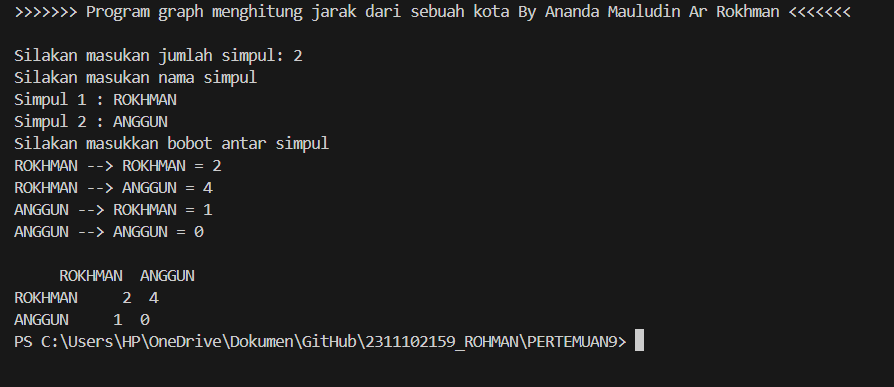
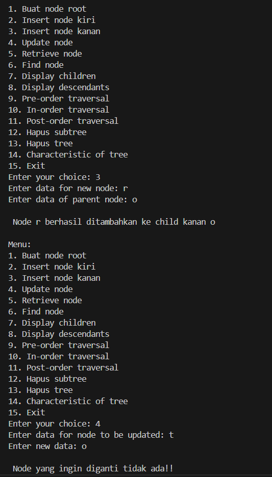
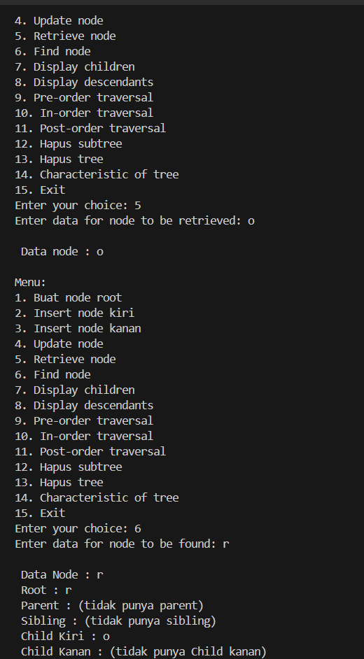
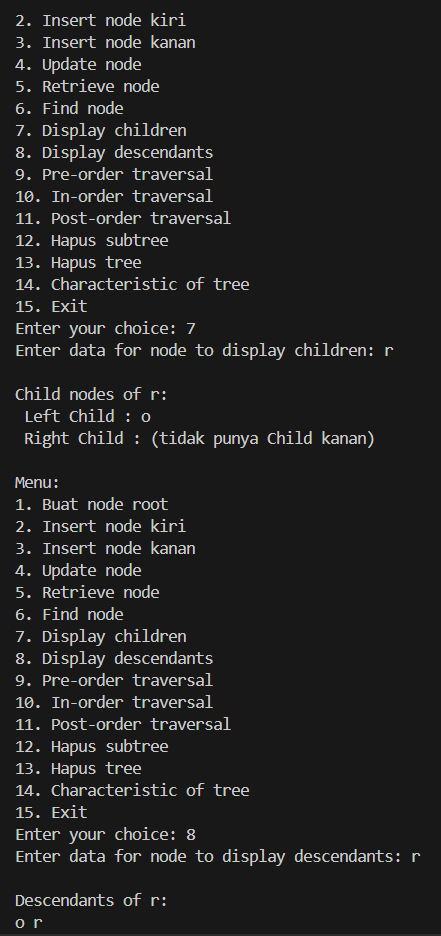
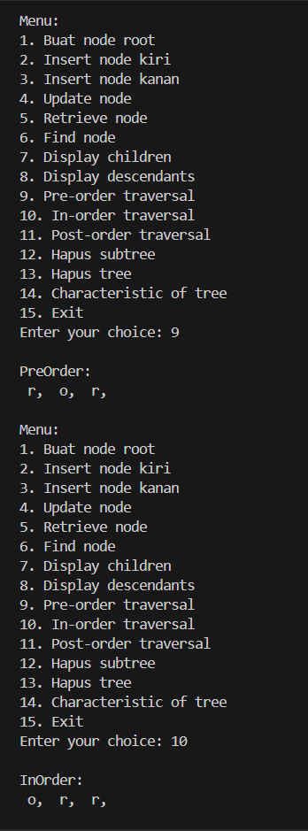
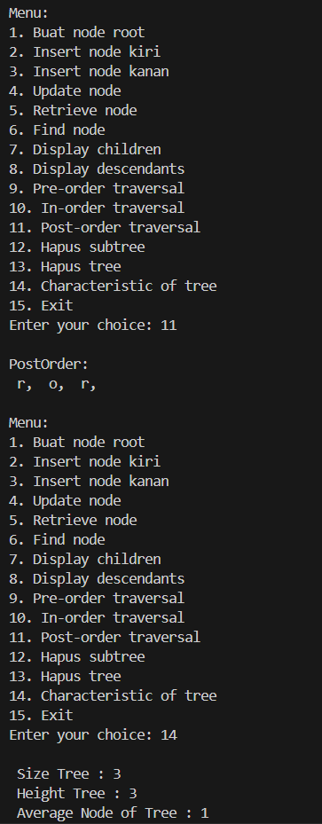
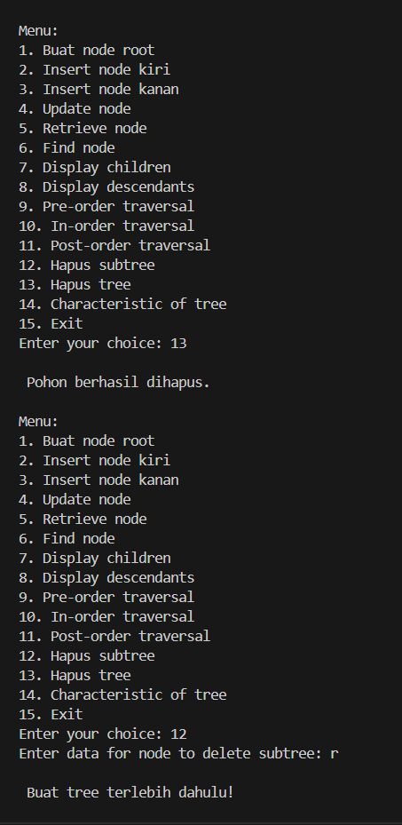
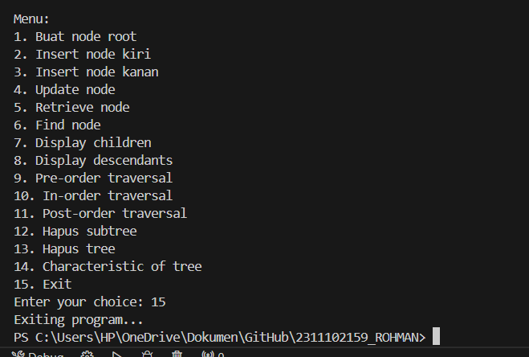

# <h1 align="center">LAPORAN PRAKTIKUM MODUL 9 : GRAPH DAN TREE</h1>
<p align="center">ANANDA MAULUDIN AR ROKHMAN - 23111021159</p>

# Dasar Teori

## A. PENGERTIAN GRAPH DAN TREE
Graf didefinisikan sebagai kumpulan titik (melambangkan verteks) yang terhubung oleh garis (melambangkan tepi) dan verteks (atau node). Graf dapat memiliki struktur yang kompleks dan digunakan untuk menunjukkan berbagai konsep, seperti jaringan jalan dan jaringan persahabatan Friendster. Mereka juga dapat memiliki bobot pada tiap sisi, yang digunakan untuk menunjukkan konsep seperti batas kecepatan tertinggi atau panjang jalan.

Pohon (Tree) adalah representasi graf yang digunakan untuk mewakili permainan strategis. Pohon digambarkan dengan menggunakan graf berarah, di mana setiap node menunjukkan keputusan yang dapat dibuat oleh pemain, dan setiap tepi menunjukkan hasil dari keputusan tersebut. Dalam permainan strategis, pohon digunakan untuk menganalisis proses pengambilan keputusan dan untuk menemukan nilai strategi murni yang lebih efektif.


## Guided 

### 1. Program Graph
```C++
#include <iostream>
#include <iomanip>

using namespace std;

string simpul[7] = {
    "Ciamis", "Bandung", "Bekasi", "Tasikmalaya", "Cianjur", "Purwokerto", "Yogyakarta" 
};
int busur[7][7] = {
    {0,7,8,0,0,0,0},
    {0,0,5,0,0,15,0},
    {0,6,0,0,5,0,0},
    {0,5,0,0,2,4,0},
    {23,0,0,10,0,0,8},
    {0,0,0,0,7,0,3},
    {0,0,0,0,9,4,0},
};
void tampilGraph(){
    for (int baris=0; baris<7; baris++){
        cout <<" "<<setiosflags(ios::left)<<setw(15)<<simpul[baris]<<" : ";
        for (int kolom = 0; kolom<7; kolom++){
            if(busur[baris][kolom] != 0){
                cout << " " << simpul[kolom]<< " ( " << busur[baris][kolom]<<" )";
            }
        } cout << endl;
    }
}
int main (){
    tampilGraph();
}
```

### 2. Program Tree
```C++
#include <iostream>
#include <iomanip>
using namespace std;

struct Pohon
{
    char data;
    Pohon *left, *right, *parent;
};
Pohon *root, *baru;
void init()
{
    root = NULL;
}
bool isEmpty()
{
    return root == NULL;
}
void buatNode(char data)
{
    if (isEmpty())
    {
        root = new Pohon();
        root->data = data;
        root->left = NULL;
        root->right = NULL;
        root->parent = NULL;
        cout << "\n Node " << data << " berhasil dibuat sebagai root."
             << endl;
    }
    else
    {
        cout << "\n Tree sudah ada!" << endl;
    }
}
Pohon *insertLeft(char data, Pohon *node)
{
    if (isEmpty())
    {
        cout << "\n Buat tree terlebih dahulu!" << endl;
        return NULL;
    }
    else
    {
        if (node->left != NULL)
        {
            cout << "\n Node " << node->data << " sudah ada child kiri !" << endl;
                return NULL;
        }
        else
        {
            Pohon *baru = new Pohon();
            baru->data = data;
            baru->left = NULL;
            baru->right = NULL;
            baru->parent = node;
            node->left = baru;
            cout << "\n Node " << data << " berhasil ditambahkan ke child kiri " << baru->parent->data << endl;
                return baru;
        }
    }
}
Pohon *insertRight(char data, Pohon *node)
{
    if (isEmpty())
    {
        cout << "\n Buat tree terlebih dahulu!" << endl;
        return NULL;
    }
    else
    {
        if (node->right != NULL)
        {
            cout << "\n Node " << node->data << " sudah ada child  kanan !" << endl;
                return NULL;
        }
        else
        {
            Pohon *baru = new Pohon();
            baru->data = data;
            baru->left = NULL;
            baru->right = NULL;
            baru->parent = node;
            node->right = baru;
            cout << "\n Node " << data << " berhasil ditambahkan ke child kanan " << baru->parent->data << endl;
                return baru;
        }
    }
}
void update(char data, Pohon *node)
{
    if (isEmpty())
    {
        cout << "\n Buat tree terlebih dahulu!" << endl;
    }
    else
    {
        if (!node)
        {
            cout << "\n Node yang ingin diganti tidak ada!!" << endl;
        }
        else
        {
            char temp = node->data;
            node->data = data;
            cout << "\n Node " << temp << " berhasil diubah menjadi "
                 << data << endl;
        }
    }
}
void retrieve(Pohon *node)
{
    if (isEmpty())
    {
        cout << "\n Buat tree terlebih dahulu!" << endl;
    }
    else
    {
        if (!node)
        {
            cout << "\n Node yang ditunjuk tidak ada!" << endl;
        }
        else
        {
            cout << "\n Data node : " << node->data << endl;
        }
    }
}
void find(Pohon *node)
{
    if (isEmpty())
    {
        cout << "\n Buat tree terlebih dahulu!" << endl;
    }
    else
    {
        if (!node)
        {
            cout << "\n Node yang ditunjuk tidak ada!" << endl;
        }
        else
        {
            cout << "\n Data Node : " << node->data << endl;
            cout << " Root : " << root->data << endl;
            if (!node->parent)
                cout << " Parent : (tidak punya parent)" << endl;
            else
                cout << " Parent : " << node->parent->data << endl;
            if (node->parent != NULL && node->parent->left != node &&
                node->parent->right == node)
                cout << " Sibling : " << node->parent->left->data << endl;
            else if (node->parent != NULL && node->parent->right != node && node->parent->left == node)
                cout << " Sibling : " << node->parent->right->data << endl;
            else
                cout << " Sibling : (tidak punya sibling)" << endl;
            if (!node->left)
                cout << " Child Kiri : (tidak punya Child kiri)" << endl;
            else
                cout << " Child Kiri : " << node->left->data << endl;
            if (!node->right)
                cout << " Child Kanan : (tidak punya Child kanan)" << endl;
            else
                cout << " Child Kanan : " << node->right->data << endl;
        }
    }
}
// Penelusuran (Traversal)
// preOrder
void preOrder(Pohon *node = root)
{
    if (isEmpty())
    {
        cout << "\n Buat tree terlebih dahulu!" << endl;
    }
    else
    {
        if (node != NULL)
        {
            cout << " " << node->data << ", ";
            preOrder(node->left);
            preOrder(node->right);
        }
    }
}
// inOrder
void inOrder(Pohon *node = root)
{
    if (isEmpty())
    {
        cout << "\n Buat tree terlebih dahulu!" << endl;
    }
    else
    {
        if (node != NULL)
        {
            inOrder(node->left);
            cout << " " << node->data << ", ";
            inOrder(node->right);
        }
    }
}
// postOrder
void postOrder(Pohon *node = root)
{
    if (isEmpty())
    {
        cout << "\n Buat tree terlebih dahulu!" << endl;
    }
    else
    {
        if (node != NULL)
        {
            postOrder(node->left);
            postOrder(node->right);
            cout << " " << node->data << ", ";
        }
    }
}
// Hapus Node Tree
void deleteTree(Pohon *node)
{
    if (isEmpty())
    {
        cout << "\n Buat tree terlebih dahulu!" << endl;
    }
    else
    {
        if (node != NULL)
        {
            if (node != root)
            {
                node->parent->left = NULL;
                node->parent->right = NULL;
            }
            deleteTree(node->left);
            deleteTree(node->right);
            if (node == root)
            {
                delete root;
                root = NULL;
            }
            else
            {
                delete node;
            }
        }
    }
}
// Hapus SubTree
void deleteSub(Pohon *node)
{
    if (isEmpty())
    {
        cout << "\n Buat tree terlebih dahulu!" << endl;
    }
    else
    {
        deleteTree(node->left);
        deleteTree(node->right);
        cout << "\n Node subtree " << node->data << " berhasil dihapus." << endl;
    }
}
// Hapus Tree
void clear()
{
    if (isEmpty())
    {
        cout << "\n Buat tree terlebih dahulu!!" << endl;
    }
    else
    {
        deleteTree(root);
        cout << "\n Pohon berhasil dihapus." << endl;
    }
}
// Cek Size Tree
int size(Pohon *node = root)
{
    if (isEmpty())
    {
        cout << "\n Buat tree terlebih dahulu!!" << endl;
        return 0;
    }
    else
    {
        if (!node)
        {
            return 0;
        }
        else
        {
            return 1 + size(node->left) + size(node->right);
        }
    }
}
// Cek Height Level Tree
int height(Pohon *node = root)
{
    if (isEmpty())
    {
        cout << "\n Buat tree terlebih dahulu!" << endl;
        return 0;
    }
    else
    {
        if (!node)
        {
            return 0;
        }
        else
        {
            int heightKiri = height(node->left);
            int heightKanan = height(node->right);
            if (heightKiri >= heightKanan)
            {
                return heightKiri + 1;
            }
            else
            {
                return heightKanan + 1;
            }
        }
    }
}
// Karakteristik Tree
void characteristic()
{
    cout << "\n Size Tree : " << size() << endl;
    cout << " Height Tree : " << height() << endl;
    cout << " Average Node of Tree : " << size() / height() << endl;
}
int main()
{
   buatNode('A');
    Pohon *nodeB, *nodeC, *nodeD, *nodeE, *nodeF, *nodeG, *nodeH, *nodeI, *nodeJ;

    nodeB = insertLeft('B', root);
    nodeC = insertRight('C', root);
    nodeD = insertLeft('D', nodeB);
    nodeE = insertRight('E', nodeB);
    nodeF = insertLeft('F', nodeC);
    nodeG = insertLeft('G', nodeE);
    nodeH = insertRight('H', nodeE);
    nodeI = insertLeft('I', nodeG);
    nodeJ = insertRight('J', nodeG);

    update('Z', nodeC);
    update('C', nodeC);
    retrieve(nodeC);
    find(nodeC);
    characteristic();

    cout << "\n PreOrder :" << endl;
    preOrder(root);
    cout << "\n" << endl;

    cout << " InOrder :" << endl;
    inOrder(root);
    cout << "\n" << endl;
    
    cout << " PostOrder :" << endl;
    postOrder(root);
    cout << "\n" << endl;
}
```

## Unguided 

Cantumkan NIM pada salah satu variabel di dalam program.
Contoh : int nama_22102003;
### 1. [Buatlah program graph dengan menggunakan inputan user untuk menghitung jarak dari sebuah kota ke kota lainnya.]
Output Program :


```C++
// LAPRAK 9 : UNGUIDED 1
// ANANDA MAULUDIN AR ROKHMAN
// 2311102159
// S1 IF-11-D

// Program graph dengan menggunakan inputan user untuk menghitung jarak dari sebuah kota ke kota lainnya
#include <iostream> // Library untuk operasi input dan output
#include <vector>   // Library untuk penggunaan kontainer vector
#include <string>   // Library untuk penggunaan tipe data string

using namespace std; // Menggunakan namespace std untuk mempermudah penulisan kode

int main() {
    int jumlahSimpul_2311102159; // Deklarasi variabel untuk menyimpan jumlah simpul

    // Menampilkan judul program
    cout << "\n>>>>>>> Program graph menghitung jarak dari sebuah kota By Ananda Mauludin Ar Rokhman <<<<<<<" << endl;
    // Meminta pengguna memasukkan jumlah simpul
    cout << "\nSilakan masukan jumlah simpul: ";
    cin >> jumlahSimpul_2311102159; // Membaca input jumlah simpul dari pengguna

    // Mendeklarasikan vektor untuk menyimpan nama-nama simpul
    vector<string> namaSimpul_2311102159(jumlahSimpul_2311102159);
    // Mendeklarasikan matriks untuk menyimpan bobot (jarak) antar simpul
    vector<vector<int>> bobot_2311102159(jumlahSimpul_2311102159, vector<int>(jumlahSimpul_2311102159));

    // Meminta pengguna memasukkan nama-nama simpul
    cout << "Silakan masukan nama simpul" << endl;
    for (int i_2311102159 = 0; i_2311102159 < jumlahSimpul_2311102159; ++i_2311102159) {
        // Meminta input nama simpul dari pengguna
        cout << "Simpul " << i_2311102159 + 1 << " : ";
        cin >> namaSimpul_2311102159[i_2311102159]; // Membaca input nama simpul dan menyimpannya ke dalam vektor
    }

    // Meminta pengguna memasukkan bobot antar simpul
    cout << "Silakan masukkan bobot antar simpul" << endl;
    for (int i_2311102159 = 0; i_2311102159 < jumlahSimpul_2311102159; ++i_2311102159) {
        for (int j_2311102159 = 0; j_2311102159 < jumlahSimpul_2311102159; ++j_2311102159) {
            // Meminta input bobot (jarak) dari simpul i ke simpul j
            cout << namaSimpul_2311102159[i_2311102159] << " --> " << namaSimpul_2311102159[j_2311102159] << " = ";
            cin >> bobot_2311102159[i_2311102159][j_2311102159]; // Membaca input bobot dan menyimpannya ke dalam matriks
        }
    }

    cout << endl; // Menambahkan baris baru untuk tampilan yang lebih rapi

    // Menampilkan tabel jarak antar simpul
    cout << "     "; // Menambahkan spasi untuk perataan tabel
    for (const string& nama_2311102159 : namaSimpul_2311102159) {
        cout << nama_2311102159 << "  "; // Menampilkan nama-nama simpul sebagai header kolom
    }
    cout << endl;

    for (int i_2311102159 = 0; i_2311102159 < jumlahSimpul_2311102159; ++i_2311102159) {
        cout << namaSimpul_2311102159[i_2311102159] << "     "; // Menampilkan nama simpul sebagai header baris
        for (int j_2311102159 = 0; j_2311102159 < jumlahSimpul_2311102159; ++j_2311102159) {
            cout << bobot_2311102159[i_2311102159][j_2311102159] << "  "; // Menampilkan bobot (jarak) antar simpul
        }
        cout << endl;
    }

    return 0; // Mengembalikan nilai 0 untuk menandakan program berakhir dengan sukses
}

```

#### Output:


Output dari program ini adalah matriks ketetanggaan yang menunjukkan jarak antara setiap pasangan kota. Setiap elemen dalam matriks harus memiliki lebar minimal dua karakter. Cara sederhana untuk membuat dan menampilkan grafik yang menunjukkan jarak antar kota disediakan oleh program ini, itu dapat diperluas untuk menangani operasi grafik dan algoritma yang lebih kompleks.    

### 2. [Modifikasi guided tree diatas dengan program menu menggunakan input data tree dari user dan berikan fungsi tambahan untuk menampilkan node child dan descendant dari node yang diinput kan!]

```C++
#include <iostream>
#include <iomanip>
#include <queue>
using namespace std;

struct Pohon
{
    char data;
    Pohon *left, *right, *parent;
};

Pohon *root, *baru;

void init()
{
    root = NULL;
}

bool isEmpty()
{
    return root == NULL;
}

void buatNode(char data)
{
    if (isEmpty())
    {
        root = new Pohon();
        root->data = data;
        root->left = NULL;
        root->right = NULL;
        root->parent = NULL;
        cout << "\n Node " << data << " berhasil dibuat sebagai root." << endl;
    }
    else
    {
        cout << "\n Tree sudah ada!" << endl;
    }
}

Pohon *insertLeft(char data, Pohon *node)
{
    if (isEmpty())
    {
        cout << "\n Buat tree terlebih dahulu!" << endl;
        return NULL;
    }
    else
    {
        if (node->left != NULL)
        {
            cout << "\n Node " << node->data << " sudah ada child kiri!" << endl;
            return NULL;
        }
        else
        {
            Pohon *baru = new Pohon();
            baru->data = data;
            baru->left = NULL;
            baru->right = NULL;
            baru->parent = node;
            node->left = baru;
            cout << "\n Node " << data << " berhasil ditambahkan ke child kiri " << baru->parent->data << endl;
            return baru;
        }
    }
}

Pohon *insertRight(char data, Pohon *node)
{
    if (isEmpty())
    {
        cout << "\n Buat tree terlebih dahulu!" << endl;
        return NULL;
    }
    else
    {
        if (node->right != NULL)
        {
            cout << "\n Node " << node->data << " sudah ada child kanan!" << endl;
            return NULL;
        }
        else
        {
            Pohon *baru = new Pohon();
            baru->data = data;
            baru->left = NULL;
            baru->right = NULL;
            baru->parent = node;
            node->right = baru;
            cout << "\n Node " << data << " berhasil ditambahkan ke child kanan " << baru->parent->data << endl;
            return baru;
        }
    }
}

void update(char data, Pohon *node)
{
    if (isEmpty())
    {
        cout << "\n Buat tree terlebih dahulu!" << endl;
    }
    else
    {
        if (!node)
        {
            cout << "\n Node yang ingin diganti tidak ada!!" << endl;
        }
        else
        {
            char temp = node->data;
            node->data = data;
            cout << "\n Node " << temp << " berhasil diubah menjadi " << data << endl;
        }
    }
}

void retrieve(Pohon *node)
{
    if (isEmpty())
    {
        cout << "\n Buat tree terlebih dahulu!" << endl;
    }
    else
    {
        if (!node)
        {
            cout << "\n Node yang ditunjuk tidak ada!" << endl;
        }
        else
        {
            cout << "\n Data node : " << node->data << endl;
        }
    }
}

void find(Pohon *node)
{
    if (isEmpty())
    {
        cout << "\n Buat tree terlebih dahulu!" << endl;
    }
    else
    {
        if (!node)
        {
            cout << "\n Node yang ditunjuk tidak ada!" << endl;
        }
        else
        {
            cout << "\n Data Node : " << node->data << endl;
            cout << " Root : " << root->data << endl;
            if (!node->parent)
                cout << " Parent : (tidak punya parent)" << endl;
            else
                cout << " Parent : " << node->parent->data << endl;
            if (node->parent != NULL && node->parent->left != node &&
                node->parent->right == node)
                cout << " Sibling : " << node->parent->left->data << endl;
            else if (node->parent != NULL && node->parent->right != node && node->parent->left == node)
                cout << " Sibling : " << node->parent->right->data << endl;
            else
                cout << " Sibling : (tidak punya sibling)" << endl;
            if (!node->left)
                cout << " Child Kiri : (tidak punya Child kiri)" << endl;
            else
                cout << " Child Kiri : " << node->left->data << endl;
            if (!node->right)
                cout << " Child Kanan : (tidak punya Child kanan)" << endl;
            else
                cout << " Child Kanan : " << node->right->data << endl;
        }
    }
}

void preOrder(Pohon *node = root)
{
    if (isEmpty())
    {
        cout << "\n Buat tree terlebih dahulu!" << endl;
    }
    else
    {
        if (node != NULL)
        {
            cout << " " << node->data << ", ";
            preOrder(node->left);
            preOrder(node->right);
        }
    }
}

void inOrder(Pohon *node = root)
{
    if (isEmpty())
    {
        cout << "\n Buat tree terlebih dahulu!" << endl;
    }
    else
    {
        if (node != NULL)
        {
            inOrder(node->left);
            cout << " " << node->data << ", ";
            inOrder(node->right);
        }
    }
}

void postOrder(Pohon *node = root)
{
    if (isEmpty())
    {
        cout << "\n Buat tree terlebih dahulu!" << endl;
    }
    else
    {
        if (node != NULL)
        {
            postOrder(node->left);
            postOrder(node->right);
            cout << " " << node->data << ", ";
        }
    }
}

void deleteTree(Pohon *node)
{
    if (isEmpty())
    {
        cout << "\n Buat tree terlebih dahulu!" << endl;
    }
    else
    {
        if (node != NULL)
        {
            if (node != root)
            {
                node->parent->left = NULL;
                node->parent->right = NULL;
            }
            deleteTree(node->left);
            deleteTree(node->right);
            if (node == root)
            {
                delete root;
                root = NULL;
            }
            else
            {
                delete node;
            }
        }
    }
}

void deleteSub(Pohon *node)
{
    if (isEmpty())
    {
        cout << "\n Buat tree terlebih dahulu!" << endl;
    }
    else
    {
        deleteTree(node->left);
        deleteTree(node->right);
        cout << "\n Node subtree " << node->data << " berhasil dihapus." << endl;
    }
}

void clear()
{
    if (isEmpty())
    {
        cout << "\n Buat tree terlebih dahulu!" << endl;
    }
    else
    {
        deleteTree(root);
        cout << "\n Pohon berhasil dihapus." << endl;
    }
}

int size(Pohon *node = root)
{
    if (isEmpty())
    {
        cout << "\n Buat tree terlebih dahulu!" << endl;
        return 0;
    }
    else
    {
        if (!node)
        {
            return 0;
        }
        else
        {
            return 1 + size(node->left) + size(node->right);
        }
    }
}

int height(Pohon *node = root)
{
    if (isEmpty())
    {
        cout << "\n Buat tree terlebih dahulu!" << endl;
        return 0;
    }
    else
    {
        if (!node)
        {
            return 0;
        }
        else
        {
            int heightKiri = height(node->left);
            int heightKanan = height(node->right);
            if (heightKiri >= heightKanan)
            {
                return heightKiri + 1;
            }
            else
            {
                return heightKanan + 1;
            }
        }
    }
}

void characteristic()
{
    cout << "\n Size Tree : " << size() << endl;
    cout << " Height Tree : " << height() << endl;
    cout << " Average Node of Tree : " << size() / height() << endl;
}

void displayChildren(Pohon *node)
{
    if (isEmpty())
    {
        cout << "\n Buat tree terlebih dahulu!" << endl;
        return;
    }
    if (!node)
    {
        cout << "\n Node yang ditunjuk tidak ada!" << endl;
        return;
    }
    cout << "\nChild nodes of " << node->data << ":" << endl;
    if (node->left)
        cout << " Left Child : " << node->left->data << endl;
    else
        cout << " Left Child : (tidak punya Child kiri)" << endl;
    if (node->right)
        cout << " Right Child : " << node->right->data << endl;
    else
        cout << " Right Child : (tidak punya Child kanan)" << endl;
}

void displayDescendants(Pohon *node)
{
    if (isEmpty())
    {
        cout << "\n Buat tree terlebih dahulu!" << endl;
        return;
    }
    if (!node)
    {
        cout << "\n Node yang ditunjuk tidak ada!" << endl;
        return;
    }
    cout << "\nDescendants of " << node->data << ":" << endl;
    queue<Pohon *> q;
    q.push(node);
    while (!q.empty())
    {
        Pohon *current = q.front();
        q.pop();
        if (current != node)
            cout << current->data << " ";
        if (current->left)
            q.push(current->left);
        if (current->right)
            q.push(current->right);
    }
    cout << endl;
}

void displayMenu()
{
    cout << "\nMenu:" << endl;
    cout << "1. Buat node root" << endl;
    cout << "2. Insert node kiri" << endl;
    cout << "3. Insert node kanan" << endl;
    cout << "4. Update node" << endl;
    cout << "5. Retrieve node" << endl;
    cout << "6. Find node" << endl;
    cout << "7. Display children" << endl;
    cout << "8. Display descendants" << endl;
    cout << "9. Pre-order traversal" << endl;
    cout << "10. In-order traversal" << endl;
    cout << "11. Post-order traversal" << endl;
    cout << "12. Hapus subtree" << endl;
    cout << "13. Hapus tree" << endl;
    cout << "14. Characteristic of tree" << endl;
    cout << "15. Exit" << endl;
    cout << "Enter your choice: ";
}

int main()
{
    init();
    int choice;
    char data;
    char parentData;
    Pohon *parentNode = nullptr;
    
    do
    {
        displayMenu();
        cin >> choice;
        switch (choice)
        {
        case 1:
            cout << "Enter data for root node: ";
            cin >> data;
            buatNode(data);
            break;
        case 2:
            cout << "Enter data for new node: ";
            cin >> data;
            cout << "Enter data of parent node: ";
            cin >> parentData;
            parentNode = root; // Start searching from the root
            while (parentNode && parentNode->data != parentData)
            {
                // Use BFS to find the parent node
                queue<Pohon *> q;
                q.push(parentNode);
                parentNode = nullptr;
                while (!q.empty())
                {
                    Pohon *current = q.front();
                    q.pop();
                    if (current->data == parentData)
                    {
                        parentNode = current;
                        break;
                    }
                    if (current->left)
                        q.push(current->left);
                    if (current->right)
                        q.push(current->right);
                }
            }
            insertLeft(data, parentNode);
            break;
        case 3:
            cout << "Enter data for new node: ";
            cin >> data;
            cout << "Enter data of parent node: ";
            cin >> parentData;
            parentNode = root; // Start searching from the root
            while (parentNode && parentNode->data != parentData)
            {
                // Use BFS to find the parent node
                queue<Pohon *> q;
                q.push(parentNode);
                parentNode = nullptr;
                while (!q.empty())
                {
                    Pohon *current = q.front();
                    q.pop();
                    if (current->data == parentData)
                    {
                        parentNode = current;
                        break;
                    }
                    if (current->left)
                        q.push(current->left);
                    if (current->right)
                        q.push(current->right);
                }
            }
            insertRight(data, parentNode);
            break;
        case 4:
            cout << "Enter data for node to be updated: ";
            cin >> data;
            cout << "Enter new data: ";
            cin >> parentData;
            parentNode = root; // Start searching from the root
            while (parentNode && parentNode->data != data)
            {
                // Use BFS to find the node
                queue<Pohon *> q;
                q.push(parentNode);
                parentNode = nullptr;
                while (!q.empty())
                {
                    Pohon *current = q.front();
                    q.pop();
                    if (current->data == data)
                    {
                        parentNode = current;
                        break;
                    }
                    if (current->left)
                        q.push(current->left);
                    if (current->right)
                        q.push(current->right);
                }
            }
            update(parentData, parentNode);
            break;
        case 5:
            cout << "Enter data for node to be retrieved: ";
            cin >> data;
            parentNode = root; // Start searching from the root
            while (parentNode && parentNode->data != data)
            {
                // Use BFS to find the node
                queue<Pohon *> q;
                q.push(parentNode);
                parentNode = nullptr;
                while (!q.empty())
                {
                    Pohon *current = q.front();
                    q.pop();
                    if (current->data == data)
                    {
                        parentNode = current;
                        break;
                    }
                    if (current->left)
                        q.push(current->left);
                    if (current->right)
                        q.push(current->right);
                }
            }
            retrieve(parentNode);
            break;
        case 6:
            cout << "Enter data for node to be found: ";
            cin >> data;
            parentNode = root; // Start searching from the root
            while (parentNode && parentNode->data != data)
            {
                // Use BFS to find the node
                queue<Pohon *> q;
                q.push(parentNode);
                parentNode = nullptr;
                while (!q.empty())
                {
                    Pohon *current = q.front();
                    q.pop();
                    if (current->data == data)
                    {
                        parentNode = current;
                        break;
                    }
                    if (current->left)
                        q.push(current->left);
                    if (current->right)
                        q.push(current->right);
                }
            }
            find(parentNode);
            break;
        case 7:
            cout << "Enter data for node to display children: ";
            cin >> data;
            parentNode = root; // Start searching from the root
            while (parentNode && parentNode->data != data)
            {
                // Use BFS to find the node
                queue<Pohon *> q;
                q.push(parentNode);
                parentNode = nullptr;
                while (!q.empty())
                {
                    Pohon *current = q.front();
                    q.pop();
                    if (current->data == data)
                    {
                        parentNode = current;
                        break;
                    }
                    if (current->left)
                        q.push(current->left);
                    if (current->right)
                        q.push(current->right);
                }
            }
            displayChildren(parentNode);
            break;
        case 8:
            cout << "Enter data for node to display descendants: ";
            cin >> data;
            parentNode = root; // Start searching from the root
            while (parentNode && parentNode->data != data)
            {
                // Use BFS to find the node
                queue<Pohon *> q;
                q.push(parentNode);
                parentNode = nullptr;
                while (!q.empty())
                {
                    Pohon *current = q.front();
                    q.pop();
                    if (current->data == data)
                    {
                        parentNode = current;
                        break;
                    }
                    if (current->left)
                        q.push(current->left);
                    if (current->right)
                        q.push(current->right);
                }
            }
            displayDescendants(parentNode);
            break;
        case 9:
            cout << "\nPreOrder:\n";
            preOrder();
            cout << endl;
            break;
        case 10:
            cout << "\nInOrder:\n";
            inOrder();
            cout << endl;
            break;
        case 11:
            cout << "\nPostOrder:\n";
            postOrder();
            cout << endl;
            break;
        case 12:
            cout << "Enter data for node to delete subtree: ";
            cin >> data;
            parentNode = root; // Start searching from the root
            while (parentNode && parentNode->data != data)
            {
                // Use BFS to find the node
                queue<Pohon *> q;
                q.push(parentNode);
                parentNode = nullptr;
                while (!q.empty())
                {
                    Pohon *current = q.front();
                    q.pop();
                    if (current->data == data)
                    {
                        parentNode = current;
                        break;
                    }
                    if (current->left)
                        q.push(current->left);
                    if (current->right)
                        q.push(current->right);
                }
            }
            deleteSub(parentNode);
            break;
        case 13:
            clear();
            break;
        case 14:
            characteristic();
            break;
        case 15:
            cout << "Exiting program..." << endl;
            break;
        default:
            cout << "Invalid choice, please try again." << endl;
        }
    } while (choice != 15);

    return 0;
}

```

#### Output:
















kode C++ untuk struktur data pohon biner yang mencakup berbagai fungsi pengelolaan pohon, seperti membuat, memasukkan, memperbarui, mengambil, menemukan, menampilkan karakteristik, dan melakukan traversal.

## Kesimpulan
1. Graf (Graph):

- Graf adalah struktur data yang menunjukkan hubungan antara objek dalam bentuk node atau vertex serta sambungan antara node tersebut dalam bentuk sisi atau tepi.

- Graf dapat digunakan untuk berbagai aplikasi, termasuk pemetaan jalan, pemodelan data, dan jaringan sosial.

- Graf berarah, tak berarah, dan dengan berat adalah tiga kategori graf.

2. Tree (Pohon):
   
- Sebuah pohon adalah struktur data yang terdiri dari satu set node yang terhubung dalam grafik, dengan setiap node memiliki setidaknya satu simpul induk dan nol atau lebih simpul anak dalam urutan khusus.

- Pohon keluarga, skema pertandingan, dan struktur organisasi adalah contoh data hirarki yang disimpan dalam pohon.

- Pohon memiliki kemampuan untuk melakukan berbagai operasi, seperti membuat, membersihkan, kosong, memasukkan, menemukan, mengubah, mengambil kembali, menghapus subpohon, dan traversal (pre-order, in-order, dan post-order).


## Referensi
 [1] (https://osf.io/preprints/osf/tcdfg)

 [2] (https://journal.um-surabaya.ac.id/index.php/matematika/article/view/1463)